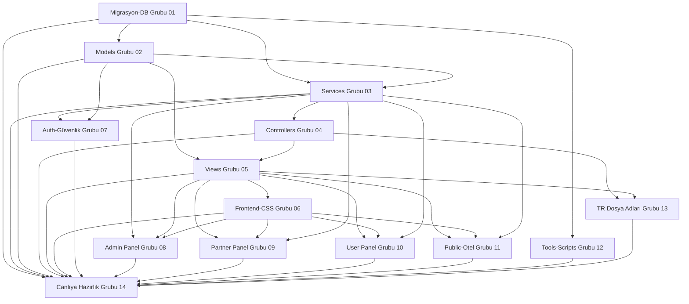

# Agent Grupları — Master Kayıt

**Program Director:** bağımsız geliştirme alanları, açık bağımlılıklar.  
**Son güncelleme:** 2026-05-22  
**Charter kökü:** `docs/agent-gruplari/` (repo: `Docs/agent-gruplari/`)  
**Master CTO:** [MASTER_CTO_OFIS.md](MASTER_CTO_OFIS.md)

## Bağımlılık grafiği

## Grup tablosu

| Grup ID | Alan | Charter dosyası | Bağımlı olduğu gruplar | Bağımsız çalışabilir? | Durum |
|---------|------|-----------------|------------------------|----------------------|-------|
| **01** | Migrasyon & DB | [01-migrasyon-db.md](Docs/agent-gruplari/01-migrasyon-db.md) | — | Evet (plan/audit) | ✅ |
| **02** | Models | [02-models.md](Docs/agent-gruplari/02-models.md) | 01 | Hayır (şema) | ✅ |
| **03** | Services | [03-services.md](Docs/agent-gruplari/03-services.md) | 01, 02 | Hayır | ✅ |
| **04** | Controllers | [04-controllers.md](Docs/agent-gruplari/04-controllers.md) | 02, 03 | Hayır | ✅ |
| **05** | Views (Razor) | [05-views-razor.md](Docs/agent-gruplari/05-views-razor.md) | 02, 04 | Hayır | ✅ |
| **06** | Frontend CSS/JS | [06-frontend-css.md](Docs/agent-gruplari/06-frontend-css.md) | 05 | Hayır | 🔄 |
| **07** | Auth & güvenlik | [07-auth-guvenlik.md](Docs/agent-gruplari/07-auth-guvenlik.md) | 02, 03 | Kısmen (audit) | 🔄 |
| **08** | Admin panel | [08-admin-panel.md](Docs/agent-gruplari/08-admin-panel.md) | 03, 05, 06 | Hayır | 🔄 |
| **09** | Partner panel | [09-partner-panel.md](Docs/agent-gruplari/09-partner-panel.md) | 03, 05, 06 | Hayır | 🔄 |
| **10** | User panel | [10-user-panel.md](Docs/agent-gruplari/10-user-panel.md) | 03, 05, 06 | Hayır | 🔄 |
| **11** | Public otel | [11-public-otel.md](Docs/agent-gruplari/11-public-otel.md) | 03, 05, 06 | Hayır | 🔄 |
| **12** | Tools & scripts | [12-tools-scripts.md](Docs/agent-gruplari/12-tools-scripts.md) | 01 | Evet | ✅ |
| **13** | Türkçe dosya adları | [13-turkce-dosya-adlari.md](Docs/agent-gruplari/13-turkce-dosya-adlari.md) | 04, 05 | Hayır | 🔄 |
| **14** | Canlıya hazırlık | [14-canliya-hazirlik.md](Docs/agent-gruplari/14-canliya-hazirlik.md) | 01–13 | Hayır | 🔄 |

## Çakışma kuralları

| Kural | Açıklama |
|-------|----------|
| 06 ↔ 03 | Grup **06** `Services/` SQL düzenlemez. |
| 03 ↔ 06 | Grup **03** `wwwroot/**/*.css` düzenlemez. |
| 13 ↔ 04 | Grup **13** yeniden adlandırma öncesi Grup **04** sınıf listesini dokümante eder. |
| Hakem | Backend CTO — Grup **14** (`qa-cto`) |

## Paralel çalıştırma

Aynı anda **farklı upstream’i ✅ olan** gruplar: **12** + **07**, **06** + **11** (farklı CSS glob), **13** (Faz 1 ✅) + **08** (farklı klasör). Upstream 🔄 ise yalnızca audit/plan.

## Orchestrator hattı (insan sprint)

| Rol | Kapsam |
|-----|--------|
| Master CTO | Faz sırası, `PROJECT_COMPLETION_SUMMARY.md` |
| Backend CTO | 01–05, 07–08, build/SQL |
| Frontend CTO | 06, 11, screenshot onay |

## Senkronize plan belgeleri

| Belge | Grup |
|-------|------|
| [DB_UYUM_MASTER_PLAN.md](DB_UYUM_MASTER_PLAN.md) | 01–04 |
| [MODELS_GELISTIRME.md](Models/MODELS_GELISTIRME.md) | 02 |
| [SERVICES_GELISTIRME.md](Services/SERVICES_GELISTIRME.md) | 03 |
| [CONTROLLERS_GELISTIRME.md](Controllers/CONTROLLERS_GELISTIRME.md) | 04 |
| [VIEWS_GELISTIRME.md](Views/VIEWS_GELISTIRME.md) | 05 |
| [FRONTEND_EKIP_PLAN.md](FRONTEND_EKIP_PLAN.md) | 06, 11 |
| [ADMIN_PANEL_AJAN_GRUBU.md](ADMIN_PANEL_AJAN_GRUBU.md) | 08 |
| [TURKCE_DOSYA_ADLANDIRMA_PLAN.md](TURKCE_DOSYA_ADLANDIRMA_PLAN.md) | 13 |
| [KALAN_ISLER_PLAN.md](KALAN_ISLER_PLAN.md) | tüm backlog |
| [PROJECT_COMPLETION_SUMMARY.md](PROJECT_COMPLETION_SUMMARY.md) | 14 |

## Build durumu (2026-05-22)

| Kontrol | Sonuç |
|---------|-------|
| Derleme (kod) | ✅ 0 CS hata (`artifacts/agent-build-check` veya kilit yokken) |
| `App_Data/logs` | ✅ csproj dışı (MSB3030 giderildi) |
| Çalışan uygulama kilidi | ⚠️ MSB3027 — `.NET Host` DLL kilitliyorsa build cache’e kopya başarısız; uygulama durdurulunca yeşil |

**Not:** Canlı deploy / git push bu oturumda yapılmadı.
