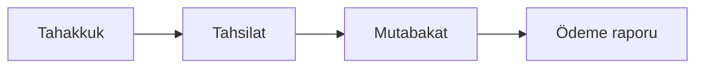

# Admin Panel — Tam Yapılandırma Envanteri

**Güncelleme:** 2026-05-24 · **Owner:** H3_admin_master · **Dalga:** Wave-A1 (admin full config)

> Bu doküman `AdminPanelController` (`[Route("admin")]`) ve `Views/Paneller/Admin` envanterinin kaynak gerçeğidir. Gap matrisi mobil CSS ve DB bağlantısına göre P0/P1 önceliklendirilir.

---

## 1. Route / sayfa envanteri

| Action | Route | View | RBAC (örnek) |
|--------|-------|------|----------------|
| Dashboard | `/admin`, `/admin/dashboard` | Dashboard.cshtml | admin.dashboard |
| SystemHealth | `/admin/sistem-sagligi` | SystemHealth.cshtml | admin.system_health |
| PlatformCheckup | `/admin/platform-checkup` | PlatformCheckup.cshtml | admin.platform_checkup |
| ApprovalCenter | `/admin/onay-merkezi` | ApprovalCenter.cshtml | admin.approval_center |
| Team | `/admin/ekibimiz` | Team.cshtml | admin.notifications |
| HelpCenter | `/admin/yardim-merkezi-yonetim` | HelpCenter.cshtml | admin.support_articles |
| SlowSql / SlowSqlMonitor | `/admin/slow-sql`, `/admin/sistem-sagligi/slow-sql` | SlowSql.cshtml | admin.system_health |
| AdminActionLogs | `/admin/islem-loglari` | AdminActionLogs.cshtml | admin.admin_action_logs |
| UnifiedReservations | `/admin/rezervasyonlar-tek-liste` | UnifiedReservations.cshtml | admin.unified_reservations |
| EmailQueue | `/admin/email-kuyruk` | EmailQueue.cshtml | admin.email_queue |
| RateLimitStats | `/admin/rate-limit` | RateLimitStats.cshtml | admin.rate_limit |
| SecurityEvents | `/admin/guvenlik-olaylari` | SecurityEvents.cshtml | admin.security_events |
| UploadHistory | `/admin/upload-gecmisi` | UploadHistory.cshtml | admin.upload_history |
| SettingsMonitor | `/admin/ayarlar-monitor` | SettingsMonitor.cshtml | admin.settings_monitor |
| CommerceInsight | `/admin/ticari-icgoru` | CommerceInsight.cshtml | admin.commerce_insight |
| Sitemap | `/admin/sitemap` | Sitemap.cshtml | admin.sitemap |
| Users | `/admin/kullanicilar` | Users.cshtml (+ _AdminSectionPage) | admin.users |
| Managers | `/admin/yoneticiler` | Managers.cshtml | admin.managers |
| Hotels | `/admin/oteller` | Hotels.cshtml | admin.hotels |
| BulkUpdateHotelPublishStatus | POST `/admin/oteller/toplu-yayin` | — | admin.hotels · **T356** |
| HotelDetail / EditHotel | `/admin/otel-detay/{id}` | HotelDetail.cshtml | admin.hotels |
| ActiveHotels | `/admin/acik-oteller` | ActiveHotels.cshtml | admin.hotels |
| PendingHotels | `/admin/bekleyen-oteller` | PendingHotels.cshtml | admin.hotels |
| Reservations | `/admin/rezervasyonlar` | Reservations.cshtml | admin.reservations |
| Payments | `/admin/odemeler` | Payments.cshtml | admin.payments |
| Invoices | `/admin/faturalar` | Invoices.cshtml | admin.invoices |
| Commissions | `/admin/komisyonlar` | Commissions.cshtml | admin.commissions |
| CommissionCollection | `/admin/komisyon-tahsilat` | CommissionCollection.cshtml | admin.commissions |
| Contracts | `/admin/sozlesmeler` | Contracts.cshtml | admin.contracts |
| PartnerApplications | `/admin/partner-basvurulari` | PartnerApplications.cshtml | admin.partner_applications |
| **PartnerDocuments** | `/admin/partner-evraklari` | **PartnerDocuments.cshtml** | admin.partner_applications · **Wave-A1** |
| CompanyApplications | `/admin/firma-basvurulari` | CompanyApplications.cshtml | admin.company_applications |
| ListingSubscriptions | `/admin/otel-liste-abonelikleri` | ListingSubscriptions.cshtml | admin.listing_subscriptions |
| PlatformPackages | `/admin/platform-paketleri` | PlatformPackages.cshtml | admin.platform_packages |
| DevelopmentRequests | `/admin/gelistirme-talepleri` | DevelopmentRequests.cshtml | admin.development_requests |
| PlatformOfficials | `/admin/platform-yetkilileri` | PlatformOfficials.cshtml | admin.platform_officials |
| Reviews | `/admin/degerlendirmeler` | ReviewsModeration.cshtml | admin.reviews |
| RevenueCommandCenter | `/admin/gelir-merkezi` | RevenueCommandCenter.cshtml | admin.reports |
| Reports | `/admin/raporlar` | Reports.cshtml | admin.reports |
| Campaigns | `/admin/kampanyalar` | Campaigns.cshtml | admin.hotels |
| Notifications | `/admin/bildirimler` | Notifications.cshtml | admin.notifications |
| Settings | `/admin/ayarlar` | Settings.cshtml | admin.settings |
| WhatsAppCloudApi | `/admin/whatsapp-cloud-api` | WhatsAppCloudApi.cshtml | admin.whatsapp |
| Security | `/admin/guvenlik` | Security.cshtml | admin.security |
| Blog / Faq / SupportArticles | `/admin/blog`, `/admin/sss`, `/admin/destek-makaleleri` | Blog, Faq, SupportArticles | admin.* |
| MailCenter / EmailRouting / EmailTemplates | `/admin/mail-merkezi`, … | MailCenter, EmailRouting, EmailTemplates | admin.* |
| CompanyReservations | `/admin/firma-rezervasyonlari` | CompanyReservations.cshtml | admin.company_reservations |
| Logs / GeoSearchLogs / HotelCoordinateChanges / Backups / Complaints | çeşitli | ilgili view | admin.* |

**Section sayfaları** (`RenderSectionAsync`): users, managers, platform-officials, campaigns, notifications, settings, security, blog — ortak `_AdminSectionPage.cshtml` + `panel-admin-section` CSS.

---

## 2. Gap matrisi (özet)

| Sayfa | DB tabloları (ana) | Mobil CSS çifti | Durum |
|-------|-------------------|-----------------|-------|
| Dashboard | OTELLER, REZERVASYONLAR, KULLANICILAR | dashboard.css ✓ | ✅ |
| Onay Merkezi | OTELLER, PARTNER_DETAYLARI, FIRMALAR, FATURALAR | approval-center ✓ | ✅ T356 link · Wave-A1 UX |
| Oteller + toplu yayın | OTELLER | panel-admin-hotels ✓ | ✅ T356 |
| Komisyon oranları | OTELLER, KOMISYON_* | commissions ✓ | ✅ |
| Komisyon tahsilat | KOMISYON_MUHASEBE_KAYITLARI | panel-admin-commission-collection ✓ | ✅ lifecycle bar Wave-A1 |
| Komisyon mutabakat (admin) | KOMISYON_MUHASEBE (ITIRAZ) | — | 🟡 P1 dedicated view |
| Partner evrakları | PARTNER_BASVURU_EVRAKLARI, GUVENLI_DOSYA_* | partner-documents ✓ | ✅ Wave-A1 scaffold |
| Partner başvuruları | PARTNER_DETAYLARI | partner-applications ✓ | ✅ |
| Sözleşmeler | SOZLESMELER | panel-admin-contracts | ✅ seed Wave-A1 |
| Gelir merkezi | REZERVASYONLAR, KOMISYON_* | revenue-command-center ✓ | ✅ T350 |
| Slow SQL / Security / Upload | API_LOGLARI, audit | panel-admin-section / eksik | 🟡 P1 T353–T355 |
| Fraud alerts | (stub) | — | 🔴 P0 T357 |

**Mobil CSS kuralı:** `PageCssPath` → `~/assets/css/{path}.css` + `{path}.mobile.css` (layout `_AdminPanelLayout`).

---

## 3. Komisyon yaşam döngüsü

| Aşama | Admin | Partner | DB |
|-------|-------|---------|-----|
| **Tahakkuk** | `/admin/komisyonlar`, `/admin/raporlar` | Finans özeti | REZERVASYONLAR.KOMISYON_*, KOMISYON_MUHASEBE_KAYITLARI |
| **Tahsilat** | `/admin/komisyon-tahsilat` toplu işaretle | — | PLATFORM_TAHSILAT_DURUMU |
| **Mutabakat** | Rapor + itiraz KPI (P1) | `/panel/partner/finans/mutabakat` | ITIRAZ_VAR_MI, dönem özet |
| **Ödeme** | `/admin/odemeler`, faturalar | Ödeme geçmişi | ODEME_ISLEMLERI |

---

## 4. Otel onay / yayın iş akışı

1. Partner evrak + başvuru → **Partner Evrakları** / **Partner Başvuruları**
2. Admin **Onay Merkezi** KPI → otel satırı
3. **Otel detay** onay + oda/fiyat
4. **T356** `POST /admin/oteller/toplu-yayin` — `BulkUpdateHotelPublishStatusAsync` + audit
5. Yayın: `YAYIN_DURUMU = Yayında`, `ONAY_DURUMU = Onaylandı`

---

## 5. Partner evrak uyumluluk

| Zorunlu evrak | Partner upload | Admin inceleme |
|---------------|----------------|----------------|
| Vergi Levhası | Preferences / basvuru-ve-evraklar | PartnerDocuments onay/red |
| Ticaret Sicil Gazetesi | ✓ | ✓ |
| İmza Sirküleri | ✓ | ✓ |
| IBAN Belgesi | ✓ | ✓ |
| Turizm Belgesi | ✓ | ✓ |
| Kimlik Belgesi | ✓ | ✓ |
| Sözleşme (opsiyonel) | ✓ | ✓ |

**Durumlar:** `Beklemede` → `Onaylandi` / `Reddedildi` (+ `RED_NEDENI`, `INCELEYEN_ADMIN_ID`).

---

## 6. Dalga planı (admin master)

| Dalga | Kapsam | Hedef |
|-------|--------|-------|
| **Wave-A1** (bu oturum) | Evrak admin, onay UX, sözleşme seed, plan dokümanları | P0 gap kapatma |
| Wave-A2 | Komisyon mutabakat admin, ödeme raporları CSV | P0 finans |
| Wave-A3 | Otel oda/fiyat admin edit derinleştirme | P0 operasyon |
| Wave-A4 | H16 hukuk şablonları + firma sözleşme | H16_ork_hukuk |

**10 dk döngü:** Her tick'te gap matrisinden tek P0; build gate `.coord-build-admin`.

---

## 7. İlgili dosyalar

- `Docs/PLATFORM_SOZLESME_HUKUK_ORKESTRA.md`
- `Docs/ADMIN_PANEL_MASTER_ROADMAP.md`
- `CTO_AJAN_ATAMA_KUYRUGU.md` · `PLATFORM_1AY_ORKESTRA_PLAN.md`
- `Database/MigrationsSql/veri/migrationlar/20260524_seed_platform_sozlesmeler.sql`
