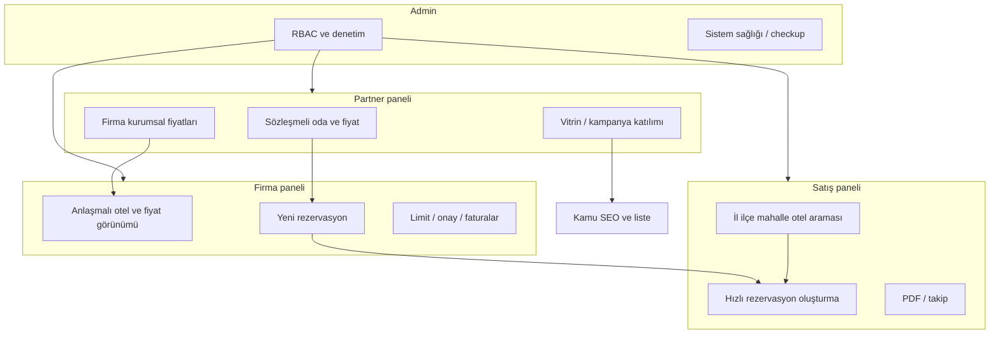

# Kurumsal (Firma) ↔ Partner ↔ Satış ↔ Admin — iş akışı ve SEO yol haritası

Bu belge, **partner otellerin oda/fiyat mantığı** ile **firma rezervasyonu**, **satış personelinin hızlı rezervasyon** ve **admin omurga kontrolü** arasındaki ilişkiyi tek yerde toplar. “Kusursuz” hedefi **sprint + QA** ile yaklaşır; kod tabanında ilgili giriş noktaları aşağıda sabittir.

## 1. İş akışı (tek diyagram)

## 2. Kodda sabit giriş noktaları (doğrulama için)

| Rol | Ana rota | Controller / servis |
|-----|-----------|----------------------|
| Firma — yeni rezervasyon | `GET/POST /panel/firma/yeni-rezervasyon` | `FirmaPanelController`, `FirmaService` |
| Partner — kurumsal fiyatlar | `/panel/partner/firma-fiyatlari` | `PartnerPanelController` |
| Partner — firma rezervasyonları | `/panel/partner/firmalar/rezervasyonlar` | `PartnerPanelController` |
| Satış — hızlı rezervasyon | `/panel/satis/yeni-rezervasyon` (şehir/ilçe/mahalle sorgu parametreleri) | `SalesPanelController`, `SalesService` |
| Satış — asistan | `/panel/satis/yeni-rezervasyon/otel-asistani` | Aynı |
| Admin | `/admin/*` | `AdminPanelController`, RBAC |

## 3. SEO ve edinme (il / ilçe / mahalle / otel adı)

| Konu | Hedef | Teknik karşılık |
|------|--------|-----------------|
| Programatik konum sayfaları | İl–ilçe–otel aramasında görünürlük | `HotelService` liste sorguları, `q` / şehir parametreleri, `SitemapService` |
| Kampanya ve partner vitrin | Kurumsal müşteri çekme | `kampanyalar` + anasayfa slider; liste `?kampanya=` |
| Güven ve dönüşüm | Tıklama sonrası rezervasyon | kamu `OtellerController`, güven metinleri footer; panellerde net CTA |
| Ölçüm | Hangi kanal getirdi | mevcut growth/RUM uçları; kampanya UTM politikası operasyonla |

Detay checklist: `SEO_BOOKING_PARITY_PLAN.md` ve `PLATFORM_SINGLE_WINDOW_AUDIT_AND_BACKLOG.md`.

## 4. Sohbet / mesaj tabanlı yapı

Misafir–otel–firma iletişimi **`mesaj_konusmalari`** ve **`mesajlar`** tabloları üzerinden `MessageCenterService` ile yürür; firma gelen kutusu `/panel/firma/mesajlar`. **“Adım tabloları”** iş kuralı olarak rezervasyon durum makinesi + mesaj thread’i ile modellenir; şema değişikliği gerekiyorsa migration ile yapılır (canlıda truncate yok).

## 5. Sıralı sprint önerisi (eksiksiz hissi için)

1. **Veri doğruluğu:** Partner firma fiyatı girilmiş mi, firma anlaşması aktif mi (rapor sorguları).
2. **Satış hızı:** `CreateReservation` formunda arama sonuçları ve otel seçimi süresi (UX ölçümü).
3. **Firma onay akışı:** Limit/onay ekranı ile rezervasyon durumu uyumu.
4. **SEO:** Liste/detay canonical ve şema (ayrı iş paketi).
5. **Mobil:** `paneller/firma|partner|satis/*.mobile.css` smoke (dar ekran).
6. **Admin:** Komisyon / rezervasyon birleşik liste ile “omurga” kontrolü.

## 6. İlgili mevcut plan dosyaları

- `FIRMA_PANEL_FULL_PLAN.md`
- `PARTNER_PANEL_FULL_PLAN.md`
- (Satış için repo içi controller/view envanteri — gerektiğinde `PARTNER` ile aynı formatta genişletilebilir)
- `ADMIN_PANEL_FULL_PLAN.md`, `PANELS_OPERATIONS_AND_SECURITY_MAP.md`

Her sprint sonunda: ilgili panel planına **tamamlanan satır + tarih** işlenir.
