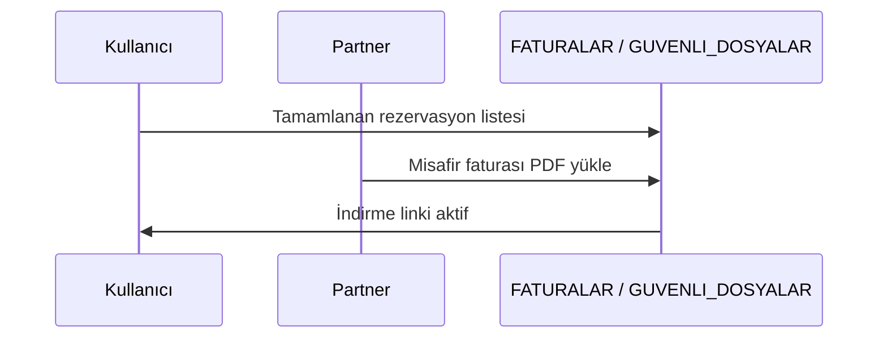

# Fatura — Kullanıcı İndirme & Partner Yükleme Planı

**Orkestra:** `H12_fatura_ork` (H4 User + H2 Partner + H8 DB)  
**Wave:** `Wave-VIII-fatura`

## Durum (2026-05-23)

| Task | Durum | Not |
|------|--------|-----|
| T435 User faturalarım mobil + indirme | ✅ Faz 1 | Kart-only mobil, 44px indir, PDF önizle, boş durum |
| T436 Bildirim hook | ⏳ Faz 2 | — |
| T437 Partner misafir faturası mobil | ✅ Faz 1 | `guest-invoices.css`, upload banner, kart tablo |
| T438 Partner platform fatura polish | ⏳ Faz 2 | — |
| T439 DB migration | ⏭️ Atlandı | `107_REZERVASYON_FATURALARI.sql` mevcut |

**Build:** `.build-h12-fatura` (yerel doğrulama)

---

## Akış özeti

---

## Kullanıcı — Faturalarım (`/panel/user/faturalarim`)

| Özellik | Mevcut | Hedef |
|---------|--------|-------|
| Liste | Kart + tablo | Mobilde sadece kart, swipe aksiyon |
| İndirme | `DownloadUrl` | PDF/WebP önizleme modal |
| Boş durum | Var | "Otel henüz yüklemedi" + tahmini tarih |
| Bildirim | Kısmi | Fatura yüklendiğinde push/e-posta (Faz 2) |
| Tablo yok | Migration uyarısı | `FATURALAR` + `REZERVASYON_FATURALARI` kontrol |

**Servis:** `UserPanelService.GetInvoicesAsync` — join rezervasyon tamamlandı + partner yükledi dosya.

**Task:** T435 user invoice mobile + download UX · T436 notification hook stub

---

## Partner — Misafir faturası yükleme

| Route | Açıklama |
|-------|----------|
| `GET /panel/partner/finans/misafir-faturalari` | Eksik/yüklenen liste |
| `POST .../yukle` | `multipart/form-data` → `SaveGuestInvoiceAsync` |

| Özellik | Mevcut | Hedef |
|---------|--------|-------|
| Upload | Inline form satırda | Mobil: tam genişlik file input + progress |
| Validasyon | secureFileId | Max 10MB PDF, virus scan stub |
| Toplu yükleme | Yok | Faz 2 — CSV rezervasyon no |
| Partner faturalar | `/panel/partner/finans/faturalar` | Platform→partner kesilen (ayrı sekme) |

**Task:** T437 partner GuestInvoices mobile + drag-drop · T438 partner platform fatura listesi polish

---

## DB (idempotent)

**Dosya:** `20260526_fatura_misafir_baglanti.sql` (gerekirse)

- `REZERVASYON_MISAFIR_FATURALARI` veya mevcut `FATURALAR.REZERVASYON_ID` + `FATURA_PDF_YOLU`
- Index rezervasyon_id

**Seed demo:** 3 tamamlanmış rezervasyon + örnek PDF path (ORK oteller)

---

## Admin görünürlük

- Mevcut `/admin/faturalar` — filtre partner yükleme kaynağı
- Onay merkezi: bekleyen misafir faturası yoksa auto-onay

---

## Smoke

1. Partner `irmhro0+pendik@gmail.com` → misafir faturası yükle
2. User → faturalarım → indir
3. Mobil 390px — tek sütun, 44px butonlar

**Tasks:** T435–T439 · Owner H12
