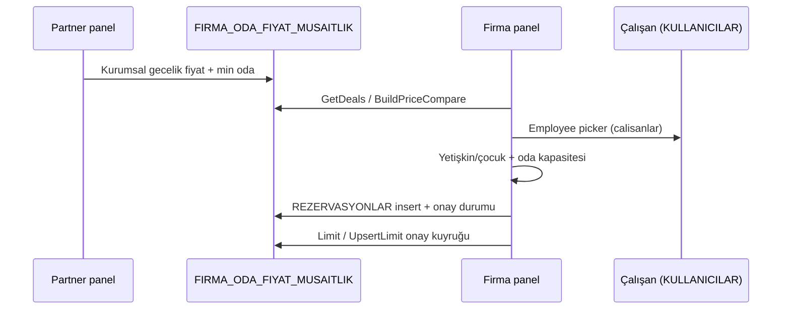

# Firma Panel Master Plan

**Mandate:** Kurumsal paneli `/firma` kamu sayfası markası ve rezervasyon E2E ile dünya standardına taşımak.  
**Orkestra:** `H6_fe_firma` (Firma-FE-Ork) · **Öncelik:** P0  
**Referans:** `Views/Firma/Firma.cshtml`, `ORKESTRA_FE_DUNYA_STANDARDI.md`, `panel-form-ux.css`

---

## Sayfa envanteri (route ↔ şablon)

| Route | View | Şablon (proje verileri) | Durum | Mobile CSS |
|-------|------|-------------------------|-------|------------|
| `/panel/firma/dashboard` | `Dashboard.cshtml` | FİRMA anasayfa | ✅ KPI + trend | `dashboard.mobile.css` |
| `/panel/firma/firma-fiyatlari` | `Deals.cshtml` | FİRMA FİYATLARI | ✅ kart grid | `deals.mobile.css` |
| `/panel/firma/firma-fiyatlari/karsilastir` | `DealsCompare.cshtml` | karşılaştır | 🟡 tablo/kart | `deals.mobile.css` |
| `/panel/firma/yeni-rezervasyon` | `CreateReservation.cshtml` | REZERVASYON oluştur | 🟡 Wave-F1 | `create-reservation.mobile.css` |
| `/panel/firma/rezervasyonlar` | `Reservations.cshtml` | REZERVASYONLAR | 🟡 Wave-F1 `data-label` | `reservations.mobile.css` |
| `/panel/firma/calisanlar` | `Employees.cshtml` | ÇALIŞANLAR | 🟡 Wave-F1 form UX | `employees.mobile.css` |
| `/panel/firma/limitler-onaylar` | `Limits.cshtml` | LİMİTLER | 🟡 Wave-F1 tablo kart | `limits.mobile.css` |
| `/panel/firma/faturalar` | `Invoices.cshtml` | FATURALAR | 🟡 Wave-F1 tablo kart | `invoices.mobile.css` |
| `/panel/firma/mesajlar` | `Messages.cshtml` | mesajlar | ✅ | `messages.mobile.css` |
| `/panel/firma/harcama-raporlari` | `Spending.cshtml` | harcama | ✅ grafik | `spending.mobile.css` |
| `/panel/firma/otel-bazli-rapor` | `Hotels.cshtml` | otel rapor | 🟡 tablo kart | `hotels.mobile.css` |
| `/panel/firma/guvenlik` | `Security.cshtml` | güvenlik | ✅ | `security.mobile.css` |

**Shell:** `_FirmaPanelLayout.cshtml` → `shell.css` + `shell.mobile.css` (safe-area, alt nav, **tablo→kart** `firma-table--cards`).

**Done (önceki sprint):** `FirmaService` firma günlük fiyat (`FIRMA_ODA_FIYAT_MUSAITLIK`) + standart fiyat kıyası; rezervasyon insert `FIRMA_ID` / `FIRMA_CALISAN_ID`.

**Gap (F2+):** departman paneli, çalışan düzenleme, fatura indirme, SS PNG, i18n SharedLocalizer.

---

## Rezervasyon E2E

1. **Partner** `CompanyPricing` → `FIRMA_ODA_FIYAT_MUSAITLIK` (otel + oda + tarih).  
2. **Firma Fiyatları** liste + “Rezervasyon Yap” (`hotelId`, `roomTypeId`).  
3. **Yeni Rezervasyon** personel seçimi, misafir sayısı, firma/standart toplam.  
4. **Limitler & Onaylar** `FIRMA_HARCAMA_LIMITLERI` + `rezervasyon-onay` POST.

---

## 10 dk orkestra dalgaları (H6)

| Wave | Odak | Çıktı |
|------|------|--------|
| **F1** (bu oturum) | Mobil tablo kart, CreateReservation, dashboard KPI, panel-form-ux, ölü link | Views + CSS + service guest policy |
| **F2** | DealsCompare kart, Messages polish, Spending/Hotels SS | mobile + empty states |
| **F3** | Çalışan düzenleme, departman filtresi API, fatura PDF | controller + view |
| **F4** | i18n registry, FE-CTO SS batch | 7 `.resx` |
| **F5** | Lighthouse + erişilebilirlik kapısı | `docs/frontend-screenshots/firma/` |

---

## Sayfa bazlı UX gap (buton / form / tablo / arama)

| Sayfa | Buton | Form | Tablo | Arama |
|-------|-------|------|-------|-------|
| Dashboard | ✅ linkler | — | F1 `data-label` | — |
| Firma Fiyatları | F1 `roomTypeId` rez link | ✅ filtre GET | kart (tablo yok) | ✅ |
| Yeni Rezervasyon | F1 personel + fiyat rozeti | F1 panel-form-ux | — | ✅ otel ara |
| Rezervasyonlar | F1 “Yeni” CTA | — | F1 kart | — |
| Çalışanlar | ✅ modal | F1 panel-form-ux | F1 kart | ✅ debounce |
| Limitler | ✅ onayla/reddet | 🟡 limit kaydet compact | F1 kart | — |
| Faturalar | — | — | F1 kart | — |
| Mesajlar | ✅ gönder | ✅ | liste | — |

---

## Build / kanıt

- `dotnet build -o .coord-build-firma` — 0 hata hedef  
- Kuyruk: `CTO_AJAN_ATAMA_KUYRUGU.md` → `H6_fe_firma: in_progress, P0`  
- Log: `geliştrme-orkestra.md` #066+

*Son güncelleme: 2026-05-24 — Wave-F1*
