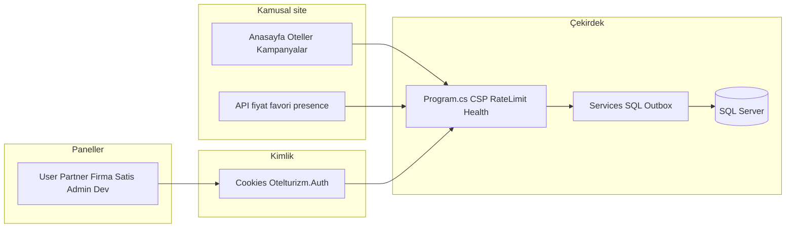

# Tek pencere platform denetimi — bağlam, boşluklar ve sıralı iyileştirme kuyruğu

Bu belge platformu **uçtan uca tek bakışta** özetler; detay planlar ayrı MD dosyalarında kalır. **Yürütme sırası** için önce `PLATFORM_MASTER_EXECUTION_ORDER.md`, sonra buradaki **Kuyruk** tablosu kullanılır.

## 1. Mimari akış (tek ekran)

## 2. Katman özeti ve bağlam

| Katman | Ne iş yapar | Ana kaynak kod / yapılandırma |
|--------|-------------|--------------------------------|
| HTTP güvenliği | CSP, güvenlik başlıkları, korelasyon | `Program.cs` |
| Kamu SEO | robots, sitemap, canonical, şema | `wwwroot/robots.txt`, `SitemapService`, `HomeController`, `Oteller` |
| Oturum | Çerez, CSRF | `Program.cs`, `[ValidateAntiForgeryToken]` |
| API yüzeyi | Oran sınırları, toplu fiyat sınırları | `Controllers/Api/*`, `quote-strict` vb. |
| Dosya | Tokenlı erişim | `SecureFileService`, `/secure-files` |
| Paneller | RBAC, audit | `AdminPanelController`, izin kodları |
| Gözlemlenebilirlik | Log dosyaları, admin log görünümleri | `App_Data/logs`, `/admin/log-kayitlari`, `/admin/guvenlik-olaylari` |
| Veri | Şema ve tohumlar | `Database/MigrationsSql/` |

## 3. Tespit edilen boşluklar ve iş sırası (özet)

Aşağıdaki sıra **bağımlılığa göre** dizilmiştir: güvenlik/sağlık → SEO → iş kuralları → UX tamamlama → veri → yayın.

| # | Alan | Bağlam | Önerilen iş | Durum / kaynak |
|---|------|--------|-------------|----------------|
| S1 | Güvenlik ve sağlık | Üretim gözlemi, oran sınırları | `/health/*`, audit log izleme | `SECURITY_PLATFORM_PLAN.md` — çoklu madde uygulandı |
| S2 | SEO kamu sayfaları | İndeks ve çift içerik riski | Liste pagination canonical, otel detay Offer şeması | `SEO_BOOKING_PARITY_PLAN.md` |
| S3 | Gizli yapılandırma | Depoda düz parola riski | Ortam değişkeni / Key Vault; repo içi secrets döndürme | Operasyon — **appsettings üzerinden doğrudan commit edilmemeli** |
| S4 | Mobil tutarlılık | `*.mobile.css` ile Layout media | Sayfa başına `PageCssPath` ve eş dosya kontrolü | Önceki mobil düzenlemeler; drift sürekli izlenmeli |
| S5 | Panel UX “yakında” | Kullanıcı beklentisi | Admin kullanıcı düzenleme aksiyonları (placeholder), Partner/Firma güvenlik alt özellikleri | `Views/Paneller/Admin/Users.cshtml`, Partner/Firma `Security.cshtml` |
| S6 | Seyahat planlama | Erken sayfa | İçerik veya feature flag ile netleştirme | `Views/SeyahatPlanlama/Index.cshtml` |
| S7 | Otel detay oda özellikleri | Boş durum metni | CMS veya oda şablonu ile doldurma | `OtelDetay.cshtml` fallback metni |
| S8 | Çok otelli operasyon | Partner–firma rezervasyon görünürlüğü | Filtre ve rapor zenginliği | `PANELS_OPERATIONS_AND_SECURITY_MAP.md` |
| S9 | Veritabanı | Şema uyumu | `apply_all_migrations_safe` staging doğrulaması | `Database/MigrationsSql/` |
| S10 | Yayın öncesi smoke | Regresyon | Faz 8 checklist | `PLATFORM_MASTER_EXECUTION_ORDER.md` |

## 4. Admin içinden operasyon “tek pencere”

Üretim sunucusunda repo klasörü olmayabilir; operasyonel bağlantılar **Admin UI** üzerinden:

| İhtiyaç | Admin yolu |
|---------|------------|
| Sistem bileşenleri | `/admin/sistem-sagligi` |
| Platform checklist | `/admin/platform-checkup` |
| Güvenlik ayarları | `/admin/guvenlik` |
| Olaylar | `/admin/guvenlik-olaylari?take=200` |
| Rate limit gözlemi | `/admin/rate-limit` |
| Ham log görünümü | `/admin/log-kayitlari` |

Dashboard’a bu bağlantıların kısayolu eklendi (`Dashboard.cshtml`).

## 5. Sıralı iyileştirme protokolü (her sprint)

1. Bu tablodan **en üst sıradaki** açık kalemi seç (S2 öncelikli ise SEO, vb.).
2. İlgili **detay MD** ve ilgili **controller/service** üzerinde değişiklik.
3. **Doğrulama:** ilgili fazın “çıktı / doğrulama” maddesi (`PLATFORM_MASTER_EXECUTION_ORDER.md`).
4. Merge + staging smoke.
5. Tabloda satırı **Tamamlandı** + tarih ile işaretle (bu dosyada veya görev sisteminde).

## 6. Bilinçli olarak geniş tutulan kalemler

- **OTA tam paritesi** (Booking/Agoda/…) tek sprintte kapanmaz; SEO + güven + ödeme + içerik birlikte ilerler.
- **“Tüm mobil sayfalar”** envanteri otomatik tek taramayla bitmez; kritik kamu üçlüsü (anasayfa, liste, detay) önce sabitlenir.

## İlgili belgeler

- `Docs/CROSS_PANEL_B2B_AND_SEO_ROADMAP.md` — partner firma fiyatı → firma rezervasyon → satış → SEO
- `Docs/PLATFORM_MASTER_EXECUTION_ORDER.md` — faz sırası
- `Docs/SECURITY_PLATFORM_PLAN.md`
- `Docs/SEO_BOOKING_PARITY_PLAN.md`
- `Docs/PANELS_OPERATIONS_AND_SECURITY_MAP.md`
- Panel tam planları: `ADMIN_*`, `USER_*`, `PARTNER_*`, `FIRMA_*`
