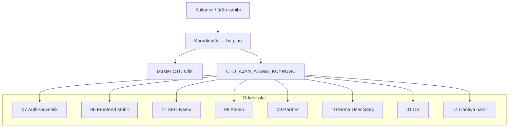

# Platform Koordinatör Operasyon Planı

**Son güncelleme:** 2026-05-23T01:31+03:00  
**Rol:** Üst koordinatör — planlama, önceliklendirme, orkestra/CTO ataması, onay kapıları; uygulama dalgaları arka orkestralara devredilir.  
**Kullanıcı ile birlikte:** Kritik UI/akış kararları ve FE-CTO ekran onayı birlikte yürütülür.

---

## Sürekli döngü (5 dk rolling — INFINITE JOB)

Sürekli orkestrasyon: koordinatör planlar → CTO ajanları uygular → verify tick.

| Belge | Amaç |
|-------|------|
| [PLATFORM_SUREKLI_GELISTIRME_DONGUSU.md](PLATFORM_SUREKLI_GELISTIRME_DONGUSU.md) | Ritim (Plan/Execute/Verify), wave adları, H1–H10, KPI K1–K8, Wave-I görevleri |
| [PLATFORM_5DK_PLAN_SABLONU.md](PLATFORM_5DK_PLAN_SABLONU.md) | Her **5 dk** plan tick’i (birincil) |
| [PLATFORM_10DK_PLAN_SABLONU.md](PLATFORM_10DK_PLAN_SABLONU.md) | Arşiv (10 dk) |
| [PLATFORM_30DK_PLAN_SABLONU.md](PLATFORM_30DK_PLAN_SABLONU.md) | Eski şablon (arşiv / uzun dalga) |
| [CTO_AJAN_ATAMA_KUYRUGU.md](CTO_AJAN_ATAMA_KUYRUGU.md) | `sprint-continuous-infinite-20260523` · `wave_i` T326–T370 |
| [Docs/PLATFORM_OZELLIK_GAP_ANALIZI.md](Docs/PLATFORM_OZELLIK_GAP_ANALIZI.md) | Rakip gap 35 satır |
| [Docs/ADMIN_PANEL_MASTER_ROADMAP.md](Docs/ADMIN_PANEL_MASTER_ROADMAP.md) | Admin P0–P3 |
| [Docs/ORKESTRA_PANEL_EKSIKLIKLER.md](Docs/ORKESTRA_PANEL_EKSIKLIKLER.md) | Panel SS/mobile/API |

**Sonraki 6 döngü çapaları (+03, PLAN → EXECUTE → VERIFY → PLAN):**

| # | PLAN başlangıç | Wave ID |
|---|----------------|---------|
| 1 | 00:00 | `Wave-I-20260523-0100` |
| 2 | 00:30 | `Wave-II-20260523-0130` |
| 3 | 01:00 | `Wave-III-20260523-0200` |
| 4 | 01:30 | `Wave-IV-20260523-0230` |
| 5 | 02:00 | `Wave-V-20260523-0300` |
| 6 | 02:30 | `Wave-VI-20260523-0330` |

*Commit ve canlı deploy yalnızca kullanıcı açık isteğiyle.*

---

## 1. Vizyon (tek cümle)

Otelturizm platformu: **güvenli**, **mobil öncelikli** (~%99 mobil trafik), **hızlı** (arama + yükleme + PageSpeed), **SEO olgun**, **tüm panellerde eksiksiz** iş akışları — canlıya çıkış yalnızca tanımlı onay kapıları geçildiğinde.

---

## 2. Koordinasyon modeli

| Katman | Kim | Ne yapar | Ne yapmaz |
|--------|-----|----------|-----------|
| Koordinatör | Bu sohbet / Master plan | Öncelik, wave, T-ID, blokaj çözümü, özet | 151 sayfanın tek başına CSS’i |
| Master CTO | `MASTER_CTO_OFIS.md` | Faz bağımlılığı, upstream ✅ kuralı | Deploy/commit (kullanıcı istemedikçe) |
| Orkestra CTO | `CTO_AJAN_ATAMA_KUYRUGU.md` | Kod + SS + smoke kanıtı | Canlı DB dokunmadan migration dışı |
| FE-CTO | `FRONTEND_ORKESTRATOR_PLAN.md` | Sayfa bazlı mobil/desktop onay | Backend şema |

**Kural:** Upstream (DB → Models → Services) 🔄 iken downstream “tamam” işaretlenmez.

---

## 3. Hedef eksenleri ve KPI

| Eksen | Hedef | Ölçüm / kanıt | Orkestra | Plan dosyası |
|-------|-------|---------------|----------|--------------|
| **Güvenlik** | Tüm POST/aksiyon korumalı; dosya tokenlı | CSRF audit, RBAC seed, `/admin/guvenlik` | `ork-guvenlik` (Grup 07) | `Docs/SECURITY_PLATFORM_PLAN.md` |
| **İşleyiş** | Rezervasyon, komisyon, fatura, bildirim E2E | Smoke script + panel SS | Grup 03, 08–10 | `KURUMSAL_IS_AKISI_PLANI.md` |
| **Mobil UX** | %99 mobil: okunabilir, dokunma 44px+, safe-area | 151/151 `*.mobile.css` + FE-CTO SS | `fe-*` (Grup 06) | `FRONTEND_ORKESTRATOR_PLAN.md` |
| **Masaüstü** | Geniş ekranda boşluk/kırık yok | Desktop SS seti (kritik 20 sayfa önce) | `fe-*` | Aynı |
| **Her buton/aksiyon** | Yetki + antiforgery + net geri bildirim | Panel operasyon haritası | 08–10 + 07 | `Docs/PANELS_OPERATIONS_AND_SECURITY_MAP.md` |
| **Yükleme / dosya** | Görsel kalite, düşük boyut, güvenli saklama | WebP/lazy, max boyut, `SecureFileService` | `ork-medya` + 07 | `Docs/SECURITY_PLATFORM_PLAN.md` |
| **Arama / liste** | Hızlı filtre, etiket/kampanya tutarlılığı | p95 yanıt, boş 500 yok | `fe-otel-public` + 03 | `ORKESTRA_OTEL_DETAY_PLANI.md` |
| **SEO** | İndeks, canonical, schema, hreflang | GSC / Lighthouse SEO ≥90 | `ork-seo-global` (11) | `Docs/SEO_BOOKING_PARITY_PLAN.md` |
| **PageSpeed** | Kamu sayfalar ~100’e yakın | LCP, INP, CLS lab + field | `ork-perf` + 06 | `CROSS_PANEL_B2B_AND_SEO_ROADMAP.md` |
| **Eksiksizlik** | Tüm gereksinimler planlı + kapalı | `PROJECT_COMPLETION_SUMMARY` → **EVET** | Grup 14 | `Docs/PLATFORM_MASTER_EXECUTION_ORDER.md` |

**Dürüst durum (2026-05-23):** Build ✅ · FE-CTO **6/151** · Canlıya hazır **HAYIR** · Genel platform **~35–40%** (`PROJECT_COMPLETION_SUMMARY.md`).

---

## 4. Yürütme sırası (değiştirilmez omurga)

Kaynak: `Docs/PLATFORM_MASTER_EXECUTION_ORDER.md` + `Docs/PLATFORM_SINGLE_WINDOW_AUDIT_AND_BACKLOG.md` (S1–S10).

1. Güvenlik & sağlık (S1)  
2. SEO kamu (S2)  
3. Panel operasyon + RBAC (S3, S8)  
4. Admin / Partner / Firma / User / Satış tam set (S5)  
5. Mobil drift + FE-CTO döngüsü (S4, S6)  
6. DB migration staging (S9)  
7. Yayın smoke Faz 8 (S10)  

Paralel hatlar (birbirini bloke etmez): **A** güvenlik · **B** SEO · **C** panel iş kuralları · **D** mobil CSS/SS · **E** DB.

---

## 5. Wave G — Platform mükemmellik (yeni atama dalgası)

| ID | Orkestra | İş paketi | Çıktı | Öncelik |
|----|----------|-----------|-------|---------|
| T301 | `ork-guvenlik` | Tüm panel POST CSRF + yetkisiz 403 tutarlılığı | Audit tablosu ✅ | P0 |
| T302 | `ork-guvenlik` | CSP enforce (prod), rate limit gözlem | Admin rate-limit SS | P0 |
| T303 | `ork-medya` | Otel/galeri yükleme: WebP, max KB, lazy | Upload policy doc + kod | P1 |
| T304 | `ork-perf` | Anasayfa, liste, detay: kritik CSS, preload, font | Lighthouse ≥90 mobil | P1 |
| T305 | `ork-seo-global` | Liste pagination canonical, kampanya URL `etiket` | GSC hazır URL seti | P1 |
| T306 | `fe-otel-public` | OtelDetay mobil+desktop SS + runtime 0 hata | FE-CTO ✅ detay | P0 |
| T307 | `fe-otel-public` | Anasayfa pill/card → `/oteller?etiket=` tam eşleme | 10 etiket smoke | P0 |
| T308 | `db-ork` | 10 İstanbul ilçe demo otel seed | `OTELLER` + partner bağ | P1 |
| T309 | `fe-partner` | Commissions tablo + günlük/aylık KPI + ödendi | `Commissions.cshtml` dolu | P0 |
| T310 | `fe-admin` | Auth test kullanıcı + 55 sayfa SS döngüsü | FE-CTO admin ≥80% | P1 |
| T311 | `fe-partner` | 47 sayfa SS döngüsü | FE-CTO partner ≥80% | P1 |
| T312 | `fe-firma` + `fe-user` + `fe-satis` | Kalan paneller SS | Toplam 151/151 FE-CTO | P2 |
| T313 | `models-services` | Rezervasyon/profil adres ID E2E test | INSERT kanıt | P1 |
| T314 | `master-cto` | `PROJECT_COMPLETION_SUMMARY` → canlıya hazır **EVET** | Tüm kapılar | Son |

---

## 6. Onay kapıları (canlıya çıkış)

Aşağıdakilerin **hepsi** ✅ olmadan `canliya_hazir: evet` yazılmaz:

| Kapı | Koşul |
|------|--------|
| K1 Build | `dotnet build` 0 hata |
| K2 DB | Staging’de migration sırası + yedek notu |
| K3 Güvenlik | CSRF audit + RBAC seed + health uçları |
| K4 FE-CTO | **151/151** sayfa (mobil + kritik desktop SS) |
| K5 Kamu perf | Anasayfa, liste, detay Lighthouse mobil ≥90 |
| K6 SEO | robots, sitemap, canonical, otel JSON-LD örnekleme |
| K7 Smoke | Faz 8 checklist (`PLATFORM_MASTER_EXECUTION_ORDER.md`) |
| K8 İş | Rezervasyon mutlu yol + partner komisyon + firma fiyat |

---

## 7. Haftalık koordinasyon döngüsü

1. **Pazartesi:** `CTO_AJAN_ATAMA_KUYRUGU.md` → `queue_next_10` güncelle  
2. **Günlük:** Blokaj (build, auth, DB FK) → ilgili orkestraya T-ID  
3. **SS günü:** Kullanıcı + koordinatör → FE-CTO onay/red notu `FRONTEND_ORKESTRATOR_PLAN.md`  
4. **Cuma:** `PROJECT_COMPLETION_SUMMARY.md` yüzde ve EVET/HAYIR matrisi  

### 7b. 30 dakikalık sonsuz döngü (INFINITE)

Şablon: [`PLATFORM_30DK_PLAN_SABLONU.md`](PLATFORM_30DK_PLAN_SABLONU.md)

| Döngü | Wave ID | PLAN başlangıç (+03) |
|-------|---------|----------------------|
| 1 | `Wave-I-20260523-0100` | 2026-05-23 **00:00** |
| 2 | `Wave-II-20260523-0130` | 2026-05-23 **00:30** |
| 3 | `Wave-III-20260523-0200` | 2026-05-23 **01:00** |
| 4 | `Wave-IV-20260523-0230` | 2026-05-23 **01:30** |
| 5 | `Wave-V-20260523-0300` | 2026-05-23 **02:00** |
| 6 | `Wave-VI-20260523-0330` | 2026-05-23 **02:30** |

Her VERIFY: `dotnet build -o .coord-build` + `ORKESTRA_DURUM_KONTROL.md` snapshot + KPI (build, FE-CTO X/151, K1–K8).

---

## 8. Seninle çalışma şekli

| Konu | Koordinatör | Sen |
|------|-------------|-----|
| Yeni özellik / sayfa | T-ID açar, orkestraya yazar | Öncelik ve kabul kriteri |
| UI ince ayar | SS sonucunu özetler | Ekranda birlikte düzeltme |
| Canlı / git | Yapmaz (istek gerekir) | Açık onay verirsin |
| Acil hata | P0 wave, tek orkestra | Log/URL paylaşımı |

---

## 9. İlgili tek doğruluk kaynakları

| Belge | Amaç |
|-------|------|
| `MASTER_CTO_OFIS.md` | Faz panosu |
| `CTO_AJAN_ATAMA_KUYRUGU.md` | T001–T370 atama · `wave_i` sürekli sprint |
| `Docs/PLATFORM_OZELLIK_GAP_ANALIZI.md` | Rakip özellik gap |
| `Docs/ADMIN_PANEL_MASTER_ROADMAP.md` | En gelişmiş admin yol haritası |
| `Docs/ORKESTRA_PANEL_EKSIKLIKLER.md` | Panel eksiklik envanteri |
| `PLATFORM_SUREKLI_GELISTIRME_DONGUSU.md` | 30 dk döngü + KPI |
| `PLATFORM_30DK_PLAN_SABLONU.md` | Plan tick şablonu |
| `FRONTEND_ORKESTRATOR_PLAN.md` | 151 sayfa FE-CTO |
| `PROJECT_COMPLETION_SUMMARY.md` | EVET/HAYIR |
| `Docs/PLATFORM_MASTER_EXECUTION_ORDER.md` | Faz 1–8 sırası |
| `Docs/PLATFORM_SINGLE_WINDOW_AUDIT_AND_BACKLOG.md` | S1–S10 boşluklar |
| `AGENT_GRUPLARI_MASTER.md` + `docs/agent-gruplari/` | 14 grup charter |

---

## 10. Hemen sonraki 10 iş (koordinatör kuyruğu)

1. **T306** — OtelDetay: hata sıfır + mobil SS  
2. **T309** — Partner Commissions veri + KPI  
3. **T307** — Anasayfa etiket/pill → liste filtresi  
4. **T301** — Panel POST CSRF tam tarama  
5. **T308** — 10 demo otel seed (İstanbul ilçe)  
6. **T101–T102** — Admin/Partner dashboard auth SS  
7. **T304** — Kamu üçlü PageSpeed  
8. **T303** — Görsel yükleme politikası  
9. **T313** — Rezervasyon adres ID E2E  
10. **T314** — Tamamlanma özeti (yalnızca kapılar geçince EVET)  

**Wave H (5651/5661 paket satışı):** T315–T319 kod iskelet ✅ · T321–T325 SS/ödeme/onay pending · `Docs/PAKET_SATIS_5651_5661_PLANI.md`

*Deploy ve git commit yapılmaz; kullanıcı açık istemedikçe.*
