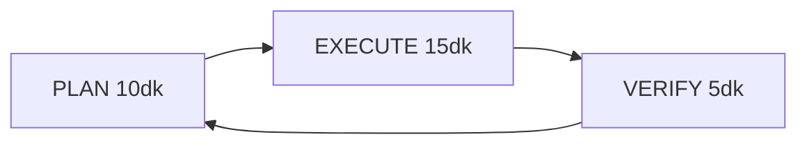

# Platform Sürekli Geliştirme Döngüsü (INFINITE 10dk)

**Mandate:** Her **10 dakikada** audit → plan → execute → verify → plan (sonsuz).  
**Koordinatör:** Platform Coordinator · **Job:** `AGENT_LOOP_TICK_platform_coord` (**600s**)  
**Politika:** Onaysız orkestra atama · commit/deploy yok

---

## 1. Sonsuz döngü (PLAN → EXECUTE → VERIFY → PLAN)

| Faz | Süre | Çıktı |
|-----|------|--------|
| **PLAN** | 0–2 dk | `PLATFORM_10DK_PLAN_SABLONU.md` |
| **EXECUTE** | 2–8 dk | Orkestra H1–H14 kod/SS/migration |
| **VERIFY** | 8–10 dk | `dotnet build -o .coord-build` · KPI |

**Wave ID formatı:** `Wave-{Roman}-YYYYMMDD-HHMM`  
Örnek sıra: `Wave-I-20260523-0100` → `Wave-II-20260523-0130` → `Wave-III-20260523-0200` …

---

## 2. On paralel akış (H1–H10)

| Stream | Owner (Orkestra) | Odak | Bu döngü öncelik |
|--------|------------------|------|------------------|
| **H1** | `fe-otel-public` (Frontend Ork Kamu) | Liste/harita/detay, SEO URL, PageSpeed | P1 bakım |
| **H2** | `fe-partner` (Partner FE Ork) | 47 sayfa SS, komisyon, paket | P0 SS |
| **H3** | `fe-admin` / **H3_admin_master** | En gelişmiş admin — T350–T370 | **P0 ana hat** |
| **H4** | `fe-user` (User FE Ork) | 17 sayfa SS + loyalty sync | P1 |
| **H5** | `fe-satis` (Satis FE Ork) | Shell + rapor SS | P2 |
| **H6** | `fe-firma` (Firma FE Ork) | Rezervasyon E2E + kalan mobile | P1 |
| **H7** | `ork-guvenlik` (Security Ork) | CSRF, RBAC, fraud hook | P0 gate |
| **H8** | `ork-backend` (DB-Services Ork) | Migration, API, webhooks backend | P0 |
| **H9** | `ork-seo` (SEO Ork) | Canonical, schema, A/B SEO | P1 |
| **H10** | `master-cto` (Master CTO) | K1–K8 kapıları, T314 final | Son kapı |

---

## 3. KPI bloğu (her VERIFY sonunda güncellenir)

| KPI | Hedef | Güncel (2026-05-23 Wave-I) | Kanıt |
|-----|-------|----------------------------|--------|
| **Build** | 0 hata | ✅ 0 hata (`dotnet restore` + build `-o .coord-build`) | `dotnet build -o .coord-build` |
| **FE-CTO** | 151/151 onay | **6/151** | `FRONTEND_ORKESTRATOR_PLAN.md` |
| **K1** Build | ✅ | ✅ | coord-build |
| **K2** DB migration staging | ✅ | 🔄 | `Database/MigrationsSql/` |
| **K3** Güvenlik | ✅ | 🔄 kısmi | T301/T302 done |
| **K4** FE-CTO 151 | ✅ | ❌ 6/151 | — |
| **K5** Kamu Lighthouse ≥90 | ✅ | 🔄 | T304 done kod |
| **K6** SEO set | ✅ | 🔄 | T305 |
| **K7** Smoke Faz 8 | ✅ | ❌ | — |
| **K8** İş E2E | ✅ | 🔄 | rezervasyon/komisyon kısmi |
| **Canlıya hazır** | `evet` | **hayır** | Tüm K* gerekli |

---

## 4. Akış çıkış kriterleri (cycle exit per stream)

| Stream | Exit criteria (bu 10dk turu “done” sayılır) |
|--------|---------------------------------------------|
| **H1** | Kamu 3’lü build pass + 0 runtime; en az 1 yeni SS path dokümante |
| **H2** | Partner: atanmış T-ID `done` + ilgili sayfa `*.mobile.css` smoke |
| **H3** | Admin: P0 roadmap maddesi kodlandı VEYA SS batch + table-cards kanıt |
| **H4** | User: 2 sayfa PNG SS + PageCssMobile doğrulandı |
| **H5** | Satış: 1 sayfa SS + shell safe-area regression yok |
| **H6** | Firma: 1 E2E POST + 1 sayfa mobile.css tamam |
| **H7** | Güvenlik: yeni endpoint CSRF audit satırı ✅ veya fraud hook stub |
| **H8** | Backend: idempotent migration dosyası + build interface uyumu |
| **H9** | SEO: 1 canonical/etiket düzeltmesi veya schema örneği |
| **H10** | Master: KPI tablosu güncellendi; blokaj notu `ORKESTRA_DURUM_KONTROL` |

---

## 5. Wave-I görev özeti (T326–T370)

Tam registry: `CTO_AJAN_ATAMA_KUYRUGU.md` · Detay roadmap: `Docs/ADMIN_PANEL_MASTER_ROADMAP.md`

| T-ID | Stream | Özet | Durum |
|------|--------|------|--------|
| T326 | H8 | Build gate / coord-build verify | done |
| T327–T329 | H1 | OtelDetay SS, liste polish, harita cluster (wave_i kamu) | assigned |
| T330 | H3 | Admin auth test user + SS unblock | assigned |
| T331 | H2 | Partner SS batch-1 | assigned |
| T332 | H6 | Firma kalan mobile+SS | assigned |
| T333 | H3 | FE-CTO 10 sayfa onay yolu | assigned |
| T334 | H3 | PlatformPackages SS (T322) | assigned |
| T335 | H8 | T324 Faz2 payment spec | assigned |
| T336–T338 | H10 | K1–K3 gate audit docs | assigned |
| T339 | H10 | Wave-I close snapshot | assigned |
| T340 | H9 | Homepage A/B (T369) | assigned |
| T341 | H1 | Map clustering v2 | assigned |
| T342–T343 | H4 | Wishlist sync + loyalty tie-in | assigned |
| T344 | H8 | e-Fatura monitor (T368) | assigned |
| T345 | H3 | 5651/5661 Faz2 admin | assigned |
| T346 | H9 | AI search placeholder (T370) | assigned |
| T347–T348 | H3 | Guest messaging + review SLA | assigned |
| T349 | H8 | Build gate pass | done |
| T350–T357 | H3/H7 | Admin P0: Revenue, SlowSql, Security, Upload, Bulk, Fraud | assigned |
| T358–T370 | H3/H8/H9 | Admin P1–P3 roadmap (bkz. ADMIN_PANEL_MASTER_ROADMAP) | assigned |

---

## 6. Operasyon bağlantıları

- **Aktif şablon (10dk):** `PLATFORM_10DK_PLAN_SABLONU.md`
- **Job:** `AGENT_LOOP_TICK_platform_coord` (600s) — `cycle_interval: 10m`
- Arşiv (30dk): `PLATFORM_30DK_PLAN_SABLONU.md`
- Gap analizi: `Docs/PLATFORM_OZELLIK_GAP_ANALIZI.md`
- Köşe audit: `Docs/PLATFORM_TAM_KONTROL_AUDIT_WAVE-IV.md` · `Docs/AUTH_REZERVASYON_E2E_AUDIT.md`
- Panel eksiklikleri: `Docs/ORKESTRA_PANEL_EKSIKLIKLER.md`
- Koordinatör planı: `PLATFORM_KOORDINATOR_OPERASYON_PLANI.md` · snapshot: `ORKESTRA_DURUM_KONTROL.md`

*Git commit ve canlı deploy yalnızca kullanıcı onayı ile.*
