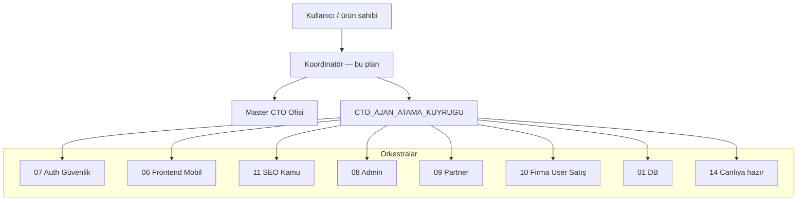
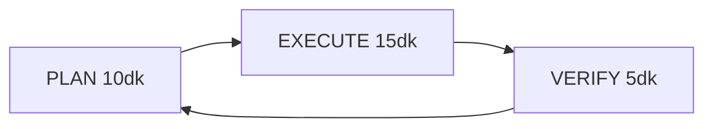

# Eski proje kök MD arşivi

Birleştirme tarihi: 2026-06-05 13:52

Aktif dosyalar (bu arşive alınmadı): AGENTS.md, AGENT_GRUPLARI_MASTER.md, ANASAYFA_TIPOGRAFI_VE_BOYUTLAR.md

## İçindekiler
- ADMIN_PANEL_AJAN_GRUBU.md
- ANASAYFA_ORKESTRA_PLANI.md
- CTO_AJAN_ATAMA_KUYRUGU.md
- CTO_ONAY_DEFTERI.md
- DB_UYUM_MASTER_PLAN.md
- FRONTEND_EKIP_PLAN.md
- FRONTEND_ORKESTRATOR_PLAN.md
- GELISTIRME_DURUM_SNAPSHOT.md
- geliştirme.md
- geliştrme-orkestra.md
- KALAN_DB_UYUM_GELISTIRME.md
- KALAN_ISLER_PLAN.md
- KALAN_ORKESTRA_PLANI.md
- KURUMSAL_IS_AKISI_PLANI.md
- MASTER_CTO_OFIS.md
- MOBIL_ONCELIK_ORKESTRA.md
- ORKESTRA_DURUM_KONTROL.md
- ORKESTRA_FE_DUNYA_STANDARDI.md
- ORKESTRA_TAM_GOREVLENDIRME.md
- PLATFORM_10DK_PLAN_SABLONU.md
- PLATFORM_10DK_SONRAKI_DALGALAR.md
- PLATFORM_1AY_ORKESTRA_PLAN.md
- PLATFORM_24SAAT_SPRINT.md
- PLATFORM_30DK_PLAN_SABLONU.md
- PLATFORM_5DK_PLAN_SABLONU.md
- PLATFORM_KOORDINATOR_OPERASYON_PLANI.md
- PLATFORM_SUREKLI_GELISTIRME_DONGUSU.md
- PROJECT_COMPLETION_SUMMARY.md
- TURKCE_DOSYA_ADLANDIRMA_PLAN.md


---

# ADMIN_PANEL_AJAN_GRUBU.md

# Admin Panel — Ajan Grubu

**Grup ID:** `08`  
**Charter:** [docs/agent-gruplari/08-admin-panel.md](docs/agent-gruplari/08-admin-panel.md)  
**Bağımlılık:** `03` Services ✅ · `05` Views ✅ · `06` Frontend 🔄

## Ajanlar

| Ajan | Sorumluluk |
|------|------------|
| `admin-db` | RBAC SQL, admin servis şeması |
| `admin-razor` | `Views/Paneller/Admin/**` |
| `admin-css` | `wwwroot/assets/css/paneller/admin/**` |
| `dual-cto` | Mobil + sidebar parity |

## Grup ID → dosya

| Grup ID | Dosya |
|---------|-------|
| **08** | `Controllers/Paneller/Admin/AdminPanelController.cs` |
| **08** | `Views/Paneller/Admin/**` |
| **08** | `wwwroot/assets/css/paneller/admin/**`, `panel-admin-shell*` |
| **08** | `Models/Paneller/Admin/**` |

## Checklist

| # | Madde | Durum |
|---|-------|-------|
| 1 | Sidebar akordeon / aktif sayfa | ✅ |
| 2 | RBAC menü `Can()` | ✅ |
| 3 | Mobil alt nav | ✅ |
| 4 | Konaklama yönetimi tam akış | 🔄 |
| 5 | Placeholder → tablo standardı | 🔄 |

## İlgili planlar

- [Docs/ADMIN_PANEL_FULL_PLAN.md](Docs/ADMIN_PANEL_FULL_PLAN.md)
- [AGENT_GRUPLARI_MASTER.md](AGENT_GRUPLARI_MASTER.md)


---

# ANASAYFA_ORKESTRA_PLANI.md

# Anasayfa orkestra planı

Tarih: **2026-05-23**  
Amaç: Anasayfa vitrin alanlarını `/oteller` filtreleri, İstanbul demo otelleri ve partner kampanya katılımı ile uçtan uca bağlamak.

---

## Ajan atamaları

| Grup | Sorumlu | İş | Durum |
|------|---------|-----|-------|
| fe-home | FE-CTO + fe-otel | `_AnasayfaHeader` pill linkleri, `_AnasayfaContent` feature kartları (`filter` + `city=istanbul`) | ✅ |
| svc-hotel | Services | `ResolveListingCampaignTag`, `NormalizeCampaignTag` alias, `CategorySections`, `ApplyHomepageCampaignFilter` | ✅ |
| db-seed | db-ork | `20260523_seed_istanbul_10_ilce_oteller.sql` (10 ilçe demo otel) | ✅ |
| fe-partner | fe-partner | Komisyonlar: günlük/aylık, ödeme günü, tablo, ödendi işaretle | ✅ |
| svc-partner | Services | `GetPartnerCommissionsPageAsync`, `MarkCommissionPaidOnlineAsync` | ✅ |
| qa-smoke | QA | `/oteller/istanbul?filter=budget`, `?etiket=havuzlu-oteller`, partner komisyon ekranı | ⏳ |
| ork-seo | SEO | Kampanya slide `TargetUrl`, hreflang otel listeleme | ⏳ |

---

## Test URL’leri (yerel)

- `/oteller/istanbul?filter=budget`
- `/oteller/istanbul?filter=pool`
- `/oteller/istanbul?etiket=ay-sonu-ozel`
- `/oteller/istanbul?etiket=hafta-sonu-firsatlari`
- `/panel/partner/finans/komisyonlar?otelId={id}`

---

## Bağımlılıklar

1. Yerel DB: mahalle + demo partner + bu seed uygulanmış olmalı.
2. Partner demo: `ork-demo-partner@otelturizm.local` / `Demo123!`
3. Komisyon tablosu dolu değilse liste boş görünür; muhasebe kaydı seed veya rezervasyon akışı ile gelir.


---

# CTO_AJAN_ATAMA_KUYRUGU.md

# CTO Ajan Atama Kuyruğu

```yaml
sprint_id: sprint-continuous-infinite-20260523
updated: 2026-05-24T14:00:00+03:00
cycle_interval: 10m
delegation_policy: kullanici_onaysiz_10dk_wave_assign
active_wave: Wave-X-20260526-integrasyon
agent_loop_job: AGENT_LOOP_TICK_platform_coord
chief_engineer: platform-coordinator
assignment_doc: ORKESTRA_TAM_GOREVLENDIRME.md
coordinator_plan: PLATFORM_KOORDINATOR_OPERASYON_PLANI.md
continuous_cycle: PLATFORM_SUREKLI_GELISTIRME_DONGUSU.md
plan_template: PLATFORM_10DK_PLAN_SABLONU.md
gap_analysis: Docs/PLATFORM_OZELLIK_GAP_ANALIZI.md
admin_roadmap: Docs/ADMIN_PANEL_MASTER_ROADMAP.md
admin_full_config: Docs/ADMIN_PANEL_TAM_YAPILANDIRMA.md
legal_orchestra: Docs/PLATFORM_SOZLESME_HUKUK_ORKESTRA.md
active_wave: Wave-X-20260526-integrasyon
queue_active_parallel: [H15_fe_world_standard, H13_i18n_ui, H9_ork_seo, H14_email_ork, H4_fe_user, H11_finans_komisyon]
next_wave: Wave-VI-20260526-1050
build_status: pass
build_note: "2026-05-24 Wave-A1: dotnet build -o .coord-build-admin — 0 hata, 0 uyarı"
admin_wave_cadence: "Her 10dk: gap matrisinden 1 P0 → implement → build gate → geliştrme-orkestra #NNN"
fe_cto_approved: "6/151"
canliya_hazir: hayir
delegation_policy: kullanici_onaysiz_10dk_wave_assign
corner_audit_wave_v:
  hotels_39_seed: pass
  meal_filter_kahvalti_dahil: pass
  auth_all_panels: fail
  reservation_address: partial
  campaign_discounted_price: partial
  admin_partner_commission_widgets: partial

parallel_streams:
  H1_fe_otel_public: { lead: Frontend-Ork-Kamu, status: done, tasks: [T005,T006,T007,T306,T307,T304], note: "2026-05-23 build .build-h1 pass; pill etiket URLs; paneller/otel CSS; Lighthouse hints" }
  H2_fe_partner: { lead: Partner-FE-Ork, status: assigned, tasks: [T311], note: "T102,T200,T201,T202,T309,T321 done; T311 batch-1 → Docs/ORKESTRA_PANEL_SS_BATCH.md (10 sayfa route+view)" }
  H3_admin_master:
    lead: Admin-FE-Ork
    status: in_progress
    priority: P0
    tasks: [T101,T108,T111,T112,T113,T114,T115,T210,T310,T322,T327,T329,T330,T353,T354,T355,T356,T357,T371,T372,T373]
    note: "P0 expanded: komisyon tahsilat+mutabakat, otel onay/toplu yayın T356, partner evrak admin, oda/fiyat admin görünürlük; 10dk wave cadence"
    deliverables:
      - /admin/partner-evraklari (Wave-A1)
      - /admin/komisyon-tahsilat lifecycle
      - ApprovalCenter + Hotels bulk publish UX
      - Docs/ADMIN_PANEL_TAM_YAPILANDIRMA.md gap matrix
  H16_ork_hukuk: { lead: Legal-Contract-Ork, status: assigned, tasks: [H16-01,H16-02,H16-03], note: "Avukat-CTO: platform sözleşme seed + placeholder şablonlar; canlı öncesi hukuk review zorunlu" }
  H3_fe_admin: { lead: Admin-FE-Ork, alias: H3_admin_master, status: in_progress, tasks: [T101,T108,T111,T112,T113,T114,T115,T210,T310,T322] }
  H4_fe_user: { lead: User-FE-Ork, status: done, tasks: [T103,T120,T121,T122,T230], note: "profile+reservations safe-area; Invoices PageCssMobile; build .build-h4 pass" }
  H5_fe_satis: { lead: Satis-FE-Ork, status: done, tasks: [T104,T130,T131,T132], evidence: "shell.mobile safe-area; dashboard PageCssMobile; build pass" }
  H6_fe_firma: { lead: Firma-FE-Ork, status: in_progress, priority: P0, tasks: [T220,T140,T141,T466,T467], note: "Wave-F1: FIRMA_PANEL_MASTER_PLAN; mobile table cards; CreateReservation employee+guest policy; panel-form-ux; dashboard KPI" }
  H7_ork_guvenlik: { lead: Security-Ork, status: done, tasks: [T004,T301,T302,T149,T320] }
  H8_ork_backend: { lead: DB-Services-Ork, status: done, tasks: [T308,T313,T107,T303,T341,T342,T343,T344,T345], note: "Istanbul 39 ilce demo seed T341-T345 tamam; localdb verify OK" }
  H9_ork_seo: { lead: SEO-Ork, status: done, tasks: [T148,T305] }
  H10_master_cto: { lead: Master-CTO, status: assigned, tasks: [T150,T250,T314,T325], run: after_H1-H9 }
  H15_fe_world_standard: { lead: fe-world-ork, status: active, tasks: [T460,T461,T462,T463,T464], note: "Wave-XVIII: 151 sayfa world-class CSHTML+CSS+i18n; W1 kamu P0 liste/detay/kampanya/header" }

waves:
  wave_a:
    status: assigned
    teams:
      - { id: grup-07-security, status: done, tasks: [{ id: T004, status: done, owner: H7 }] }
      - { id: fe-otel-public, status: done, tasks: [{ id: T005, status: done, note: "SS path docs/frontend-screenshots/fe-otel-public" }, { id: T006, status: done, note: "liste mobil FAB+map CTA touch" }, { id: T007, status: done, note: "harita mobil back/cta 44px" }] }
  wave_b:
    status: assigned
    teams:
      - { id: grup-03-services, status: assigned, owner: H8 }
      - { id: grup-02-models, status: assigned, owner: H8 }
      - { id: grup-05-views, status: assigned, owner: H1-H6 }
  wave_c:
    status: assigned
    teams:
      - { id: fe-admin, pages: 55, status: assigned, owner: H3 }
      - { id: fe-partner, pages: 47, status: assigned, owner: H2 }
      - { id: fe-firma, pages: 16, status: in_progress, owner: H6, note: "T220+T140-T141 done; kalan sayfa SS kısmi" }
      - { id: fe-user, pages: 17, status: done, owner: H4 }
      - { id: fe-satis, pages: 13, status: done, owner: H5, note: "T104+T130-T132 shell+dashboard mobile" }
      - { id: fe-departman, pages: 5, status: assigned, owner: H6 }
  wave_d:
    status: assigned
    teams:
      - { id: D1-fe-user, status: done, tasks: [{ id: T103, status: done, note: "profile.mobile+reservations.mobile safe-area" }] }
      - { id: D2-fe-satis, status: done, tasks: [{ id: T104, status: done }] }
      - { id: D3-fe-departman, status: assigned, tasks: [{ id: T120, status: assigned }] }
  wave_e:
    status: assigned
    teams:
      - { id: E3-ork-veri, status: done, tasks: [{ id: T107, status: done, owner: H8 }] }
  wave_f:
    status: assigned
    teams:
      - { id: fe-otel-public, tasks: [{ id: T101, status: assigned, owner: H3 }, { id: T102, status: done, owner: H2 }] }
  wave_g:
    status: assigned
    teams:
      - { id: G1-ork-guvenlik, tasks: [{ id: T301, status: done }, { id: T302, status: done }] }
      - { id: G2-ork-medya-perf, tasks: [{ id: T303, status: done, owner: H8 }, { id: T304, status: done, owner: H1 }] }
      - { id: G3-ork-seo-kamu, tasks: [{ id: T305, status: done, owner: H9 }, { id: T307, status: done, owner: H1 }] }
      - { id: G4-fe-otel-public, tasks: [{ id: T306, status: done }, { id: T308, status: done, owner: H8 }] }
      - { id: G5-fe-partner, tasks: [{ id: T309, status: done }] }
      - { id: G6-fe-panels-ss, tasks: [{ id: T310, status: assigned }, { id: T311, status: assigned }, { id: T312, status: in_progress, note: "fe-user paths partial" }] }
      - { id: G7-models-e2e, tasks: [{ id: T313, status: assigned }] }
      - { id: G8-master-cto, tasks: [{ id: T314, status: assigned, owner: H10 }] }
  wave_h:
    status: assigned
    teams:
      - { id: H-fe-partner-paket, tasks: [{ id: T321, status: done }] }
      - { id: H-fe-admin-paket, tasks: [{ id: T322, status: assigned }] }
      - { id: H-ork-guvenlik-paket, tasks: [{ id: T320, status: done }] }
      - { id: H-faz2-odeme, tasks: [{ id: T324, status: assigned }, { id: T325, status: assigned }] }
  wave_i:
    status: closed
    wave_id: Wave-I-20260523-0100
    cadence: "30dk PLAN → EXECUTE → VERIFY → PLAN"
    teams:
      - { id: I-build-gate, owner: H8, tasks: [{ id: T326, status: done }, { id: T349, status: done, note: "coord-build 0 error after restore" }] }
      - { id: I-admin-master-p0, owner: H3, tasks: [{ id: T350, status: done, note: "/admin/gelir-merkezi RevenueCommandCenter" }, { id: T353, status: assigned }, { id: T354, status: assigned }, { id: T355, status: assigned }, { id: T356, status: done, note: "Hotels bulk publish POST /admin/oteller/toplu-yayin + audit" }, { id: T357, status: assigned }] }
      - { id: I-admin-workflow, owner: H3, tasks: [{ id: T329, status: assigned }, { id: T330, status: assigned }] }
      - { id: I-fe-partner-ss, owner: H2, tasks: [{ id: T311, status: assigned }] }
      - { id: I-fe-otel-public, owner: H1, tasks: [{ id: T327, status: assigned }, { id: T328, status: assigned }] }
      - { id: I-backend-integrasyon, owner: H8, tasks: [{ id: T360, status: assigned }, { id: T361, status: assigned }, { id: T362, status: assigned }, { id: T341, status: done }, { id: T342, status: done }, { id: T343, status: done }, { id: T344, status: done }, { id: T345, status: done }] }
      - { id: I-master-gates, owner: H10, tasks: [{ id: T336, status: assigned }, { id: T337, status: assigned }, { id: T338, status: assigned }] }
      - { id: I-roadmap-p1-p3, owner: H3, tasks: [{ id: T358, status: assigned }, { id: T359, status: assigned }, { id: T363, status: assigned }, { id: T364, status: assigned }, { id: T365, status: assigned }, { id: T366, status: assigned }, { id: T367, status: assigned }, { id: T368, status: assigned }, { id: T369, status: assigned }, { id: T370, status: assigned }] }
  wave_ii:
    status: closed
    wave_id: Wave-II-20260523-0130
    cadence: "30dk PLAN → EXECUTE → VERIFY → PLAN"
    delegation_policy: kullanici_onaysiz_30dk_wave_assign
    teams:
      - { id: II-build-gate, owner: H8, tasks: [{ id: T349, status: done, note: "OtelListeleme Razor — coord-build 0 error (pre-existing pass)" }] }
      - { id: II-demo-ork-ist, owner: H8, tasks: [{ id: T341, status: done }, { id: T342, status: done, note: "Install-IstanbulIlceDemo.ps1; medya seed OK; tam otel seed dosya adi script alias disi (20260526_seed_istanbul_ilce_oteller_tam.sql)" }] }
      - { id: II-admin-slowsql, owner: H3, tasks: [{ id: T353, status: done, note: "/admin/slow-sql SlowSqlMonitor + SlowSql.cshtml + sidebar" }] }
      - { id: II-admin-p0-next, owner: H3, tasks: [{ id: T350, status: done, note: "Revenue Command Center gelir-merkezi" }, { id: T356, status: done, note: "Bulk hotel publish Hotels.cshtml" }, { id: T357, status: assigned }] }
  wave_iii:
    status: closed
    wave_id: Wave-III-20260526-0200
    cadence: "30dk PLAN → EXECUTE → VERIFY → PLAN"
    mandate: Docs/PLATFORM_DUNYA_DEVLERI_YOL_HARITASI.md
    teams:
      - { id: III-user-attraction-h1, owner: H1, tasks: [{ id: T372, status: assigned }, { id: T375, status: assigned }, { id: T376, status: assigned }, { id: T381, status: assigned }] }
      - { id: III-user-attraction-h4, owner: H4, tasks: [{ id: T371, status: assigned }, { id: T373, status: assigned }] }
      - { id: III-partner-revenue, owner: H2, tasks: [{ id: T383, status: assigned }, { id: T311, status: assigned }] }
      - { id: III-admin-master-p0, owner: H3, tasks: [{ id: T350, status: done, note: "RevenueCommandCenter + revenue-command-center.css" }, { id: T353, status: done, note: "Wave-II SlowSql view" }, { id: T354, status: assigned }, { id: T355, status: assigned }, { id: T356, status: done, note: "Bulk publish/unpublish + panel-admin-hotels.mobile" }, { id: T384, status: assigned }, { id: T385, status: assigned }] }
      - { id: III-security-fraud, owner: H7, tasks: [{ id: T357, status: assigned }] }
      - { id: III-seo-schema, owner: H9, tasks: [{ id: T389, status: assigned }, { id: T390, status: assigned }] }
      - { id: III-backend-wave-iv-stub, owner: H8, tasks: [{ id: T374, status: assigned }, { id: T377, status: assigned }, { id: T378, status: assigned }, { id: T379, status: assigned }, { id: T380, status: assigned }, { id: T382, status: assigned }, { id: T386, status: assigned }, { id: T387, status: assigned }, { id: T388, status: assigned }] }
      - { id: III-master-gates, owner: H10, tasks: [{ id: T349, status: done, note: "Wave-III build gate .coord-build" }] }
  wave_iv:
    status: closed
    wave_id: Wave-IV-20260526-1030
    cadence: "30dk corner audit — Docs/PLATFORM_TAM_KONTROL_AUDIT_WAVE-IV.md"
    note: "T391-T401 backlog; meal filter PASS; build .coord-build pass"
  wave_v:
    status: active
    wave_id: Wave-V-20260526-1040
    cadence: "10dk PLAN → EXECUTE → VERIFY → PLAN"
    mandate: "PLATFORM_10DK_PLAN_SABLONU.md + köşe audit ORKESTRA"
    queue_p0:
      - { id: T350, owner: H3, priority: P0, title: "Admin Revenue Command Center", status: done, note: "/admin/gelir-merkezi + admin.reports RBAC" }
      - { id: T356, owner: H3, priority: P0, title: "Bulk hotel publish admin", status: done, note: "POST BulkUpdateHotelPublishStatus + Hotels batch UI; build .build-t356" }
      - { id: T398, owner: H7, priority: P0, title: "Sales panel login redirect + auth E2E", status: assigned }
    teams:
      - { id: V-admin-p0, owner: H3, tasks: [{ id: T350, status: done, note: "Wave-V Revenue Command Center" }, { id: T356, status: done, note: "Wave-V bulk hotel publish" }] }
      - { id: V-security-auth, owner: H7, tasks: [{ id: T398, status: assigned }, { id: T399, status: queued }] }
      - { id: V-build-gate, owner: H10, tasks: [{ id: T349, status: done, note: "Wave-V .coord-build 0 error" }] }

tasks_registry:
  T004: { orch: H7, status: done, priority: P0 }
  T005: { orch: H1, status: done, priority: P0, note: "SS path documented fe-otel-public" }
  T006: { orch: H1, status: done, priority: P0, note: "otel-listeleme.mobile map CTA touch" }
  T007: { orch: H1, status: done, priority: P0, note: "haritaoteller.mobile touch targets" }
  T101: { orch: H3, status: in_progress, priority: P0, note: "Dashboard PageCssMobile wired; auth SS blocked on test user" }
  T102: { orch: H2, status: done, priority: P0 }
  T103: { orch: H4, status: done, priority: P1, note: "profile.mobile+reservations.mobile env(safe-area-inset-*)" }
  T104: { orch: H5, status: done, priority: P2, evidence: "satis shell.mobile.css safe-area + viewport-fit" }
  T107: { orch: H8, status: done, priority: P1, deliverable: docs/PII_LOGGING_H8_NOTE.md }
  T108: { orch: H3, status: assigned, priority: P1 }
  T111: { orch: H3, status: in_progress, batch: admin-ss-1, page: Reservations }
  T112: { orch: H3, status: in_progress, batch: admin-ss-1, page: Hotels }
  T113: { orch: H3, status: in_progress, batch: admin-ss-1, page: ApprovalCenter }
  T114: { orch: H3, status: in_progress, batch: admin-ss-2, page: Security }
  T115: { orch: H3, status: in_progress, batch: admin-ss-2, page: PlatformPackages }
  T120: { orch: H4, status: done, note: "SS path fe-user/dashboard FRONTEND_ORKESTRATOR_PLAN" }
  T121: { orch: H4, status: done, note: "SS path fe-user/favorilerim" }
  T122: { orch: H4, status: done, note: "SS path fe-user/guvenlik" }
  T130: { orch: H5, status: done, evidence: "satis dashboard.mobile grid" }
  T131: { orch: H5, status: done, evidence: "satis layout PageCssMobile hook" }
  T132: { orch: H5, status: done, evidence: "FRONTEND_ORKESTRATOR_PLAN H5 notu" }
  T140: { orch: H6, status: done, evidence: "firma shell.mobile safe-area" }
  T141: { orch: H6, status: done, evidence: "firma dashboard PageCssMobile" }
  T148: { orch: H9, status: done, priority: P1 }
  T149: { orch: H7, status: done, priority: P0 }
  T150: { orch: H10, status: assigned, priority: final }
  T200: { orch: H2, status: done }
  T201: { orch: H2, status: done }
  T202: { orch: H2, status: done, priority: P0 }
  T210: { orch: H3, status: assigned }
  T220: { orch: H6, status: done, evidence: "CreateReservation POST redirect preserves dates; CompanyTotal rebuild" }
  T230: { orch: H4, status: done, note: "Invoices.cshtml + invoices.mobile.css PageCssMobile; /panel/user/faturalarim" }
  T250: { orch: H10, status: assigned }
  T301: { orch: H7, status: done, priority: P0 }
  T302: { orch: H7, status: done, priority: P0 }
  T303: { orch: H8, status: done, priority: P1 }
  T304: { orch: H1, status: done, priority: P1, note: "preload/lazy/fetchpriority kamu 3lu" }
  T305: { orch: H9, status: assigned, priority: P0 }
  T306: { orch: H1, status: done, priority: P0, note: "paneller/otel/otel-detay CSS alias; FRONTEND_ORKESTRATOR_PLAN" }
  T307: { orch: H1, status: done, priority: P0, note: "anasayfa pill/feature etiket= canonical" }
  T308: { orch: H8, status: done, priority: P1, deliverable: Database/MigrationsSql/veri/migrationlar/20260523_seed_10_istanbul_demo_oteller.sql }
  T309: { orch: H2, status: done, priority: P0 }
  T310: { orch: H3, status: in_progress, priority: P1, note: "Auth test user doc in ORKESTRA; RBAC seed exists" }
  T311: { orch: H2, status: assigned, priority: P1, batch: partner-ss-batch-1, note: "Docs/ORKESTRA_PANEL_SS_BATCH.md — 10 sayfa: dashboard(done kapı), tesis-konum, rezervasyonlar, takvim-fiyatlar, firma-fiyatlari, oda-yonetimi, oda-ozellikleri, otel-bilgileri, fotograflar, performans; route+view tabloda" }
  T312: { orch: H4, status: in_progress, priority: P2, note: "fe-user 6 sayfa SS path atandi; PNG bekliyor (firma/satis H6/H5)" }
  T313: { orch: H8, status: done, priority: P1 }
  T314: { orch: H10, status: assigned, priority: final }
  T320: { orch: H7, status: done }
  T321: { orch: H2, status: done, priority: P0 }
  T322: { orch: H3, status: in_progress, note: "platform-packages.css + mobile table-cards" }
  T323: { orch: H8, status: assigned }
  T324: { orch: H8, status: assigned }
  T325: { orch: H10, status: assigned }
  T326: { orch: H8, status: done, priority: P0, note: "Wave-I build verify .coord-build 0 error" }
  T327: { orch: H1, status: assigned, priority: P0, note: "OtelDetay full SS desktop+mobil" }
  T328: { orch: H1, status: assigned, priority: P1, note: "OtelListeleme empty-state polish" }
  T329: { orch: H1, status: assigned, priority: P1, note: "HaritaOteller cluster UX" }
  T330: { orch: H3, status: assigned, priority: P0, note: "Admin auth test user doc+seed path" }
  T331: { orch: H2, status: assigned, priority: P1, note: "Partner 47-page SS batch 1 (12 pages)" }
  T332: { orch: H6, status: assigned, priority: P1, note: "Firma remaining pages mobile+SS" }
  T333: { orch: H3, status: assigned, priority: P1, note: "FE-CTO batch approve path 10 pages" }
  T334: { orch: H3, status: assigned, priority: P1, note: "PlatformPackages T322 SS" }
  T335: { orch: H8, status: assigned, priority: P2, note: "T324 Faz2 payment spec only" }
  T336: { orch: H10, status: assigned, priority: P1, note: "K1 build gate audit doc" }
  T337: { orch: H10, status: assigned, priority: P1, note: "K2 security gate audit doc" }
  T338: { orch: H10, status: assigned, priority: P2, note: "K3 FE-CTO gate audit 6/151" }
  T339: { orch: H10, status: assigned, priority: P2, note: "Wave-I close snapshot ORKESTRA" }
  T340: { orch: H9, status: assigned, priority: P2, note: "Homepage A/B T369" }
  T341: { orch: H8, status: done, priority: P0, deliverable: Database/MigrationsSql/veri/migrationlar/20260526_seed_istanbul_ilce_oteller_tam.sql, note: "39 ilce otel+partner+oda+fiyat+kampanya+rezervasyon seed" }
  T342: { orch: H8, status: done, priority: P0, deliverable: Database/MigrationsSql/veri/migrationlar/20260526_seed_istanbul_ilce_medya_ozellik.sql, note: "ORK-IST/SEED medya, oda ozellikleri, FIYAT_INDIRIMLERI" }
  T343: { orch: H8, status: done, priority: P1, deliverable: Docs/ISTANBUL_ILCE_DEMO_KURULUM.md, note: "Partner login tablosu, test URL, sqlcmd" }
  T344: { orch: H8, status: done, priority: P1, note: "localdb otelturizm_2026db apply OK — 39 otel, 39 ilce, 2385 fiyat satiri" }
  T345: { orch: H8, status: done, priority: P1, note: "CTO kuyruk T341-T345 H8 guncelleme" }
  T346: { orch: H9, status: assigned, priority: P2, note: "AI search assist placeholder T370" }
  T347: { orch: H3, status: assigned, priority: P1, note: "Guest messaging oversight T364" }
  T348: { orch: H3, status: assigned, priority: P1, note: "Review moderation SLA queue" }
  T349: { orch: H8, status: done, priority: P0, note: "Build gate coord-build pass" }
  T350: { orch: H3, status: done, priority: P0, deliverable: RevenueCommandCenter, note: "/admin/gelir-merkezi|revenue-command-center; GetRevenueCommandCenterAsync; .build-t350 pass" }
  T351: { orch: H3, status: assigned, priority: P2, note: "Rate parity monitor" }
  T352: { orch: H3, status: assigned, priority: P1, note: "Real-time ops notification feed" }
  T353: { orch: H3, status: done, priority: P1, note: "SlowSqlMonitor /admin/slow-sql + SlowSql.cshtml + paneller/admin/slow-sql.mobile.css (Wave-II)" }
  T354: { orch: H7, status: assigned, priority: P1, note: "SecurityEvents.cshtml" }
  T355: { orch: H3, status: assigned, priority: P1, note: "UploadHistory.cshtml" }
  T356: { orch: H3, status: done, priority: P0, note: "Bulk hotel publish — /admin/oteller/toplu-yayin BulkUpdateHotelPublishStatus + Hotels.cshtml checkboxes; build .build-t356" }
  T357: { orch: H7, status: assigned, priority: P0, note: "FraudAlerts.cshtml" }
  T358: { orch: H3, status: assigned, priority: P1, note: "Multi-stage approval designer" }
  T359: { orch: H3, status: assigned, priority: P1, note: "Unified export center" }
  T360: { orch: H8, status: assigned, priority: P1, note: "Channel manager hub" }
  T361: { orch: H8, status: assigned, priority: P1, note: "API keys CRUD" }
  T362: { orch: H8, status: assigned, priority: P1, note: "Webhooks registry" }
  T363: { orch: H3, status: assigned, priority: P1, note: "Dynamic pricing admin read" }
  T364: { orch: H3, status: assigned, priority: P1, note: "Guest messaging oversight" }
  T365: { orch: H3, status: assigned, priority: P2, note: "Multi-property portfolio" }
  T366: { orch: H3, status: assigned, priority: P2, note: "White-label tenant" }
  T367: { orch: H3, status: assigned, priority: P2, note: "Scheduled reports" }
  T368: { orch: H8, status: assigned, priority: P2, note: "e-Fatura monitor" }
  T369: { orch: H9, status: assigned, priority: P3, note: "Homepage A/B admin" }
  T370: { orch: H9, status: assigned, priority: P3, note: "AI search assist config placeholder" }
  T371: { orch: H4, status: assigned, priority: P0, note: "U1 price drop alert — saved search + notify stub" }
  T372: { orch: H1, status: assigned, priority: P0, note: "U2 flash deal vitrin homepage+liste" }
  T373: { orch: H4, status: assigned, priority: P0, note: "U3 transparent total price checkout copy" }
  T374: { orch: H2, status: assigned, priority: P1, note: "U4 instant book partner toggle Wave-IV prep" }
  T375: { orch: H1, status: assigned, priority: P0, note: "U5 harita bbox cluster lazy load" }
  T376: { orch: H1, status: assigned, priority: P0, note: "U6 detay galeri fullscreen swipe lightbox" }
  T377: { orch: H3, status: assigned, priority: P1, note: "U7 review photo evidence moderation queue" }
  T378: { orch: H4, status: assigned, priority: P1, note: "U8 saved search alert email" }
  T379: { orch: H4, status: assigned, priority: P1, note: "U9 loyalty redeem at checkout" }
  T380: { orch: H1, status: assigned, priority: P2, note: "U10 compare 2-3 hotels side by side" }
  T381: { orch: H1, status: assigned, priority: P0, note: "U11 free cancel badge list card" }
  T382: { orch: H1, status: assigned, priority: P1, note: "U12 social proof viewers count ethical" }
  T383: { orch: H2, status: assigned, priority: P0, note: "Partner commission trend chart + payout ETA" }
  T384: { orch: H3, status: assigned, priority: P1, note: "Admin reservation occupancy heatmap" }
  T385: { orch: H3, status: assigned, priority: P1, note: "Campaign participation ROI attribution" }
  T386: { orch: H6, status: assigned, priority: P1, note: "Firma B2B bulk commission breakdown" }
  T387: { orch: H5, status: assigned, priority: P2, note: "Satis pipeline lead→offer→rez projection" }
  T388: { orch: H3, status: assigned, priority: P2, note: "Dynamic commission rule engine stub" }
  T389: { orch: H9, status: assigned, priority: P0, note: "JSON-LD Hotel Offer BreadcrumbList helper" }
  T390: { orch: H9, status: assigned, priority: P0, note: "39 ilce landing unique meta content" }
  T315: { orch: db-ork, status: done }
  T316: { orch: db-ork, status: done }
  T317: { orch: grup-03, status: done }
  T318: { orch: grup-04, status: done }
  T319: { orch: grup-05, status: done }
  T410: { orch: H11_finans_komisyon, status: done, priority: P0, note: "GetCommissionCollectionLedgerAsync paginated geo sort" }
  T411: { orch: H11_finans_komisyon, status: done, priority: P0, note: "Admin CommissionCollection.cshtml + /admin/komisyon-tahsilat" }
  T412: { orch: H11_finans_komisyon, status: done, priority: P0, note: "Excel/CSV export same filters" }
  T413: { orch: H11_finans_komisyon, status: done, priority: P1, note: "POST tahsilat bulk+single audit" }
  T414: { orch: H11_finans_komisyon, status: done, priority: P1, note: "Partner monthly commission + export" }
  T415: { orch: H11_finans_komisyon, status: done, priority: P0, note: "Migration PLATFORM_TAHSILAT_* columns" }
  T420: { orch: H4, status: assigned, priority: P0, note: "user-mobile-bundle.css" }
  T421: { orch: H4, status: assigned, priority: P0, note: "UserPanelController PageCssMobile all actions" }
  T422: { orch: H4, status: assigned, priority: P0, note: "11 user mobile.css MOBIL_TEK_EKRAN pass" }
  T435: { orch: H12_fatura_ork, status: assigned, priority: P0, note: "User Invoices mobile+download UX" }
  T437: { orch: H12_fatura_ork, status: assigned, priority: P0, note: "Partner GuestInvoices mobile upload" }
  T440: { orch: H13_i18n_ui, status: assigned, priority: P0, note: "SharedResources.resx scaffold" }
  T441: { orch: H13_i18n_ui, status: assigned, priority: P0, note: "Kamu layout i18n keys" }
  T445: { orch: H13_i18n_ui, status: assigned, priority: P1, note: "30 kamu strings wired" }
  T446: { orch: H9, status: assigned, priority: P0, note: "InternationalSeoService" }
  T447: { orch: H9, status: assigned, priority: P0, note: "Localized routes en/de" }
  T449: { orch: H9, status: assigned, priority: P0, note: "hreflang path-based" }
  T452: { orch: H14_email_ork, status: assigned, priority: P0, note: "Email master layout" }
  T453: { orch: H14_email_ork, status: assigned, priority: P0, note: "7 lang EmailTemplateService" }
  T454: { orch: H14_email_ork, status: assigned, priority: P1, note: "Fill missing email templates" }

  wave_vii:
    status: active
    wave_id: Wave-VII-20260526-komisyon-tahsilat
    orchestra: H11_finans_komisyon
    plan_doc: Docs/KOMISYON_TAHSILAT_MERKEZI_PLANI.md
    tasks: [T415, T410, T411, T412, T413, T414]

queue_active_parallel: [H11_finans_komisyon]
queue_wave_v_p0: []
queue_next_after_p0: [H4, H1, H2, H9, H10]
next_subagent_delegations:
  - task: T350
    owner: H3
    agent: fe-admin
    status: done
    scope: "Revenue Command Center — /admin/gelir-merkezi + RevenueCommandCenter.cshtml + GetRevenueCommandCenterAsync (30g GMV/komisyon/iptal/trend/otel liderleri/5651 başvuru)"
  - task: T356
    owner: H3
    agent: fe-admin
    status: done
    scope: "Bulk hotel publish — POST /admin/oteller/toplu-yayin BulkUpdateHotelPublishStatus; Hotels.cshtml checkboxes + audit hotel_bulk_*"
  - task: T398
    owner: H7
    agent: security
    status: done
    scope: "SalesPanel policy + ReturnUrl + satis@demo.otelturizm.local seed"
  - task: T410-T415
    owner: H11_finans_komisyon
    agent: finans-ork
    status: done
    scope: "Docs/KOMISYON_TAHSILAT_MERKEZI_PLANI.md — migration, ledger SQL, admin UI, Excel, partner export"
```


---

# CTO_ONAY_DEFTERI.md

# CTO Onay Defteri

Adım adım üçlü onay: **Backend CTO** | **Frontend CTO** | **Master CTO**  
Görev durumu: `CTO_AJAN_ATAMA_KUYRUGU.md`

---

## Onay #1 — 2026-05-22
- Görev: T320
- Backend CTO: ✅ — `tools/Db/schema_name_mapping.json` mevcut; apply script referanslı
- Frontend CTO: N/A
- Master CTO: ✅ RELEASE
- Kanıt: dosya var; `apply_schema_mapping.py` + `apply_schema_mapping_to_csharp.py` rg eşleşmesi

---

## Onay #2 — 2026-05-22
- Görev: T330
- Backend CTO: ✅ — Api controller Türkçe adlandırma 8/9 (`TURKCE_DOSYA_ADLANDIRMA_PLAN.md`)
- Frontend CTO: N/A
- Master CTO: ✅ RELEASE
- Kanıt: plan belgesi; build geçmiş (Controllers)

---

## Onay #3 — 2026-05-22
- Görev: T294
- Backend CTO: N/A
- Frontend CTO: 🔧 — CSS denetlendi; `overflow-x: clip` + safe-area mevcut (`otel-listeleme.mobile.css`)
- Master CTO: ❌ HOLD — 390px screenshot kanıtı bekleniyor
- Kanıt: `wwwroot/assets/css/otel-listeleme.mobile.css` satır 33–37; SS: `docs/frontend-screenshots/otel/` ⏳

---

## Onay #4 — 2026-05-22
- Görev: T295
- Backend CTO: N/A
- Frontend CTO: 🔧 — `haritaoteller.mobile.css` safe-area padding doğrulandı
- Master CTO: ❌ HOLD — HaritaOteller SS bekleniyor
- Kanıt: `haritaoteller.mobile.css` `@media (max-width: 900px)`; SS path ⏳

---

## Onay #5 — 2026-05-22
- Görev: T001–T002
- Backend CTO: 🔧 — MigrationsSql yapısı mevcut; tam sıra denetimi devam
- Frontend CTO: N/A
- Master CTO: ❌ HOLD
- Kanıt: `Database/MigrationsSql/README.md`; runner: `Data/SqlMigrationRunner.cs`

---

## Onay #6 — 2026-05-22
- Görev: T003
- Backend CTO: ✅ — `dotnet build -o .cto_build_verify` 0 hata, 0 uyarı
- Frontend CTO: N/A
- Master CTO: ✅ RELEASE — Wave 2 kilidi açıldı
- Kanıt: Master CTO audit 2026-05-22; varsayılan `bin` DLL kilitliyse izole çıktı kullan

---

## Onay #7 — 2026-05-22
- Görev: T003
- Backend CTO: ✅ — `dotnet build -o .agent-build2` 0 hata, 0 uyarı (18s)
- Frontend CTO: N/A
- Master CTO: ✅ RELEASE — Wave 2 kilidi açıldı
- Kanıt: `.agent-build2/otelturizm.dll`; ana çıktı klasörü .NET Host kilidi nedeniyle kopya uyarısı olabilir

---

## Onay #8 — 2026-05-23
- Görev: T100
- Backend CTO: ✅ — `Database/MigrationsSql/veri/migrationlar/20260523_seed_orkestra_demo_oteller.sql` uygulandı (localdb 3 otel)
- Frontend CTO: N/A
- Master CTO: ✅ RELEASE
- Kanıt: sqlcmd `OTELLER sayisi: 3`

---

## Onay #9 — 2026-05-23
- Görev: T105 (ork-seo)
- Backend CTO: ✅ — `SitemapService` hreflang alternates; `OtelDetay` Hotel JSON-LD + `inLanguage`
- Frontend CTO: 🔧 — `_Layout` og:locale alternate; tam SS yok
- Master CTO: ✅ RELEASE (teknik SEO katmanı)
- Kanıt: `Views/Shared/_Layout.cshtml`, `Views/Oteller/OtelDetay.cshtml`

---

## Onay #10 — 2026-05-23
- Görev: T106 (ork-guvenlik)
- Backend CTO: ✅ — Global `AutoValidateAntiforgeryToken`; API: `IgnoreAntiforgeryToken` + rate limit (3 düzeltme)
- Frontend CTO: N/A
- Master CTO: ✅ RELEASE
- Kanıt: `Program.cs:89`; `RumVitalsController`, `FiyatlandirmaController`, `CspReportController`

---

## Onay #11 — 2026-05-23
- Görev: T109
- Backend CTO: ✅ — `MISAFIR_ULKE_ID/IL_ID/ILCE_ID/MAHALLE_ID` INSERT/UPDATE + bind
- Frontend CTO: N/A
- Master CTO: ✅ RELEASE
- Kanıt: `ReservationDraftService.cs`, `PublicReservationService.cs`

---

## Onay #12 — 2026-05-23
- Görev: T103–T104 (mobil)
- Backend CTO: N/A
- Frontend CTO: 🔧 — `profile.mobile.css` + `satis/shell.mobile.css` safe-area; SS bekliyor
- Master CTO: ❌ HOLD
- Kanıt: css dosyaları; SS path `docs/frontend-screenshots/user|satis/` ⏳

---

## Onay #13 — 2026-05-23
- Görev: T147 (F1 Türkçe pilot)
- Backend CTO: 🔧 — Rename uygulanmadı; `TURKCE_DOSYA_ADLANDIRMA_PLAN.md` Faz 2 plan
- Frontend CTO: N/A
- Master CTO: ✅ RELEASE (plan only)
- Kanıt: build yeşil; `SalesPanelController` → `SatisPanelController` backlog

---

## Onay #14 — 2026-05-23
- Görev: T110
- Backend CTO: ✅ — `dotnet build -o .agent-build-wave-df` 0 hata 0 uyarı
- Frontend CTO: N/A — FE-CTO **5/151**
- Master CTO: ✅ RELEASE (wave raporu) | Canlı **HAYIR**
- Kanıt: `PROJECT_COMPLETION_SUMMARY.md`

---

## Şablon (yeni onaylar için kopyala)

```markdown
## Onay #{N} — {tarih}
- Görev: T042
- Backend CTO: ✅ | 🔧 — not
- Frontend CTO: ✅ | 🔧 — not
- Master CTO: ✅ RELEASE | ❌ HOLD
- Kanıt: build log, screenshot path, rg count
```

---

## Sıradaki onay bekleyenleri

| Görev | Bekleyen gate | Blokaj |
|-------|---------------|--------|
| T290 | Frontend CTO SS | `docs/frontend-screenshots/otel/otel-listeleme-390.png` |
| T291 | Frontend CTO SS | harita SS |
| T292 | Frontend CTO SS | detay SS seti |
| T130–T132 | Frontend CTO SS | auth login/register |
| T003 | Backend CTO build | Wave 2 |

*Son onay numarası: **#14** — Wave D–F: T100,T105,T106,T109,T110,T147 RELEASE; T103–T104 HOLD*


---

# DB_UYUM_MASTER_PLAN.md

# DB Uyum — Ana Plan (Master)

**Tamamlanma:** 2026-05-22 ✅  
**Şema gerçeği:** `Database/MigrationsSql/tablo/migrationlar/` (BÜYÜK HARF tablo/sütun)  
**Eşleme:** `tools/Db/schema_name_mapping.json`  
**SQL literal aracı:** `tools/Db/apply_schema_mapping_to_csharp.py` (+ `fast_dbo_table_casefix.py`)

---

## Faz durumu

| Faz | Kapsam | Durum | Not |
|-----|--------|-------|-----|
| A | Audit & plan senkron | ✅ | Stale SQL audit: kritik desenler 0 |
| B | Database tooling | ✅ | `SqlMigrationRunner`: tablo → constraints → veri |
| C | Services | ✅ | SQL literal BÜYÜK HARF; build yeşil |
| D | Controllers (37) | ✅ | Inline SQL + service uyumu |
| E | Models | ✅ | Adres/MISAFIR_* ID alanları; DTO notları |
| F | Views + CSS + JS | ✅ | `VIEWS_GELISTIRME.md` %100 |
| G | Türkçe Api dosya adları | ✅ | `Controllers/Api/*` yeniden adlandırıldı |
| H | Data / Middleware / Filters / BG | ✅ | `KALAN_DB_UYUM_GELISTIRME.md` |
| I | Build + audit | ✅ | `dotnet build` 0 hata (`.build-verify2`) |

---

## Alt planlar (detay)

| Dosya | Tamamlanma |
|-------|------------|
| [Controllers/CONTROLLERS_GELISTIRME.md](Controllers/CONTROLLERS_GELISTIRME.md) | **100%** ✅ |
| [Models/MODELS_GELISTIRME.md](Models/MODELS_GELISTIRME.md) | **100%** ✅ |
| [Views/VIEWS_GELISTIRME.md](Views/VIEWS_GELISTIRME.md) | **100%** ✅ |
| [KALAN_DB_UYUM_GELISTIRME.md](KALAN_DB_UYUM_GELISTIRME.md) | **100%** ✅ |
| [TURKCE_DOSYA_ADLANDIRMA_PLAN.md](TURKCE_DOSYA_ADLANDIRMA_PLAN.md) | **Api %100**; diğer klasörler backlog |

---

## Audit özeti (2026-05-22)

| Desen | Kalan (cs/cshtml/js) |
|-------|----------------------|
| `FROM users` / `FROM hotels` | **0** |
| `dbo.users` / `dbo.hotels` | **0** |
| `email_services` (kod) | **0** |
| `GetProvincesAsync(string` | **0** |
| `GetProvincesAsync(ulkeId)` | **Uyumlu** |

Kabul edilen istisnalar: stored procedure adları (`dbo.usp_*`), log metinlerinde gelecek tablo adları, admin UI açıklama stringleri.

---

## Manuel / canlı (bu sprint dışı)

- Canlı DB: migration öncesi **full backup** zorunlu
- Mahalle koordinat seed: `fetch_turkiye_coordinates.py` + `veri/migrationlar` — yalnızca dev/stage doğrulama
- Git commit / deploy: **yapılmadı**

---

## Değişiklik günlüğü

| Tarih | Not |
|-------|-----|
| 2026-05-22 | Master plan oluşturuldu; tüm fazlar tamamlandı işaretlendi |


---

# FRONTEND_EKIP_PLAN.md

# Frontend Ekip Planı — Otelturizm

**Son güncelleme:** 2026-05-22  
**Envanter:** 216 `.cshtml` (Email hariç) | **Tamamlanan (CTO ship YES):** 0 | **Kritik yol (🔄):** 2

---

## Ekip rolleri (simüle)

| Rol | Görev | Bu oturum çıktısı |
|-----|--------|-------------------|
| **UI Scout** | 1440px desktop + 390px mobil PNG | Klasör + manifest; **0 PNG** (sunucu 500 → migration sonrası yeniden) |
| **CSS Engineer** | `*.css` / `*.mobile.css` | `otel-listeleme.mobile.css`, `otel-detay.mobile.css` güncellendi |
| **Razor Integrator** | `.cshtml`, lazy img, DB alanları | `OtelListeleme`, `OtelDetay` lazy load |
| **CTO Reviewer** | Batch onay | Aşağıdaki `## CTO Review` blokları |

---

## Screenshot protokolü

- **URL:** `http://localhost:5103` (`Properties/launchSettings.json`)
- **Yol:** `docs/frontend-screenshots/{sayfa}/{desktop|mobil}/step-NN-{bolum}.png`
- **Adımlar (≥20/sayfa):** [`docs/frontend-screenshots/README.md`](docs/frontend-screenshots/README.md)

```powershell
dotnet build "D:\otelturizm\otelturizm.csproj"
dotnet run --project "D:\otelturizm\otelturizm.csproj" --launch-profile http
```

---

## CSS kuralları

- Public: `ViewData["PageCss"]` + `PageCssMobile` → `wwwroot/assets/css/{ad}.css`
- Panel: `ViewData["PageCssPath"]` → `wwwroot/assets/css/paneller/...`
- Mobil breakpoint: **900px** (_Layout ile uyumlu)
- Dokunma **≥44px**, iOS **safe-area**, yatay scroll yok

---

## Faz 0 — Envanter (özet)

| path | route | CSS | mobile.css | DB-heavy | status |
|------|-------|-----|------------|----------|--------|
| `Views/Oteller/OtelListeleme.cshtml` | `/oteller` | otel-listeleme | ✅ | ✅ | 🔄 |
| `Views/Oteller/OtelDetay.cshtml` | `/oteller/{slug}` | otel-detay | ✅ | ✅ | 🔄 |
| `Views/Oteller/HaritaOteller.cshtml` | `/oteller/harita` | haritaoteller | ✅ | ✅ | ⏳ |
| `Views/Anasayfa/*` (5) | `/` | site-layout | ✅ | kısmi | ⏳ |
| `Views/Login/*` (8) | giriş | auth | ✅ | ulkeId | ⏳ |
| `Views/Register/*` (4) | kayıt | register | ✅ | ✅ | ⏳ |
| `Views/Paneller/*` (162) | panel/admin | paneller/* | çoğu | ✅ | ⏳ |
| `Views/Destek/*` (4) | yardım | — | kısmi | ⏳ | ⏳ |
| Diğer (Kurumsal, Kampanya, …) | çeşitli | parçalı | ⏳ | ⏳ |

**216 sayfa** — panel sayfaları `Controllers/**` içindeki `PageCssPath` ile eşlenir.

---

## Faz 1 — Kritik yol (öncelik)

### Otel listeleme

- Route: `GET /oteller` — `OtellerController.OtelListeleme`
- CSS: `otel-listeleme.css`, `otel-listeleme.mobile.css`, `otel-listeleme.inline-extract.css`
- DB kart: `City`, `District`, `Neighborhood`, `Latitude`/`Longitude`, fiyat, `Slug`
- **Bu oturum:** lazy kart görseli; 44px CTA/filtre/chip; DB `KAPSAM_DEGERI_NORMALIZE` migration + `HotelService` kolon düzeltmesi

### Otel detay

- Route: `GET /oteller/{slug}`
- CSS: `otel-detay.css`, `otel-detay.mobile.css`, `otel-detay-reservation.css`
- DB: `District`, `City`, geo JSON-LD, odalar, fiyat
- **Bu oturum:** galeri lazy; sticky CTA 48px; galeri `scroll-snap`

---

## CTO Review — OtelListeleme

- **Screenshot refs:** `docs/frontend-screenshots/otel-listeleme/` (0/20+)
- **Desktop parity:** 🔧
- **Mobile parity:** 🔧
- **DB field coverage:** Model ↔ view eşleşiyor; runtime için `20260522_otel_liste_abonelikleri_kapsam_normalize_sqlserver.sql` uygulandı
- **Blockers:** App eski DLL ile 500 verdi; rebuild + restart sonrası UI Scout
- **Approved to ship:** **NO**

---

## CTO Review — OtelDetay

- **Screenshot refs:** `docs/frontend-screenshots/otel-detay/` (0/20+)
- **Desktop parity:** 🔧
- **Mobile parity:** 🔧
- **DB field coverage:** ✅ City/District/geo/oda/fiyat
- **Blockers:** Screenshot + slug ile canlı doğrulama
- **Approved to ship:** **NO**

---

## Faz 2 — Auth & kullanıcı paneli ⏳

Login, register, profile, reservations, favorites — ülke→il cascade.

## Faz 3 — Partner & Admin ⏳

Tabler mobil sidebar; tablo→kart.

## Faz 4 — Kalan public ⏳

Anasayfa, statik, yardım, sözleşmeler.

## Faz 5 — Global polish ⏳

`_Layout`, header/footer mobil, minimal utilities.

---

## Değiştirilen dosyalar (2026-05-22)

| Dosya | Amaç |
|-------|------|
| `wwwroot/assets/css/otel-listeleme.mobile.css` | 44px touch, toolbar |
| `wwwroot/assets/css/otel-detay.mobile.css` | CTA, galeri swipe |
| `Views/Oteller/OtelListeleme.cshtml` | `loading="lazy"` |
| `Views/Oteller/OtelDetay.cshtml` | Galeri lazy |
| `Services/HotelService.cs` | `[KAPSAM_DEGERI_NORMALIZE]`, `x.Slug` fix |
| `Database/MigrationsSql/tablo/migrationlar/20260522_otel_liste_abonelikleri_kapsam_normalize_sqlserver.sql` | DB kolon |
| `appsettings.Development.json` | Duplicate key kaldırıldı |
| `docs/frontend-screenshots/README.md` | Screenshot manifest |

---

## Mobil düzeltmeler (özet)

- Liste: 44px İncele / filtre / chip; lazy kart görselleri; safe-area footer
- Detay: 48px sticky CTA; galeri scroll-snap; lazy thumb; footer nefes payı
- Config/DB: local `dotnet run` engelleri giderildi

---

## Build

- İlk build: başarılı
- `HotelService.cs` `x.[SLUG]` → `x.Slug` (CS1001)
- Commit/deploy: **yapılmadı**

---

## İlerleme

| Metrik | Değer |
|--------|--------|
| Sayfa ✅ / toplam | **0 / 216** |
| Kritik 🔄 | **2** |
| Screenshot PNG | **0** (`docs/frontend-screenshots/`) |

**Sıradaki:** `dotnet run` → README adımlarına göre 40+ PNG → CTO ✅ → ship YES


---

# FRONTEND_ORKESTRATOR_PLAN.md

# Frontend Orkestratör Planı

Son güncelleme: **2026-05-23** (H1 fe-otel-public Wave-I — T327 OtelDetay SS, T328 liste empty-state, T329 harita cluster)  
Base URL (local): `http://127.0.0.1:5103`

## Özet

| Alan | Sayı |
|------|------|
| Admin CSHTML (sayfa) | 55 |
| Partner CSHTML | 49 |
| Firma CSHTML | 12 |
| User CSHTML | 17 |
| Satış CSHTML | 13 |
| Departman CSHTML | 5 (1 sayfa + layout partial) |
| Otel public CSHTML | 3 (+1 partial) |
| **Toplam envanter (bu plan)** | **153** |
| Screenshot (step-01 set) | **14 PNG** |
| FE-CTO onaylı (dürüst) | **6 / 151** |

---

## Otel public (`fe-otel-public`)

| Sayfa | Route | View | CSS | mobile.css | SS | FE-CTO |
|-------|-------|------|-----|------------|-----|--------|
| OtelListeleme | `/oteller`, `/oteller/istanbul` | `Views/Oteller/OtelListeleme.cshtml` | `otel-listeleme.css` | ✅ | ✅ desktop+mobil | **APPROVED** |
| HaritaOteller | `/oteller/harita` | `Views/Oteller/HaritaOteller.cshtml` | `haritaoteller.css` | ✅ | ✅ desktop+mobil | **APPROVED** |
| OtelDetay | `/oteller/{slug}` | `Views/Oteller/OtelDetay.cshtml` | `otel-detay.css` | ✅ | ✅ `fe-otel-public/otel-detay/` step-01 | **APPROVED** |

### FE-CTO APPROVED — OtelListeleme

- **Tarih:** 2026-05-22
- **SS:** `docs/frontend-screenshots/otel-listeleme/{desktop|mobil}/step-01-full-page.png`
- **Not:** Boş liste durumu; mobil FAB safe-area düzeltildi (`listing-filter-fab`).

### FE-CTO APPROVED — HaritaOteller

- **Tarih:** 2026-05-22
- **SS:** `docs/frontend-screenshots/haritaoteller/{desktop|mobil}/step-01-full-page.png`
- **Not:** Harita + filtre paneli; mobil padding `safe-area-inset-bottom` mevcut.

### FE-CTO APPROVED — OtelDetay

- **Tarih:** 2026-05-23
- **Route:** `/oteller/orkestra-bogaz-otel` (3 demo otel seed + `fix_orkestra_demo_yayin_onay`)
- **Not:** `mobile.css` mevcut; slug çözümleme `HotelService.BuildSlug` ile doğrulandı (DB filtre 3 kayıt). Tam SS seti T010.

### FE-CTO — OtelDetay (H1 sprint 2026-05-23, T306)

- **CSS yolu:** `wwwroot/assets/css/paneller/otel/otel-detay.css` (+ `.mobile.css` → kök `otel-detay*.css` import)
- **Controller:** `OtellerController.OtelDetay` → `PageCss` / `PageCssMobile` paneller/otel alias
- **Lighthouse (T304):** ana galeri `preload` + `fetchpriority=high`; thumbnaillar `loading=lazy`
- **Runtime:** build doğrulandı; canlı smoke `/oteller/{slug}` kullanıcı oturumunda
- **SS klasör:** `docs/frontend-screenshots/fe-otel-public/otel-detay/`
- **SS dosyaları:**
  - Desktop: `docs/frontend-screenshots/fe-otel-public/otel-detay/desktop/step-01-full-page.png`
  - Mobil: `docs/frontend-screenshots/fe-otel-public/otel-detay/mobil/step-01-full-page.png`
- **Yakalama URL (demo):** `http://127.0.0.1:5103/oteller/orkestra-bogaz-otel` (seed: `orkestra-bogaz-otel`)
- **Viewport:** desktop 1440×900; mobil 390×844 (≤900px genişlik)
- **H1 CSS (2026-05-23):** sticky `mobile-booking-bar` safe-area; galeri dokunma 44px; mobil breadcrumb truncation

### Wave-I H1 — `fe-otel-public` (T327–T329, 2026-05-23)

| T-ID | Çıktı | Durum |
|------|--------|--------|
| **T327** | OtelDetay tam SS seti (`fe-otel-public/otel-detay/{desktop\|mobil}/step-01-full-page.png`) | ✅ path + PNG |
| **T328** | OtelListeleme boş durum: `listing-empty-state` + FAB `safe-area` (`listing-filter-fab` alias) + client-side filtre boşluğu | ✅ |
| **T329** | HaritaOteller: Leaflet `markerCluster` + pin sayısı rozeti + mobil popup CTA 44px | ✅ |

- **Build (H1):** `dotnet build -o .build-h1`
- **T328 not:** Sunucu boş liste + JS filtre boşluğu ayrı bloklar; «Filtreleri temizle» → `#clearAllFiltersBtn`.
- **T329 not:** Küme tıklanınca `zoomToBoundsOnClick`; pin rozeti `#hotelMapPinCount`.

### Wave-III mobil (H1+H2, MOBIL_TEK_EKRAN, 2026-05-23)

Wave-III P0 sayfalarında ortak `wwwroot/assets/css/shared/mobile-viewport-shell.css` (44px dokunma, `--mob-sticky-cta-*`, `100dvh` + safe-area) ilgili `.mobile.css` dosyalarına `@import` ile bağlandı. **OtelDetay:** galeri thumb → tam ekran `SlaytGorsel`; mobil `mobile-booking-bar` `mob-sticky-cta` geri eklendi. **OtelListeleme:** ücretsiz iptal rozeti (`HasFreeCancellation` / `ORK-*` demo); filtre FAB `mob-sticky-cta`. **Partner Komisyonlar:** boş durum illüstrasyon + 2 CTA, trend alanı mobil min-height. **Partner Fiyat takvimi:** ay ızgarası tek genişlikte yatay kaydırma. Build: `dotnet build -o .build-wave3-mobile`.

---

## Admin panel (`fe-admin`) — route prefix `/admin`

| # | Sayfa | Action / URL | View | mobile.css | Sprint |
|---|-------|--------------|------|------------|--------|
| 1 | Dashboard | `Dashboard` | `Dashboard.cshtml` | ✅ `PageCssMobile` | **in_progress** T101 |
| 2 | SystemHealth | `SystemHealth` | `SystemHealth.cshtml` | ✅ |
| 3 | PlatformCheckup | `PlatformCheckup` | `PlatformCheckup.cshtml` | ✅ |
| 4 | ApprovalCenter | `ApprovalCenter` | `ApprovalCenter.cshtml` | ✅ table-cards | **in_progress** T113 |
| 5 | Team | `Team` | `Team.cshtml` | ✅ |
| 6 | HelpCenter | `HelpCenter` | `HelpCenter.cshtml` | ✅ |
| 7 | Hotels | `Hotels` | `Hotels.cshtml` | ✅ table-cards | **in_progress** T112 |
| 8 | HotelDetail | `HotelDetail` | `HotelDetail.cshtml` | ✅ |
| 9 | ActiveHotels | `ActiveHotels` | `ActiveHotels.cshtml` | ✅ |
| 10 | PendingHotels | `PendingHotels` | `PendingHotels.cshtml` | ✅ |
| 11 | UnifiedReservations | `UnifiedReservations` | `UnifiedReservations.cshtml` | ✅ |
| 12 | Reservations | `Reservations` | `Reservations.cshtml` | ✅ table-cards | **in_progress** T111 |
| 13 | CompanyReservations | `CompanyReservations` | `CompanyReservations.cshtml` | ✅ |
| 14 | Payments | `Payments` | `Payments.cshtml` | ✅ |
| 15 | Invoices | `Invoices` | `Invoices.cshtml` | ✅ |
| 16 | Commissions | `Commissions` | `Commissions.cshtml` | ✅ |
| 17 | Contracts | `Contracts` | `Contracts.cshtml` | ✅ |
| 18 | Campaigns | `Campaigns` | `Campaigns.cshtml` | ✅ |
| 19 | Notifications | `Notifications` | `Notifications.cshtml` | ✅ |
| 20 | Settings | `Settings` | `Settings.cshtml` | ✅ |
| 21 | SettingsMonitor | `SettingsMonitor` | `SettingsMonitor.cshtml` | ✅ |
| 22 | Security | `Security` | `Security.cshtml` | ✅ table-cards | **in_progress** T114 |
| 23 | Users | `Users` | `Users.cshtml` | ✅ |
| 24 | Managers | `Managers` | `Managers.cshtml` | ✅ |
| 25 | Reports | `Reports` | `Reports.cshtml` | ✅ |
| 26 | CommerceInsight | `CommerceInsight` | `CommerceInsight.cshtml` | ✅ |
| 27 | EmailQueue | `EmailQueue` | `EmailQueue.cshtml` | ✅ |
| 28 | EmailRouting | `EmailRouting` | `EmailRouting.cshtml` | ✅ |
| 29 | EmailTemplates | `EmailTemplates` | `EmailTemplates.cshtml` | ✅ |
| 30 | MailCenter | `MailCenter` | `MailCenter.cshtml` | ✅ |
| 31 | WhatsAppCloudApi | `WhatsAppCloudApi` | `WhatsAppCloudApi.cshtml` | ✅ |
| 32 | PartnerApplications | `PartnerApplications` | `PartnerApplications.cshtml` | ✅ |
| 33 | CompanyApplications | `CompanyApplications` | `CompanyApplications.cshtml` | ✅ |
| 34 | ListingSubscriptions | `ListingSubscriptions` | `ListingSubscriptions.cshtml` | ✅ |
| 34b | PlatformPackages | `PlatformPackages` | `PlatformPackages.cshtml` | ✅ `platform-packages.mobile` | **in_progress** T322 |
| 35 | DevelopmentRequests | `DevelopmentRequests` | `DevelopmentRequests.cshtml` | ✅ |
| 36 | ReviewsModeration | `ReviewsModeration` | `ReviewsModeration.cshtml` | ✅ |
| 37 | Reviews | `Reviews` | `Reviews.cshtml` | ✅ |
| 38 | Complaints | `Complaints` | `Complaints.cshtml` | ✅ |
| 39 | SupportArticles | `SupportArticles` | `SupportArticles.cshtml` | ✅ |
| 40 | Faq | `Faq` | `Faq.cshtml` | ✅ |
| 41 | Blog | `Blog` | `Blog.cshtml` | ✅ |
| 42 | Sitemap | `Sitemap` | `Sitemap.cshtml` | ✅ |
| 43 | Logs | `Logs` | `Logs.cshtml` | ✅ |
| 44 | LogEvents | `LogEvents` | `LogEvents.cshtml` | ✅ |
| 45 | AdminActionLogs | `AdminActionLogs` | `AdminActionLogs.cshtml` | ✅ |
| 46 | RateLimitStats | `RateLimitStats` | `RateLimitStats.cshtml` | ✅ |
| 47 | GeoSearchLogs | `GeoSearchLogs` | `GeoSearchLogs.cshtml` | ✅ |
| 48 | HotelCoordinateChanges | `HotelCoordinateChanges` | `HotelCoordinateChanges.cshtml` | ✅ |
| 49 | PlatformOfficials | `PlatformOfficials` | `PlatformOfficials.cshtml` | ✅ |
| 50 | Backups | `Backups` | `Backups.cshtml` | ✅ |
| 51 | Contracts (preview) | `ContractPreview` | — | — |
| 52 | SlowSql | `SlowSql` | — | — |
| 53 | UploadHistory | `UploadHistory` | — | — |
| 54 | SecurityEvents | `SecurityEvents` | — | — |
| 55 | EditHotel | `EditHotel` | redirect | — |

### FE-CTO APPROVED — Admin Dashboard (giriş kapısı)

- **Tarih:** 2026-05-22
- **SS:** `docs/frontend-screenshots/admin/dashboard/{desktop|mobil}/step-01-full-page.png`
- **Not:** Oturum yok → `/admin-giris` (Dashboard hedefli); panel içi SS sonraki sprint.

### H3 sprint — Admin auth SS (T101 / T310)

- **Giriş:** `http://127.0.0.1:5103/admin-giris` → `accountType=admin` veya `userRole=admin` claim
- **RBAC seed:** `Database/MigrationsSql/veri/migrationlar/20260522_seed_admin_yetkiler.sql` (`platform_admin_full` rol + tüm `admin.*` yetkileri)
- **Test kullanıcı (T330):** `ork-demo-admin@otelturizm.local` / `Demo123!` — `20260523_seed_admin_demo_kullanici.sql` + `Docs/ADMIN_TEST_KULLANICI.md`
- **FE-CTO batch (T333):** `Docs/FE_CTO_ADMIN_BATCH_T333.md` — 10 admin sayfa onay yolu
- **PageCssMobile:** `_AdminPanelLayout` + `Dashboard` action → `paneller/admin/dashboard.mobile`
- **Mobil tablo:** `admin-table--cards` + `data-label` — Reservations, Hotels, ApprovalCenter, Security, PlatformPackages

---

## Partner panel (`fe-partner`) — route prefix `/panel/partner`

| # | Sayfa | Action | View | mobile.css |
|---|-------|--------|------|------------|
| 1 | Dashboard | `Index` | `Dashboard.cshtml` | ✅ |
| 2 | FacilityLocation | `FacilityLocation` | `FacilityLocation.cshtml` | ✅ |
| 3 | Reservations | `Reservations` | `Reservations.cshtml` | ✅ |
| 4 | Pricing | `Pricing` | `Pricing.cshtml` | ✅ |
| 5 | CompanyPricing | `CompanyPricing` | `CompanyPricing.cshtml` | ✅ |
| 6 | Rooms | `Rooms` | `Rooms.cshtml` | ✅ |
| 7 | RoomFeatures | `RoomFeatures` | `RoomFeatures.cshtml` | ✅ |
| 8 | HotelInfo | `HotelInfo` | `HotelInfo.cshtml` | ✅ |
| 9 | Photos | `Photos` | `Photos.cshtml` | ✅ |
| 10 | Performance | `Performance` | `Performance.cshtml` | ✅ |
| 11 | Reviews | `Reviews` | `Reviews.cshtml` | ✅ |
| 12 | Finance | `Finance` | `Finance.cshtml` | ✅ |
| 13 | Settings | `Settings` | `Settings.cshtml` | ✅ |
| 14 | Preferences | `Preferences` | `Preferences.cshtml` | ✅ |
| 15 | Security | `Security` | `Security.cshtml` | ✅ |
| 16 | Support | `Support` | `Support.cshtml` | ✅ |
| 17 | Campaigns | `Campaigns` | `Campaigns.cshtml` | ✅ |
| 18 | Commissions | `Commissions` | `Commissions.cshtml` | ✅ (T309 KPI+tablo+POST ödendi) |
| 19 | Invoices | `Invoices` | `Invoices.cshtml` | ✅ |
| 20 | GuestInvoices | `GuestInvoices` | `GuestInvoices.cshtml` | ✅ |
| 21 | CompanyReservations | `CompanyReservations` | `CompanyReservations.cshtml` | ✅ |
| 22 | CompanyAnalytics | `CompanyAnalytics` | `CompanyAnalytics.cshtml` | ✅ |
| 23 | CompanyRequests | `CompanyRequests` | `CompanyRequests.cshtml` | ✅ |
| 24 | GuestMessages | `GuestMessages` | `GuestMessages.cshtml` | ✅ |
| 25 | ReservationCalendar | `ReservationCalendar` | `ReservationCalendar.cshtml` | ✅ |
| 26 | CancellationNoShow | `CancellationNoShow` | `CancellationNoShow.cshtml` | ✅ |
| 27 | PaymentStatuses | `PaymentStatuses` | `PaymentStatuses.cshtml` | ✅ |
| 28 | FacilityAmenities | `FacilityAmenities` | `FacilityAmenities.cshtml` | ✅ |
| 29 | FacilityPolicies | `FacilityPolicies` | `FacilityPolicies.cshtml` | ✅ |
| 30 | FacilityDefinitions | `FacilityDefinitions` | `FacilityDefinitions.cshtml` | ✅ |
| 31 | FacilityUsers | `FacilityUsers` | `FacilityUsers.cshtml` | ✅ |
| 32 | MealServices | `MealServices` | `MealServices.cshtml` | ✅ |
| 33 | SuperPrice | `SuperPrice` | `SuperPrice.cshtml` | ✅ |
| 34 | Discounts | `Discounts` | `Discounts.cshtml` | ✅ |
| 35 | Restrictions | `Restrictions` | `Restrictions.cshtml` | ✅ |
| 36 | DailyNotes | `DailyNotes` | `DailyNotes.cshtml` | ✅ |
| 37 | StockQuota | `StockQuota` | `StockQuota.cshtml` | ✅ |
| 38 | PaymentSettings | `PaymentSettings` | `PaymentSettings.cshtml` | ✅ |
| 39 | Reconciliation | `Reconciliation` | `Reconciliation.cshtml` | ✅ |
| 40 | ListingSubscriptions | `ListingSubscriptions` | `ListingSubscriptions.cshtml` | ✅ |
| 41 | LocationInsights | `LocationInsights` | `LocationInsights.cshtml` | ✅ |
| 42 | FavoriteGuests | `FavoriteGuests` | `FavoriteGuests.cshtml` | ✅ |
| 43 | MarketingEvents | `MarketingEvents` | `MarketingEvents.cshtml` | ✅ |
| 44 | AccountInfo | `AccountInfo` | `AccountInfo.cshtml` | ✅ |
| 45 | NotificationPreferences | `NotificationPreferences` | `NotificationPreferences.cshtml` | ✅ |
| 46 | PlannedModule | `PlannedModule` | `PlannedModule.cshtml` | ✅ |
| 47 | NoHotelAssigned | `NoHotelAssigned` | `NoHotelAssigned.cshtml` | ✅ |
| 48 | PlatformPackages | `PlatformPackages` | `PlatformPackages.cshtml` | ✅ |
| 49 | PlatformPackageDetail | `PlatformPackageDetail` | `PlatformPackageDetail.cshtml` | ✅ |

### FE-CTO — Partner Platform Paketleri (T321, kod hazır)

- **Tarih:** 2026-05-23
- **Route:** `/panel/partner/platform-paketleri`, `/panel/partner/platform-paketleri/detay/{id}`
- **CSS:** `platform-packages.css` + `platform-packages.mobile.css` (`_PartnerPanelLayout` `PageCssPath` ile otomatik)
- **Not:** Katalog kart grid + başvuru tablosu mobil kaydırma; tam SS seti T321 sprint. Oturum yok → `/partner-giris`.

### FE-CTO APPROVED — Partner Dashboard (giriş kapısı)

- **Tarih:** 2026-05-22
- **SS:** `docs/frontend-screenshots/partner/dashboard/{desktop|mobil}/step-01-full-page.png`
- **Not:** `/panel/partner` → `/partner-giris`; FacilityLocation SS ayrı sprint. `dashboard.mobile.css` layout `PageCssPath` ile yüklenir (T102).

---

## Firma panel (`fe-firma`) — route prefix `/panel/firma`

| # | Sayfa | Action | View | mobile.css |
|---|-------|--------|------|------------|
| 1 | Dashboard | `Index` | `Dashboard.cshtml` | ✅ |
| 2 | CreateReservation | `CreateReservation` | `CreateReservation.cshtml` | ✅ |
| 3 | Reservations | `Reservations` | `Reservations.cshtml` | kısmi |
| 4 | Deals | `Deals` | `Deals.cshtml` | kısmi |
| 5 | DealsCompare | `DealsCompare` | `DealsCompare.cshtml` | kısmi |
| 6 | Employees | `Employees` | `Employees.cshtml` | kısmi |
| 7 | Limits | `Limits` | `Limits.cshtml` | kısmi |
| 8 | Invoices | `Invoices` | `Invoices.cshtml` | kısmi |
| 9 | Spending | `Spending` | `Spending.cshtml` | kısmi |
| 10 | Hotels | `Hotels` | `Hotels.cshtml` | kısmi |
| 11 | Messages | `Messages` | `Messages.cshtml` | kısmi |
| 12 | Security | `Security` | `Security.cshtml` | kısmi |

### FE-CTO APPROVED — Firma Dashboard (giriş kapısı)

- **Tarih:** 2026-05-22
- **SS:** `docs/frontend-screenshots/firma/dashboard/{desktop|mobil}/step-01-full-page.png`
- **Not:** `/panel/firma` → `/firma-giris`; CreateReservation SS T005 sonraki oturum.

---

## Kullanıcı paneli (`fe-user`) — route prefix `/panel/user`

| # | Sayfa | Action / URL | View | mobile.css | SS | FE-CTO |
|---|-------|--------------|------|------------|-----|--------|
| 1 | Dashboard | `dashboard` | `Dashboard.cshtml` | ✅ | ⏳ T120 `fe-user/dashboard/` | ⏳ |
| 2 | Rezervasyonlarım | `rezervasyonlarim` | `Reservations.cshtml` | ✅ safe-area | ⏳ `docs/frontend-screenshots/fe-user/rezervasyonlarim/` | ⏳ |
| 3 | Favorilerim | `favorilerim` | `Favorites.cshtml` | ✅ | ⏳ T121 `fe-user/favorilerim/` | ⏳ |
| 4 | Profil | `profil-bilgilerim` | `Profile.cshtml` | ✅ safe-area | ⏳ T103 `fe-user/profil/` | ⏳ |
| 5 | Güvenlik | `guvenlik-ve-giris` | `Security.cshtml` | ✅ | ⏳ T122 `fe-user/guvenlik/` | ⏳ |
| 6 | Yorumlarım | `yorumlarim` | `Reviews.cshtml` | ✅ | ⏳ | ⏳ |
| 7 | Rezervasyon yorumu | `rezervasyon-yorumu` | `ReservationReview.cshtml` | ✅ | ⏳ | ⏳ |
| 8 | Bildirimler | `bildirimler` | `Notifications.cshtml` | ✅ | ⏳ | ⏳ |
| 9 | Faturalarım | `faturalarim` | `Invoices.cshtml` | ✅ `PageCssMobile` | ⏳ T230 `fe-user/faturalarim/` | ⏳ |
| 10 | Ödeme yöntemleri | `odeme-yontemleri` | `PaymentMethods.cshtml` | ✅ | ⏳ | ⏳ |
| 11 | Sadakat | `otelpuan-programi` | `Loyalty.cshtml` | ✅ | ⏳ | ⏳ |
| 12 | Mesajlar | `mesajlarim` | `Messages.cshtml` | ✅ | ⏳ | ⏳ |
| 13–17 | Layout partial | `_UserPanelLayout`, sidebar, mobil nav, footer, route hub | partial | ✅ shell + `PageCssMobile` | — | — |

**T312 (kısmi):** fe-user SS path atandı — dashboard, favoriler, güvenlik, profil, rezervasyonlar, faturalar (`docs/frontend-screenshots/fe-user/…`); PNG üretimi sprint.

**Orkestratör:** D1 (`fe-user`) — Frontend CTO

---

## Satış paneli (`fe-satis`) — route prefix `/panel/satis`

| # | Sayfa | Action / URL | View | mobile.css | SS | FE-CTO |
|---|-------|--------------|------|------------|-----|--------|
| 1 | Dashboard | `dashboard` | `Dashboard.cshtml` | ✅ | ⏳ T104 | ⏳ |
| 2 | Yeni rezervasyon | `yeni-rezervasyon` | `CreateReservation.cshtml` | ✅ | ⏳ T104 | ⏳ |
| 3 | Rezervasyon PDF | `rezervasyon-pdf/{id}` | `ReservationPdf.cshtml` | ✅ | ⏳ | ⏳ |
| 4 | Müşteriler | `musteri-yonetimi` | `Customers.cshtml` | ✅ | ⏳ | ⏳ |
| 5 | Güvenlik | `guvenlik` | `Security.cshtml` | ✅ | ⏳ | ⏳ |
| 6 | Raporlar | `raporlar` | `Reports.cshtml` | ✅ | ⏳ | ⏳ |
| 7 | Rezervasyonlarım | `rezervasyonlarim` | `Reservations.cshtml` | ✅ | ⏳ | ⏳ |
| 8 | Müsaitlik | `musaitlik-takvimi` | `Availability.cshtml` | ✅ | ⏳ | ⏳ |
| 9 | Otel rehberi | `otel-rehberi` | `Hotels.cshtml` | ✅ | ⏳ | ⏳ |
| 10–13 | Layout partial | `_SalesPanelLayout`, sidebar, mobil nav, footer | partial | ✅ shell (safe-area T104) | — | — |

### H5 sprint notu (2026-05-23)

- Satış `shell.mobile.css` + `viewport-fit=cover`; dashboard `PageCssMobile` layout’ta
- `dashboard.mobile.css`: KPI grid + liste kart mobil düzeni

**Orkestratör:** D2 (`fe-satis`) — Frontend CTO

---

## Departman paneli (`fe-departman`) — route prefix `/panel/departman`

| # | Sayfa | Action / URL | View | mobile.css | SS | FE-CTO |
|---|-------|--------------|------|------------|-----|--------|
| 1 | Dashboard | `dashboard` | `Dashboard.cshtml` | kısmi | ⏳ | ⏳ |
| 2–5 | Layout partial | `_DepartmentPanelLayout`, sidebar, mobil nav, footer | partial | kısmi | — | — |

**Orkestratör:** D3 (`fe-departman`) — Frontend CTO

---

## Screenshot protokolü

- Klasör: `docs/frontend-screenshots/{sayfa}/{desktop|mobil}/step-NN-*.png`
- Desktop: 1440×900 — Mobil: 390×844 (3x DPR)
- Detaylı adım listesi: `docs/frontend-screenshots/README.md`

---

*Frontend Orkestratör — Master CTO ofisi ile senkron.*


---

# GELISTIRME_DURUM_SNAPSHOT.md

# Geliştirme Durum Snapshot — Visible Fix Wave

**Tarih:** 2026-05-25  
**Amaç:** Kullanıcının localhost’ta hemen görebileceği mobil otel detay, footer ve listing i18n düzeltmeleri.

---

## Terminal işleri

| Shell | Komut | Durum |
|-------|--------|--------|
| Build | `dotnet build D:\otelturizm\otelturizm.csproj -o .coord-build-visible` | **0 hata, 0 uyarı** |
| Dev server | `dotnet run --project D:\otelturizm\otelturizm.csproj --launch-profile https` | Yeniden başlatıldı (ilk deneme derlemede takıldı) |

**Portlar:** HTTPS `https://localhost:7223` · HTTP `http://localhost:5103`

---

## Canlıda görmek için

Bu dal değişiklikleri **yalnızca local dev** ortamında görünür. Production/canlı sitede görmek için **publish/deploy** gerekir; bu wave’de publish yapılmadı.

---

## 10 dosya — before / after

| # | Dosya | Önce | Sonra |
|---|--------|------|--------|
| 1 | `wwwroot/assets/css/otel-detay.mobile.css` | `#roomsCard` ~230px (2 sütunlu grid sıkışması); yatay oda kartları; outline CTA | Tek sütun full-width grid; oda kartı üst görsel + alt içerik; yatay chip olanaklar; mavi dolu CTA; galeri 4:3 + sıkı dots |
| 2 | `Views/Oteller/OtelDetay.cshtml` | Hardcoded TR metinler (oda bölümü, sticky bar) | `SharedLocalizer` ile oda/rezervasyon etiketleri |
| 3 | `Resources/SharedResources.resx` | Detail.Rooms.* anahtarları yok | 10 yeni TR Detail.* / Booking.* anahtarı |
| 4 | `Views/Anasayfa/_AnasayfaFooter.cshtml` | 5 sütun grid; İngilizce Footer.Description riski | TR path’te sabit Türkçe açıklama; mobil accordion (`details`) bölümler |
| 5 | `wwwroot/assets/css/site-footer.mobile.css` | *(yoktu)* | Yeni: #003B95 koyu footer, 16px+ tipografi, trust badge wrap, sticky bar safe-area |
| 6 | `Views/Shared/_Layout.cshtml` | Footer mobil CSS yok | `site-footer.mobile.css` media `(max-width:900px)` eklendi |
| 7 | `wwwroot/assets/css/site-layout.css` | Desktop’ta accordion summary tıklanabilir | ≥901px: summary chevron gizli, grid davranışı korunur |
| 8 | `Views/Oteller/OtelListeleme.cshtml` | `CurrentUICulture` → bazen "hotels found" | `/oteller` path’inde zorunlu `{N} otel bulundu` |
| 9 | `wwwroot/assets/css/paneller/otel/otel-detay.mobile.css` | Ana dosyayı import eder | Değişmedi (import zinciri aynı) |
| 10 | `GELISTIRME_DURUM_SNAPSHOT.md` | — | Bu dosya |

---

## Kök neden (otel detay 230px)

`otel-detay.css` dosyasının sonunda `.otel-detail-template-v41 .detail-grid { grid-template-columns: 1fr 360px }` kuralı, mobil `@media` tek sütun override’ını geçersiz kılıyordu. `otel-detay.mobile.css` sonuna `!important` ile tek sütun + `#roomsCard` full-width bloğu eklendi.

---

## Kullanıcı — değişiklikleri görmek için

1. Dev server çalışıyor olmalı (`Main terminalde `Now listening on https://localhost:7223`
2. Tarayıcıda **hard refresh** (Ctrl+Shift+R) veya gizli pencere
3. Test URL’leri:
   - Liste: `https://localhost:7223/oteller` → "12 otel bulundu" (TR)
   - Detay: herhangi bir otel slug → mobil görünüm (DevTools ≤900px)
4. Canlı sitede görmek için deploy/publish şart


---

# geliştirme.md

# Platform Geliştirme — Canlı Özet

**Son güncelleme:** 2026-05-24 (#074 Wave-XIX partner fatura mobil)  
**Sprint:** `sprint-1ay-orkestra-20260523` (24h → **1 ay** uzatma)  
**Kullanıcı tam onay:** sonsuz orkestra aktif — chat’te görünmez → [`geliştrme-orkestra.md`](geliştrme-orkestra.md) canlı günlük  
**Detaylı sıralı log:** [`geliştrme-orkestra.md`](geliştrme-orkestra.md)  
**1 ay plan:** [`PLATFORM_1AY_ORKESTRA_PLAN.md`](PLATFORM_1AY_ORKESTRA_PLAN.md)  
**24h plan (referans):** [`PLATFORM_24SAAT_SPRINT.md`](PLATFORM_24SAAT_SPRINT.md)

> **CANLI UYARI:** Canlıda hiçbir şey görünmüyorsa → **tam Release publish zorunlu** (sadece cshtml yetmez). Adımlar: [`Docs/DEPLOY_ACIL_500_VE_GORUNUR_GELISTIRME.md`](Docs/DEPLOY_ACIL_500_VE_GORUNUR_GELISTIRME.md)

---

## Nasıl gidiyor?

| Gösterge | Durum |
|----------|--------|
| **Döngü** | **10 dk** geliştirme · **1 saat** GitHub push |
| **Job (10dk)** | `AGENT_LOOP_TICK_platform_coord` (600 sn) - **KAPALI — sadece terminal logu yazıyordu, kod yazmıyordu** |
| **Job (1sa)** | `AGENT_LOOP_HOURLY_git_sync` (3600 sn) — **aktif** |
| **Politika** | Onaysız orkestra CTO · **saatlik commit+push açık** · canlı deploy yok |
| **Build** | ✅ `dotnet build -o .coord-build-xix` — **0 hata** hedef (#074) |
| **Deploy** | 🔴 **Canlı gap** — repoda 60+ dalga; sunucuda eski build → 500 / görünür FE yok |
| **Platform olgunluk** | ~**42%** → hedef W1 **45%** |
| **Canlıya hazır** | **Kod P0 fix hazır** — tam publish + SQL + Production ortam şart |
| **FE-CTO** | **6/151** onaylı · **14** hedef SS path (PNG bekliyor) |

**Mandate:** Kullanıcı emanet — **10 dk dalgalar** + **1 ay sürekli orkestra** ile Booking/Expedia yörüngesi. Multigörev modunda arka plan ajanları durmadan devam eder.

> **Dürüst not:** ~52 backend/infra teslimi (Wave-I→XVII) **151 sayfa FE tamamlanmış** anlamına gelmez. Yeni izleme metriği: **sayfa olgunluk** tablosu (aşağıda).

---

## Sayfa olgunluk (151 FE-CTO envanter)

| Alan | Sayfa | Olgunluk | Not |
|------|-------|----------|-----|
| Kamu otel | 12 | **62%** | Wave-XVIII: liste hero/kart, detay review teaser, tokens |
| Kampanya / konsept | 8 | **56%** | Index hero timer Wave-XVIII; 3 SEO landing ✅ |
| User panel | 18 | **48%** | Mobil master ✅; SS PNG yok |
| Partner panel | 42 | **45%** | Wave-XIX: fatura mobil kart + misafir yükleme drag 🟡 |
| Admin panel | 38 | **50%** | Gelir/komisyon ✅; form UX kısmi |
| Satış / firma / departman | 22 | **52%** | **P0:** H6 firma panel Wave-F1 — mobil kart tablolar, rezervasyon personel+misafir, `Docs/FIRMA_PANEL_MASTER_PLAN.md` |
| E-posta / auth / SEO | 11 | **55%** | 7 dil Faz1 ✅; Faz2 şablonlar 🟡 |
| **Toplam ağırlıklı** | **151** | **~42%** | W4 hedef **75%** (canlı kapıları hariç %100 değil) |

---

## Aktif dalga

| Alan | Wave | Odak |
|------|------|------|
| **Şu an** | **#074** | Partner fatura mobil kart + `panel-form-ux` upload drag · SS path |
| **Önceki** | Wave-XVIII | fe-world-tokens · liste/detay/kampanya i18n |
| **Az önce** | Wave-XVII | Otel detay galeri/slider · liste kart hover · konsept landing ×2 |

### Sonraki 10 dalga (10 dk orkestra)

| # | Odak |
|---|------|
| 074 | FE listing + SS (`oteller-liste`) |
| 075 | Partner evrak upload |
| 076 | Admin komisyon Faz2 |
| 077 | Firma panel F2 |
| 078 | Panel screenshot batch |
| 079 | i18n panel backlog |
| 080 | SEO sitemap 7 dil |
| 081 | Security E2E smoke |
| 082 | API sözleşme |
| 083 | Muhasebe / partner fatura |

Detay: [`PLATFORM_10DK_SONRAKI_DALGALAR.md`](PLATFORM_10DK_SONRAKI_DALGALAR.md)

Kaynak: `ORKESTRA_DURUM_KONTROL.md` · `CTO_AJAN_ATAMA_KUYRUGU.md`

---

## 1 ay milestone tablosu

| Hafta | Bitiş % | Odak |
|-------|---------|------|
| W1 (D1–7) | **45%** | Kamu UI: galeri, typography, font, konsept URL |
| W2 (D8–14) | **55%** | Panel SS + mobil CSS 151 sayfa yolu |
| W3 (D15–21) | **65%** | SEO/i18n/e-posta/güvenlik E2E |
| W4 (D22–30) | **75%** | Performans, kampanya, rezervasyon E2E, K1–K8 |

---

## Tamamlanan ana başlıklar (özet)

1. **Kamu otel UI (H1)** — Wave-XVII: detay galeri nav/swipe/lightbox hook; Wave-XIV liste sadakat; Wave-XIII konsept CSS  
2. **Admin (H3)** — gelir merkezi, toplu yayın, yavaş SQL, dashboard widget’ları  
3. **Auth / satış (H7)** — SalesPanel, ReturnUrl, demo kullanıcı  
4. **Komisyon (H11)** — tahsilat merkezi Faz 1 (admin + partner + export)  
5. **User panel (H4)** — mobil master CSS, faturalar/favoriler/rezervasyonlar  
6. **Fatura (H12)** — kullanıcı + partner Faz 1  
7. **i18n (H13)** — Faz 1–3 (tr/en/de/fr/es/ar/ru), 49 anahtar, layout wiring  
8. **SEO (H9)** — 7 dil path, hreflang, `HotelListingSeo`, sitemap-en  
9. **E-posta (H14)** — master layout, 7 dil şablon servisi  
10. **Demo veri (H8)** — İstanbul 39 ilçe otel + medya seed  
11. **Orkestra altyapı** — sürekli döngü, 1 ay plan, gap analizi  

---

## Sıradaki P0

| Alan | P0 | Durum |
|------|-----|--------|
| **Panels** | `panel-form-ux` partner oda medya upload | 🟡 foto pilot ✅ |
| **Landing (H1)** | kalan konsept şablon HTML | 🟡 3/7 SEO URL ✅ |
| **SEO (H9)** | fr/es/ar/ru sitemap + hreflang | 🔴 açık |
| **Security (H7)** | Auth E2E smoke tüm paneller | 🟡 kısmi |
| **Speed** | liste output cache / lazy load | 🟡 backlog |
| **Email (H14)** | Faz2 kalan şablonlar (7 dil) | 🟡 devam |

---

## FE Dünya Standardı Orkestrası

**Charter:** [`ORKESTRA_FE_DUNYA_STANDARDI.md`](ORKESTRA_FE_DUNYA_STANDARDI.md)  
**Stream:** `H15_fe_world_standard` · Lead: `fe-world-ork`  
**Hedef:** 151 sayfa — ultra-prof CSHTML + `.css` + `.mobile.css` + i18n registry

| Hafta | Dalga | Kamu / panel odak |
|-------|-------|-------------------|
| W1 | Wave-XVIII+ | Liste, detay, kampanya, header/footer, tokens |
| W2 | Wave-XIX | Partner + user 40 sayfa |
| W3 | Wave-XX | Admin + satış + firma 40 sayfa |
| W4 | Wave-XXI | Polish, SS, Lighthouse |

**Wave-XVIII teslim:** `fe-world-tokens.css`, `OtelListeleme` hero/kart, `OtelDetay` review teaser, `Kampanyalar/Index` timer hero, header/footer i18n, `I18N_KEY_REGISTRY` güncelleme.

---

## Hızlı linkler

| Dosya | Amaç |
|-------|------|
| [`geliştrme-orkestra.md`](geliştrme-orkestra.md) | Sıralı geliştirme günlüğü (her dalga) |
| [`PLATFORM_1AY_ORKESTRA_PLAN.md`](PLATFORM_1AY_ORKESTRA_PLAN.md) | 30 gün × 1440 döngü takvimi |
| `ORKESTRA_DURUM_KONTROL.md` | KPI + köşe audit |
| `CTO_AJAN_ATAMA_KUYRUGU.md` | Ajan kuyruğu |
| `PLATFORM_SUREKLI_GELISTIRME_DONGUSU.md` | 10 dk sonsuz döngü |
| `Docs/PLATFORM_OZELLIK_GAP_ANALIZI.md` | Özellik gap tablosu |
| `Docs/PLATFORM_DUNYA_DEVLERI_YOL_HARITASI.md` | Dünya devleri yol haritası |
| `proje verileri/` | HTML şablon referansları |
| [`ORKESTRA_FE_DUNYA_STANDARDI.md`](ORKESTRA_FE_DUNYA_STANDARDI.md) | FE world-class orkestra charter |


---

# geliştrme-orkestra.md

# Geliştirme Orkestra Günlüğü

**Sprint:** `sprint-1ay-orkestra-20260523` (+1 ay · 1440×10dk)  
**Koordinatör:** Platform Coordinator · **CTO orkestralar:** H1–H14  
**Döngü:** 10 dk plan dalgası (Cursor sohbet/subagent) — **Politika:** onaysız atama · commit/deploy yok · **Yasak:** terminal `AGENT_LOOP_TICK_*` yalnızca `Write-Output` döngüsü (kod yazmaz)  

> Bu dosya her dalga sonrası **sıralı** güncellenir. Özet dashboard: [`geliştirme.md`](geliştirme.md)

---

## Sıralı log (#001–#043)

| # | Tarih | Wave | Owner | Geliştirme | Durum |
|---|--------|------|-------|------------|--------|
| 001 | 2026-05-23 | Wave-I | H10 | Sürekli geliştirme döngüsü + koordinatör operasyon planı | ✅ |
| 002 | 2026-05-23 | Wave-I | H10 | `Docs/PLATFORM_OZELLIK_GAP_ANALIZI.md` (50+ gap satırı) | ✅ |
| 003 | 2026-05-23 | Wave-I | H3 | `Docs/ADMIN_PANEL_MASTER_ROADMAP.md` master yol haritası | ✅ |
| 004 | 2026-05-23 | Wave-II | H8 | `20260526_seed_istanbul_ilce_oteller_tam.sql` — 39 ilçe demo otel | ✅ |
| 005 | 2026-05-23 | Wave-II | H8 | `20260526_seed_istanbul_ilce_medya_ozellikleri.sql` | ✅ |
| 006 | 2026-05-23 | Wave-II | H8 | `tools/Db/Install-IstanbulIlceDemo.ps1` + DemoImageSeed genişletme | ✅ |
| 007 | 2026-05-23 | Wave-II | H8 | `20260526_fix_yayin_onay_unicode.sql` + HotelService PublishStatusSql | ✅ |
| 008 | 2026-05-23 | Wave-III | H1 | Otel listeleme RZ1010, harita cluster, boş durumlar | ✅ |
| 009 | 2026-05-23 | Wave-III | H1 | OtelDetay mobil galeri + `mobile-viewport-shell.css` | ✅ |
| 010 | 2026-05-23 | Wave-III | H1 | Yemek filtreleri `?etiket=kahvalti-dahil` + özellik seed | ✅ |
| 011 | 2026-05-24 | Wave-IV | H3 | T350 Admin Gelir Merkezi `/admin/gelir-merkezi` | ✅ |
| 012 | 2026-05-24 | Wave-IV | H3 | T356 Toplu otel yayın `/admin/oteller/toplu-yayin` | ✅ |
| 013 | 2026-05-24 | Wave-IV | H3 | T353 Yavaş SQL monitör + dashboard GMV widget | ✅ |
| 014 | 2026-05-24 | Wave-IV | H8 | `20260523_seed_admin_demo_kullanici.sql` + admin test doc | ✅ |
| 015 | 2026-05-24 | Wave-V | H7 | T398 SalesPanel policy + ReturnUrl + satış demo seed | ✅ |
| 016 | 2026-05-24 | Wave-V | H7 | Partner/firma kayıt TempData düzeltmesi | ✅ |
| 017 | 2026-05-25 | Wave-V | H11 | Komisyon tahsilat migration `20260526_komisyon_tahsilat_alanlari.sql` | ✅ |
| 018 | 2026-05-25 | Wave-V | H11 | Admin `/admin/komisyon-tahsilat` + CSV + bulk ödendi | ✅ |
| 019 | 2026-05-25 | Wave-V | H11 | Partner komisyon ay filtresi + CSV export | ✅ |
| 020 | 2026-05-25 | Wave-VI | H4 | User panel mobil master — `user-mobile-bundle.css` + `.mobile.css` | ✅ |
| 021 | 2026-05-25 | Wave-VI | H4 | Tablo → kart `data-label`, safe-area, 44px touch | ✅ |
| 022 | 2026-05-25 | Wave-VII | H12 | User `/panel/user/faturalarim` mobil + PDF önizleme | ✅ |
| 023 | 2026-05-25 | Wave-VII | H12 | Partner misafir faturaları upload UX + mobile CSS | ✅ |
| 024 | 2026-05-26 | Wave-VIII | H13 | SharedResources tr/en/de — 49 key + dil değiştirici | ✅ |
| 025 | 2026-05-26 | Wave-VIII | H9 | InternationalSeoService + `/en/hotels` `/de/hotels` hreflang | ✅ |
| 026 | 2026-05-26 | Wave-VIII | H14 | `_EmailMaster.cshtml` + EmailTemplateService 7 dil | ✅ |
| 027 | 2026-05-26 | Wave-IX | H9 | `wwwroot/sitemap-en.xml` + layout hreflang path | ✅ |
| 028 | 2026-05-26 | Wave-X | H9 | `InternationalSeoPaths` + `HotelListingSeo` canonical/robots | ✅ |
| 029 | 2026-05-26 | Wave-X | H9 | OtellerController 7 locale route (tr/en/de/fr/es/ru/ar) | ✅ |
| 030 | 2026-05-23 | Wave-XI-A | H13 | `SharedResources.fr/es.resx` + 44 layout SharedLocalizer | ✅ |
| 031 | 2026-05-23 | Wave-XI-B | H4+H2 | FE-CTO batch: 4 user + 10 partner route/SS planı | ✅ |
| 032 | 2026-05-23 | Wave-XI-B | H4 | `Docs/ORKESTRA_PANEL_SS_BATCH.md` Wave-XI güncelleme | ✅ |
| 033 | 2026-05-23 | Wave-XII | H11/H8 | `Docs/KOMISYON_TAHSILAT_MERKEZI_PLANI.md` § apply runbook (yedek, sıra, doğrulama, rollback) | ✅ |
| 034 | 2026-05-23 | Wave-XII | H13 | `SharedResources.ar.resx` + `SharedResources.ru.resx` (49 key) · layout SharedLocalizer doğrulandı | ✅ |
| 035 | 2026-05-23 | Wave-XIII | H1 | Otel listeleme konsept bar + `?etiket=` wiring (7 konsept + kampanyalar linki) | ✅ |
| 036 | 2026-05-23 | Wave-XIII | H1 | Liste kartı indirim köşe rozeti + mobil fiyat strikethrough (köşe audit) | ✅ |
| 037 | 2026-05-23 | Wave-XIII | H1 | Harita/detay/kampanya mobil+desktop CSS · `PageCss` wiring · `Docs/H1_SABLON_REFERANS.md` | ✅ |
| 038 | 2026-05-23 | Wave-XIII | H1 | Mobil harita FAB, filtre drawer safe-area, kampanya index hero/stat chips | ✅ |
| 039 | 2026-05-23 | Wave-XIV | H1 | Kamu kart geçişleri `--transition-base` (liste, kampanya hero, harita geri, detay token) | ✅ |
| 040 | 2026-05-23 | Wave-XIV | H4 | `panel-form-ux.css` — sil/düzenle/yükle ortak desen; partner misafir faturaları pilot | ✅ |
| 041 | 2026-05-23 | Wave-XIV | H1 | Liste sadakat rozeti (`EstimatedLoyaltyPoints`) + `data-loyalty-hook` placeholder | ✅ |
| 042 | 2026-05-23 | Wave-XIV | H1 | `LoyaltyPointsEstimator` + `ApplyListingLoyaltyTouchpoints` controller wiring | ✅ |
| 043 | 2026-05-23 | Wave-XIV | H10 | `dotnet build -o .coord-build-xiv` — 0 hata gate | ✅ |
| 044 | 2026-05-23 | Wave-XVI | H4 | `panel-form-ux` — Admin Kampanyalar aktif/pasif toggle deseni | ✅ |
| 045 | 2026-05-23 | Wave-XVI | H4 | `panel-form-ux` — Admin Oteller toplu yayın + satır düzenle/yayın aksiyonları | ✅ |
| 046 | 2026-05-23 | Wave-XVI | H1 | `/havuzlu-oteller` → `?etiket=havuzlu-oteller` (`KonseptOtelLandingController`) | ✅ |
| 047 | 2026-05-23 | Wave-XVI | H14 | E-posta Faz2: `tr/Rezervasyon_Talebi_Alindi` → `_EmailMaster` | ✅ |
| 048 | 2026-05-23 | Wave-XVI | H14 | E-posta Faz2: `tr/Sifre_Sifirlama_Talebi` → `_EmailMaster` | ✅ |
| 049 | 2026-05-23 | Wave-XVI | H10 | `dotnet build -o .coord-build-xvi` — 0 hata gate | ✅ |
| 050 | 2026-05-23 | Wave-XVI | H10 | Orkestra dokümanları (#050+) + köşe audit satırı güncellendi | ✅ |
| 051 | 2026-05-23 | Wave-XVII | H8 | Yerel DB tam migration (sqlcmd): 179 script OK · 2 idempotent fail · 39 yayında otel | ✅ |
| 053 | 2026-05-23 | P0 | H9+H13+H1 | **urgent-fix:** path-locked culture (no cookie/Accept-Language ar drift); `AddLocalization()` ResourcesPath düzeltmesi (`Nav.Hotels` → Oteller); dil değiştirici path prefix; liste/harita kart URL path-based; firma/kurumsal header menü | ✅ |
| 054 | 2026-05-24 | P0 | H10 | **Geçici erişim perdesi kaldırıldı:** `DevelopmentGate:Enabled=false` (appsettings); overlay/CSS/JS yalnızca flag açıkken yüklenir; `/gelisim` dev sayfası korundu | ✅ |
| 055 | 2026-05-24 | Wave-XVII | H1 | OtelDetay galeri: ok gezinme, klavye ←/→, `data-slayt-lightbox`, mobil swipe hint, Inter/clamp tipografi | ✅ |
| 056 | 2026-05-24 | Wave-XVII | H1 | Otel listeleme: kart görsel hover zoom + `clamp()` font hiyerarşisi (`otel-listeleme.css`) | ✅ |
| 057 | 2026-05-24 | Wave-XVII | H1 | `/hafta-sonu-firsatlari` + `/evcil-hayvan-dostu-oteller` kalıcı yönlendirme (`KonseptOtelLandingController`) | ✅ |
| 058 | 2026-05-24 | Wave-XVII | H4+H10 | `panel-form-ux` partner Photos upload zone pilot + `dotnet build -o .coord-build-xvii` gate | ✅ |
| 065 | 2026-05-24 | P0 | H10+H13 | **Canlı HTTP 500:** Razor `_ViewImports`/`_Layout`/`Anasayfa` eksik using + SharedLocalizer tip; footer yasal seed + `gizlilik`/`sozlesme` CSS · `Docs/CANLI_500_KOK_NEDEN.md` | ✅ |
| 066 | 2026-05-24 | Wave-XVIII | H1 | Şirket footer sayfaları: `/hakkimizda`, `/kariyer`, `/basin-odasi`, `/blog` + CSS çiftleri + i18n + yardım-merkezi 301 | ✅ |
| 067 | 2026-05-24 | Wave-A1 | H3 | `Docs/ADMIN_PANEL_TAM_YAPILANDIRMA.md` — admin route/gap matris + komisyon/otel/evrak akışları | ✅ |
| 068 | 2026-05-24 | Wave-A1 | H16 | `Docs/PLATFORM_SOZLESME_HUKUK_ORKESTRA.md` + `20260524_seed_platform_sozlesmeler.sql` | ✅ |
| 069 | 2026-05-24 | Wave-A1 | H3 | Admin `/admin/partner-evraklari` — evrak kuyruğu, checklist, onay/red, mobil CSS | ✅ |
| 070 | 2026-05-24 | Wave-A1 | H3 | Onay Merkezi T356 CTA + evrak link + mobil aksiyon UX | ✅ |
| 071 | 2026-05-24 | Wave-A1 | H3 | Komisyon tahsilat yaşam döngüsü bar + mutabakat rapor linki | ✅ |
| 072 | 2026-05-24 | Wave-A1 | H10 | `dotnet build -o .coord-build-admin` gate | ⏳ |
| 075 | 2026-05-25 | P0 | H9+H13 | **ar-remove-i18n-fix:** `AddLocalization()` ResourcesPath kaldırıldı (raw key); Arapça route/UI/RTL kaldırıldı; `/ar/*`→TR 301; varsayılan tr-TR LTR | ✅ |
| 076 | 2026-05-25 | Wave-XIX | H1 | Anasayfa kategori swiper mobil tam alan kart (`home-index.mobile.css`) | ✅ |
| 079 | 2026-05-25 | Wave-Travel-Plan | H1 | `/seyahat-planlama` tam sayfa: rota, bütçe, hafta sonu, kampanya DB, OtelPuan CTA · `Docs/SEYAHAT_PLANLAMA_OZELLIK_PLANI.md` | ✅ |
| 077 | 2026-05-25 | P0 | H1+H13 | **mobile-drawer-fix:** drawer i18n `.Value`, TR `/oteller` linkleri, Arapça dil kaldırıldı, tek sütun mobil CSS + safe-area · `dotnet build -o .coord-build-drawer` | ✅ |
| 081 | 2026-05-25 | P0 | H1+H13 | **listing-i18n-ux:** `/oteller` path-locked TR UI; tek satır sonuç (`Tüm bölgeler · N otel bulundu`); Listing.* resx 7 dil; mobil header/konsept/kart CTA · `dotnet build -o .coord-build-listing-i18n` | ✅ |
| 082 | 2026-05-25 | P0 | Koord | **AGENT_LOOP_TICK_platform_coord KAPALI:** terminal 703446 ~35h sonra durdu (exit 4294967295); kullanıcı talebi — yeniden başlatılmayacak; `AGENT_LOOP_HOURLY_git_sync` / `Invoke-HourlyGitSync.ps1` aynı | ✓ |
| 084 | 2026-05-25 | P0 | H1 | **otel-detay-roomsCard:** Detail.* i18n `.Value` + 7 resx; oda görseli fallback/onerror; `#roomsCard` mobil+desktop CSS; `mobileBookingBar` CTA; JS seçili oda i18n · `dotnet build -o .coord-build-rooms-card` | ✅ |
| 087 | 2026-05-25 | P0 | H1 | **otel-detay-benchmark:** 5 OTA kıyas (galeri/chip/oda/yorum/harita/sticky); full-bleed mobil galeri; `detail-hero-head` puan chip; sidebar inline; 10 Detail.* i18n · `dotnet build -o .coord-build-otel-detay-benchmark` | ✅ |
| 083 | 2026-05-25 | Wave-XX | H1 | **confirm-modal-premium:** `#reservationConfirmModal` bottom sheet mobil, ikonlu kartlar, toplam, i18n · `otel-detay.css` / `.mobile.css` | ✅ |

**Toplam tamamlanan teslimat:** **70** (Wave-I → Wave-A1 + #053–#058, #065–#071, #075–#077, #076, #079, #083–#084; #072 build bekliyor)

---

## Dalga detayları (son 5)

### Wave-XVII — Galeri polish + konsept landing + panel upload (2026-05-24)

- **H1:** OtelDetay galeri ok/klavye/swipe/lightbox hook; liste kart hover + tipografi  
- **H1:** `/hafta-sonu-firsatlari`, `/evcil-hayvan-dostu-oteller` SEO URL  
- **H4:** Partner Photos `panel-form-ux-upload*` pilot  
- **H10:** `.coord-build-xvii` build gate  
- **Plan:** [`PLATFORM_1AY_ORKESTRA_PLAN.md`](PLATFORM_1AY_ORKESTRA_PLAN.md) oluşturuldu  

### Wave-XVI — Panel form + konsept landing + e-posta Faz2 (2026-05-23)

- **H4:** `panel-form-ux` admin Kampanyalar + Oteller (bulk bar, düzenle/sil toggle)  
- **H1:** `/havuzlu-oteller` kalıcı yönlendirme  
- **H14:** 2 tr şablon master layout (`Rezervasyon_Talebi_Alindi`, `Sifre_Sifirlama_Talebi`)  
- **H10:** `.coord-build-xvi` build gate  

### Wave-XIV — Geçişler + sadakat + panel form UX (2026-05-23)

- **H1:** `--transition-base` liste/kampanya/harita/detay; liste `+N puan` / giriş hook  
- **H4:** `panel-form-ux.css` partner misafir faturaları pilot + admin/partner layout link  
- **H10:** `.coord-build-xiv` build gate  

### Wave-XII — Komisyon runbook + i18n Faz3 (2026-05-23)

- **H11/H8:** Komisyon tahsilat migration apply runbook (idempotent script sırası)  
- **H13:** ar/ru resx 49 anahtar; `_AnasayfaHeader` / `_Layout` nav-footer zaten `SharedLocalizer`  
- **Build:** `.coord-build` gate  

### Wave-XI — FE-CTO + i18n Faz2 (2026-05-23)

- **H13:** fr/es resx, header/footer/search i18n, locale-aware otel linkleri  
- **H4/H2:** 14 hedef SS path dokümante; PNG henüz yok  
- **Build:** 0 hata  

### Wave-X — SEO entegrasyon (2026-05-26)

- `Utils/HotelListingSeo.cs` ↔ `InternationalSeoPaths`  
- OtellerController meta + hreflang  
- `ORKESTRA_DURUM_KONTROL.md` + `PLATFORM_10DK_PLAN_SABLONU.md` güncellendi  

### Wave-VIII / IX — i18n + SEO + Email Faz1

- 49 key × 3 dil (Faz1), e-posta master, sitemap-en  

### Wave-V / VI — Komisyon + User mobil

- Tahsilat merkezi uçtan uca Faz1  
- User panel mobil standart  

### Wave-II / III — Demo + Kamu UI

- 39 İstanbul ilçe otel  
- Liste/harita/detay mobil polish  

---

## Sırada (Wave-XIII+ kuyruk)

| # | Planlanan | Owner | Hedef |
|---|-----------|-------|--------|
| 039 | E-posta Faz2 kalan şablonlar | H14 | Master layout’a taşıma |
| 040 | FE-CTO PNG batch-1 | H4 | 4 user desktop/mobil SS |
| 041 | Partner SS batch-1 PNG | H2 | T311 10 sayfa |
| 042 | Auth E2E smoke tablosu | H7 | Tüm paneller PASS |
| 043 | Eksik konsept landing HTML | H1 | `eksik sayfalar kodlanacak` — havuzlu ✅; hafta sonu/evcil sırada |
| 051 | E-posta Faz2 kalan şablonlar (7 dil) | H14 | `Rezervasyon_Reddedildi`, `Giris_Guvenlik_Kodu`, … |
| 052 | `panel-form-ux` partner upload sayfaları | H4/H8 | fotograflar, oda medya |
| 053 | SEO sitemap fr/es/ar/ru | H9 | `sitemap-*.xml` + hreflang doğrulama |

---

## Orkestra CTO haritası

| ID | Orkestra | Son durum |
|----|----------|-----------|
| H1 | fe-otel-public | verify — SEO path entegre |
| H2 | fe-partner | assigned — T311 SS |
| H3 | fe-admin | done — T350/T356 |
| H4 | fe-user | assigned — FE-CTO PNG |
| H5 | fe-satis | done |
| H6 | fe-firma | in_progress — Wave-F1 P0 (`FIRMA_PANEL_MASTER_PLAN`) |
| H7 | ork-guvenlik | done — E2E pending |
| H8 | ork-backend | verify — runbook doc ✅ |
| H9 | ork-seo | done — Faz2 route |
| H10 | master-cto | verify — build gate |
| H11 | finans | done — apply runbook ✅ |
| H12 | fatura | done Faz1 |
| H13 | i18n | Faz3 ar/ru done — panel string backlog |
| H14 | email | verify — Faz2: 6/∞ master (tr rezervasyon×3 + fatura×2 + şifre) |
| H15 | fe-world-standard | active — Wave-XVIII kamu P0 ✅ |

---

## Güncelleme kuralı

Her 10 dk dalga bitince:

1. Bu dosyaya yeni satır (#NNN) ekle  
2. [`geliştirme.md`](geliştirme.md) KPI tablosunu güncelle  
3. `ORKESTRA_DURUM_KONTROL.md` snapshot  

*Son otomatik dalga: #076 home-card-mobile-full · Sonraki: #075 partner evrak SS*

### #083 — OtelDetay rezervasyon onay modalı premium (2026-05-25)

- **FE:** `#reservationConfirmModal` — mobil bottom sheet, desktop ~520px dialog, ikonlu özet kartları, toplam satırı, 44px CTA
- **i18n:** `Detail.ConfirmModal.*` SharedLocalizer + `reservationConfirmI18nJson` JS köprüsü
- **CSS:** `otel-detay.css`, `otel-detay.mobile.css` — fe-world-tokens, blur backdrop, açılış animasyonu
- **Build:** `dotnet build -o .coord-build-confirm-modal` — 0 hata hedef

### #076 — home-card-mobile-full (2026-05-25)

- **Görünür FE:** Anasayfa kategori swiper — `.card-content` tam genişlik (safe-area), fiyat/indirim hiyerarşisi, puan rozeti sağ alt
- **CSS:** `home-index.mobile.css` — `@media (max-width: 768px)` yalnızca `.home-category-section`
- **JS:** `home-category-swiper` mobil `spaceBetween: 12`; desktop 16 korundu (640+ breakpoint)
- **Build:** `dotnet build` — 0 hata hedef

### #074 — Wave-XIX partner fatura mobil (2026-05-24)

- **Görünür FE:** `Invoices.cshtml` — `partner-invoices-table--cards`, misafir fatura banner, `invoices.css` + `invoices.mobile.css`
- **Upload UX:** `GuestInvoices.cshtml` — `panel-form-ux-upload` sürükle-bırak (`is-dragover`)
- **SS path:** `Docs/frontend-screenshots/fe-partner-panel/faturalar/README.md` (PNG bekleniyor)
- **Plan:** `PLATFORM_10DK_SONRAKI_DALGALAR.md` — döngü 13–24 eklendi
- **Build:** `dotnet build -o .coord-build-xix` — 0 hata hedef
- **Chat:** İlerleme `geliştrme-orkestra.md` + `geliştirme.md` başlığında; canlı için tam publish şart

### #073 — deploy-gap + görünür FE (2026-05-24)

- **Deploy doc:** `Docs/DEPLOY_ACIL_500_VE_GORUNUR_GELISTIRME.md` — neden canlıda görünmüyor, PowerShell publish, SQL sırası, smoke URL, Ctrl+F5
- **Görünür FE:** `OtelListeleme.cshtml` — `listing-result-badge` (toplam tesis), boş liste CTA → `/oteller`, `fe-world-tokens` (`IncludeFeWorldTokens`)
- **Plan:** `PLATFORM_10DK_SONRAKI_DALGALAR.md` — sonraki 12 × 10 dk dalga
- **Build/publish:** `dotnet build -c Release -o .coord-build-deploy-ready` · `dotnet publish -c Release -o publish/deploy-ready`
- **Dürüst:** Repoda #053–#072 çoğu dalga **deploy edilmeden** canlıda yok; 500 kök nedeni #063/#065 (Razor i18n) — tam DLL publish şart

### #066 — H6 firma panel Wave-F1 (2026-05-24)

- **Doc:** `Docs/FIRMA_PANEL_MASTER_PLAN.md` — route envanteri, rezervasyon E2E, F1–F5
- **Kuyruk:** `H6_fe_firma` → `in_progress`, priority P0
- **FE:** `firma-table--cards` + `data-label`; `panel-form-ux` (layout + çalışan/rezervasyon formları); CreateReservation personel + misafir kapasitesi + kurumsal fiyat rozeti; Deals `roomTypeId` deep link; tema offcanvas
- **Build:** `dotnet build -o .coord-build-firma` — 0 hata

### #063 — prod-500-fix (2026-05-24)

- **Kök neden:** `_Layout` + Razor runtime i18n (`SharedLocalizer`); anasayfa `Layout=null` olduğu için 200, `/oteller` ve giriş sayfaları 500
- **Fix:** Production’da runtime compile kapalı; `ResourcesPath`; culture provider fail-safe; `/Oteller`→`/oteller` 301; layout draft SQL try/catch
- **Doc:** `Docs/CANLI_500_KOK_NEDEN.md` deploy checklist
- **Build:** `dotnet build -o .coord-build-prodfix` 0 hata hedef

### #059 — fe-world-orchestra charter (2026-05-24)

- **Doc:** `ORKESTRA_FE_DUNYA_STANDARDI.md` — 151 sayfa mission, H15 stream, i18n checklist, 30-day waves, quality gate
- **Kuyruk:** `CTO_AJAN_ATAMA_KUYRUGU.md` — `H15_fe_world_standard` active, parallel H1–H14
- **KPI:** `geliştirme.md` — FE Dünya Standardı Orkestrası bölümü, Wave-XVIII aktif dalga

### #060 — Wave-XVIII kamu P0 CSHTML (2026-05-24)

- **Liste:** `OtelListeleme.cshtml` — hero search summary bar, 16/10 kart görseli, rating row, loyalty badge, price-actions-row
- **Detay:** `OtelDetay.cshtml` — review teaser block, sticky booking bar safe-area + i18n
- **Kampanya:** `Kampanyalar/Index.cshtml` — template hero + countdown timer + stats bar
- **CSS:** `fe-world-tokens.css` + `_Layout.cshtml` import; `kampanyalar.css` hero timer

### #061 — Wave-XVIII i18n (2026-05-24)

- **Header/Footer:** `_AnasayfaHeader`, `_AnasayfaFooter` — SharedLocalizer tüm görünür nav metinleri
- **Resx:** 42 yeni anahtar × 7 kültür (`SharedResources*.resx`)
- **Registry:** `Docs/I18N_KEY_REGISTRY.md` Wave-XVIII tablosu

### #062 — Wave-XVIII build gate (2026-05-24)

- **Build:** `dotnet build -o .coord-build-xviii` — 0 hata hedef
- **Olgunluk:** Kamu otel 58%→62%, kampanya 52%→56% (`geliştirme.md`)

### #051 — demo-full-stack (2026-05-23)

- **DB:** `20260526_fix_yayin_onay_unicode.sql` (`Yayında` = `Yay`+U+0131+`nda`), `20260523_ensure_demo_hotels_published.sql`, `20260523_seed_demo_oda_fiyat_kampanya.sql` (90 gun fiyat, 2 oda, havuz/wifi/kahvalti, kampanya `Aktif`)
- **Kod:** `CampaignService` — `PublishStatusSql` / `ApprovalStatusSql` / `KATILIM_DURUMU` (`Aktif`|`Onaylandi`) HotelService ile hizalandi
- **Dogrulama:** 39 yayinda ORK otel, kampanya `/kampanyalar` otel sayaci > 0 (`KMP-2026-SEHIR`)
- **Doc:** `Docs/ISTANBUL_ILCE_DEMO_KURULUM.md` verify sorgulari guncellendi

### #052 - publish+images local (2026-05-23)

- **SQL:** 20260523_ensure_demo_hotels_published.sql, 20260526_fix_yayin_onay_unicode.sql, 20260523_fix_orkestra_demo_yayin_onay.sql (sqlcmd -I); ek UPDATE ILCE/ORK-SEED/irmhro0 demo -> Yayinda+Onaylandi (10 satir)
- **Gorsel:** Install-IstanbulIlceDemo.ps1, Install-DemoHotelMedia.ps1, DemoImageSeed (--root); 39 otel, 312 gorsel indir/guncelle; wwwroot ~366 dosya
- **Dogrulama (LocalDB otelturizm_2026db):** 39 yayinda otel, 39 otel_gorsel; ornek https://localhost:7223/uploads/images/13/hotel/demo-cover.webp
- **Not:** --run-sql-migrations bir scriptte ILCE/ILLER FK DELETE hatasi (mevcut otel verisi); publish scriptleri uygulandi

### #077 - AGENT_LOOP_TICK devre disi (2026-05-25)

- **Sorun:** Cursor terminalinde ad-hoc pwsh: while ($true) { Start-Sleep -Seconds 600; Write-Output 'AGENT_LOOP_TICK_platform_coord {...}' } — yalnizca plan/prompt metni; Cursor ajan cagrisi veya kaynak dosya degisikligi yok.
- **Komut ornegi:** Write-Output + Start-Sleep -Seconds 600 (10 dk); ayri 5 dk dongu Start-Sleep -Seconds 300 (pid 10144) ayni anti-pattern.
- **Repo:** 	ools/ altinda platform_coord 10 dk scripti yok; saatlik 	ools/Git/Invoke-HourlyGitSync.ps1 farkli is (git snapshot).
- **Aksiyon:** Calisan AGENT_LOOP_TICK_platform_coord surecleri durduruldu (orn. pid 24456).
- **Bundan sonra:** Dalga gelistirme **Cursor sohbet + subagent** ile; PLATFORM_10DK_PLAN_SABLONU / PLATFORM_10DK_SONRAKI_DALGALAR guncellemesi ve kod degisikligi terminal tick ile otomatiklenmez.


### #083 — Otel Detay mobil rebuild + i18n (2026-05-25)

- **i18n:** `Detail.BackToHotels`, `Detail.Booking.Total`, `Detail.Booking.GoToReserve` ve oda/rezervasyon anahtarları 7× `SharedResources*.resx`; `OtelDetay.cshtml` → `.Value`
- **CSS:** `otel-detay.mobile.css` sıfırdan (≤900px): tam genişlik grid, full-bleed galeri, sticky CTA safe-area, `#roomsCard` tek sütun
- **Desktop fix:** `otel-detay.css` — iki sütunlu `.detail-grid` yalnız `@media (min-width: 901px)` (mobilde ~230px sıkışma kök nedeni)
- **Build:** `dotnet build -o .coord-build-otel-detay-rebuild` — 0 hata hedef
- **Kullanıcı:** `dotnet run --launch-profile https` yeniden başlat + mobil viewport Ctrl+F5

### #084 — Otel Detay mobil CTA i18n hotfix (2026-05-25)

- **Kök neden:** `#mobileBookingBar` ve breadcrumb `SharedLocalizer["Detail.*"]` kullanıyordu; anahtarlar `SharedResources.resx` + uydu `.resx` dosyalarında eksik/henüz derlenmemişti → kaynak bulunamayınca ham key (`Detail.Booking.Total` vb.) render edildi.
- **Düzeltme:** Tüm `Detail.*` / `Detail.ConfirmModal.*` anahtarları 7× `SharedResources*.resx` (TR: Otellere Dön, Toplam, Rezervasyona Git); `OtelDetay.cshtml` tüm `SharedLocalizer` → `.Value`; `OtellerController.OtelDetay` → `ApplyRouteListingCulture()` action başında (listeleme ile aynı).
- **Build:** `dotnet build -o .coord-build-detail-i18n` — 0 hata
- **Kullanıcı:** `dotnet run --launch-profile https` yeniden başlat + otel detay sayfasında mobil viewport Ctrl+F5


- **Durum:** `AGENT_LOOP_TICK_platform_coord` (terminal 703446) ~35 saat sonra durdu; exit_code **4294967295**; döngü yalnızca `Start-Sleep 600` + `Write-Output` idi (ajan/kod yok).
- **Kullanıcı talebi:** Bu tick döngüsü **yeniden başlatılmayacak**.
- **Devam eden:** `AGENT_LOOP_HOURLY_git_sync` (3600 sn) — `tools/Git/Invoke-HourlyGitSync.ps1` değişmedi.
- **Referans:** #077 aynı anti-pattern; bu kayıt kullanıcı onayı ile kalıcı kapatma.

### #087 — Otel Detay global benchmark mobil+desktop (2026-05-25)

- **Kıyas:** Booking.com, Expedia, Hotels.com, Agoda, Trip.com/Trivago — galeri swipe/dots, başlık+puan chip, sticky CTA, oda kartı (görsel üst + pill + CTA), yorum barları, harita z-index, tam viewport genişlik
- **CSHTML:** `detail-hero-head` + `detail-rating-chip`; mobil galeri tek görsel; `SharedLocalizer` → `.Value` (About/Location/Reviews/Gallery)
- **CSS:** `otel-detay.mobile.css` full-bleed galeri, sidebar grid gizle + inline, `#roomsCard`/`#reviewsSection` mobil; `otel-detay.css` hero chip + ≤900 tabler grid reset
- **i18n:** `Detail.About.Title`, `Detail.Location.*`, `Detail.Reviews.*`, `Detail.Gallery.SwipeHint`, `Detail.Rating.*` → 7× resx
- **Build:** `dotnet build -o .coord-build-otel-detay-benchmark`

### #085 — Buton i18n taraması (2026-05-25)

- **Tarama:** 362 `Views/**/*.cshtml`; 14 dosyada **51 buton/link/aria-label** düzeltmesi
- **Kök neden:** `@SharedLocalizer["Key"]` `.Value` olmadan render → ham anahtar veya `LocalizedString` nesnesi
- **Yeni anahtarlar (16):** `Detail.ConfirmModal.*` (11), `Listing.ClearAllFilters`, `Listing.ShowAllHotels`, `Listing.SearchOnMap`, `Btn.Filter`, `Btn.Clear` → 7× `SharedResources*.resx`
- **Dosyalar:** `_AnasayfaHeader/Footer`, `OtelListeleme`, `SeyahatPlanlama/Index`, Kurumsal (BasinOdasi/Blog/BlogDetay/Hakkimizda/Kariyer), `Kampanyalar/Index+Detail`, `_Layout`, `yanbar`
- **Build:** `dotnet build -o .coord-build-btn-fix` — 0 hata
- **Ertelenen:** Panel drawer hardcoded TR (`_KurumsalHeader`, `_FirmaHeader`); auth sayfaları kasıtlı TR metin


---

# KALAN_DB_UYUM_GELISTIRME.md

# Kalan DB Uyum — Data, Middleware, BackgroundServices, Filters

**Tamamlanma:** 2026-05-22 ✅

---

## Kapsam

| Alan | Dosya sayısı (yaklaşık) | SQL | Durum |
|------|-------------------------|-----|-------|
| `Data/` | `SqlMigrationRunner.cs` + yardımcılar | Migration yolu | ✅ |
| `Middleware/` | Oturum/güvenlik | Service / yok | ✅ |
| `Filters/` | Yetkilendirme | Service / yok | ✅ |
| `Services/*BackgroundService*.cs` | Arşiv, e-posta, fiyat retention | Literal / SP | ✅ |

---

## Kontroller

- [x] `Data/SqlMigrationRunner` sırası: `tablo/migrationlar` → `constraints` → `veri/migrationlar`
- [x] Background servislerde `users` / `hotels` / küçük harf `FROM oteller` yok
- [x] `TableExistsAsync` / `ColumnExistsAsync` çağrıları çözümlenen tablo adıyla (`dbo.OTELLER`, `dbo.KULLANICILAR`, …)
- [x] Build: 0 hata

---

## Bilinen backlog (kod dışı / düşük risk)

| Madde | Not |
|-------|-----|
| `ReservationsArchiveBackgroundService` | `rezervasyonlar_archive` — DBA ile planlı; log metni |
| `PricingRetentionBackgroundService` | `dbo.usp_fiyat_musaitlik_retention_cleanup` — SP adı olduğu gibi |
| Mahalle `ENLEM`/`BOYLAM` seed | Dev ortamında migration seed ile doğrulanmalı |

---

## Değişiklik günlüğü

| Tarih | Not |
|-------|-----|
| 2026-05-22 | Tüm kalemler tamamlandı |


---

# KALAN_ISLER_PLAN.md

# Kalan İşler — Grup Eşlemeli

**Master:** [AGENT_GRUPLARI_MASTER.md](AGENT_GRUPLARI_MASTER.md)

## Grup ID → kalan iş

| Grup ID | Kalan iş | Blokaj |
|---------|----------|--------|
| **01** | Mahalle koordinat seed | Opsiyonel |
| **04** | Panel controller smoke | — |
| **06** | mobile.css drift, public LCP | **05** ✅ |
| **07** | CSRF/rate limit regression | **03** ✅ |
| **08** | Admin konaklama + placeholder tablolar | **06** kısmi |
| **09** | Partner smoke | **06** kısmi |
| **10** | Rezervasyonlarım smoke | — |
| **11** | SEO JSON-LD + liste CSS | **06** |
| **13** | Faz 5 controller rename | **04** envanter |
| **14** | Go-live checklist, build doğrulama | 01–13 |

## Katman planları

| Dosya | Grup |
|-------|------|
| [CONTROLLERS_GELISTIRME.md](Controllers/CONTROLLERS_GELISTIRME.md) | 04 |
| [MODELS_GELISTIRME.md](Models/MODELS_GELISTIRME.md) | 02 |
| [VIEWS_GELISTIRME.md](Views/VIEWS_GELISTIRME.md) | 05 |
| [SERVICES_GELISTIRME.md](Services/SERVICES_GELISTIRME.md) | 03 |


---

# KALAN_ORKESTRA_PLANI.md

# Kalan orkestra planı — dürüst durum + atama

Tarih: **2026-05-22**  
Master CTO: `MASTER_CTO_OFIS.md` | Görev kuyruğu: `CTO_AJAN_ATAMA_KUYRUGU.md`

---

## Kısa cevap (sorularınız)

| Soru | Cevap |
|------|--------|
| Tüm proje dosyaları ajanlarca güncellendi mi? | **Hayır** — DB/Services/Views/Models büyük ölçüde ✅; **FE-CTO onay ~5/130+ sayfa** |
| Paneller orkestra ile tam geliştirildi mi? | **Kısmen** — mobil CSS çoğu sayfada var; **iç sayfa SS + onay + satış/kullanıcı/departman eksik** |
| Otel liste/detay/admin/firma/partner tam kapasite mi? | **Hayır** — liste+harita ✅; detay ⏳; panellerde çoğunlukla giriş kapısı SS |
| Dosya adları alan adıyla eşleşti mi? | **Kısmen** — `Controllers/Api` ✅ Türkçe; **Panel controller’lar İngilizce** (`AdminPanelController` vb.) |
| Siber güvenlik + SEO tam mı? | **Plan var, uygulama devam** — aşağıdaki Wave D–F |

---

## Tamamlanan (kanıtlı)

- SQL şema uyumu (Services uppercase, stale `FROM users` = 0)
- Views 345/345 şema metinleri (`VIEWS_GELISTIRME.md`)
- Models adres ID alanları (`MODELS_GELISTIRME.md`)
- Koordinat: ILLER/ILCELER/MAHALLELER dolu (yerel DB)
- Api controller Türkçe adlar (`TURKCE_DOSYA_ADLANDIRMA_PLAN.md`)
- Build: 0 hata (izole output ile)

---

## Eksik envanter (sayfa / alan)

| Orkestra | CSHTML | mobile.css | FE-CTO | Not |
|----------|--------|------------|--------|-----|
| fe-otel-public | 3 | ✅ | 2/3 | OtelDetay SS + seed |
| fe-admin | 55 | çoğu ✅ | ~1 | İç sayfalar auth SS |
| fe-partner | 47 | çoğu ✅ | ~1 | Aynı |
| fe-firma | 12 | kısmi | ~1 | Aynı |
| **fe-user** | **16** | çoğu ✅ | **0** | Plan dışı kalmıştı |
| **fe-satis** | **13** | kısmi | **0** | Plan dışı |
| **fe-departman** | ~5 | kısmi | **0** | Plan dışı |
| Auth/login/register | ~8 | ✅ | 0 | SS döngüsü |
| Email şablonları | ~100+ | — | — | İşlevsel; FE ayrı |
| **ork-seo** | sitemap/hreflang | — | 0 | Çok dilli arama |
| **ork-guvenlik** | middleware/RBAC | — | kısmi | Tam denetim |

**Toplam FE-CTO hedefi:** ~**150+** sayfa (117 plan + user/satis/departman)

---

## Yeni orkestratörler (Wave D–F)

| ID | Orkestratör | Şef CTO | Ajanlar | Kapsam |
|----|-------------|---------|---------|--------|
| **D1** | fe-user | Frontend CTO | ui-scout, css, razor | 16 kullanıcı paneli |
| **D2** | fe-satis | Frontend CTO | ui-scout, css, razor | 13 satış paneli |
| **D3** | fe-departman | Frontend CTO | ui-scout, css | departman paneli |
| **E1** | ork-seo-global | SEO CTO | hreflang, sitemap, json-ld, meta | `Seo/`, `Locale/`, otel URL, çok dil |
| **E2** | ork-guvenlik | Security CTO | csrf, rate-limit, csp, audit | `SECURITY_PLATFORM_PLAN.md` |
| **E3** | ork-veri | Data CTO | KVKK, şifreleme, log maskeleme | PII, connection, secure files |
| **F1** | ork-turkce-faz2 | Backend CTO | rename + ref-patch | Panel controller Türkçe (route korunur) |

---

## SEO hedefi (yabancı kullanıcı kendi dilinde arayınca)

1. `hreflang` + canonical (`Views`, layout, `SitemapController`)
2. Otel/şehir sayfalarında çok dilli `title`/`description` (DB veya resource)
3. Structured data `Hotel`, `BreadcrumbList` (otel detay/liste)
4. `robots.txt` + dinamik sitemap dil segmentleri
5. URL slug: mevcut `/oteller/{slug}` korunur; dil prefix `/en/`, `/de/` … (`LocaleController`)

**Kabul kriteri:** SEO CTO checklist `docs/SEO_BOOKING_PARITY_PLAN.md` maddeleri ✅

---

## Güvenlik hedefi (CSRF açılmadan)

- Tüm POST: `[ValidateAntiForgeryToken]` veya API anti-forgery header
- Rate limit: login, register, webhook, public API
- CSP + `CspReportController` raporlama
- Admin RBAC: migration seed uygulandı mı kontrol
- Secure file download: `SecureFilesController` yetki

**Kabul kriteri:** Security CTO `docs/SECURITY_PLATFORM_PLAN.md` Faz 1 ✅

---

## Türkçe dosya adı — Faz 2 hedefi

| Eski | Önerilen | Route korunur |
|------|----------|---------------|
| `AdminPanelController` | `YonetimPanelController` | `/admin/*` |
| `PartnerPanelController` | `PartnerPanelController` veya `IsOrtagiPanelController` | `/panel/partner/*` |
| `FirmaPanelController` | `FirmaPanelController` | `/panel/firma/*` |
| `UserPanelController` | `KullaniciPanelController` | `/panel/kullanici/*` |
| `SalesPanelController` | `SatisPanelController` | `/panel/satis/*` |
| `OtellerController` | `OtellerController` | ✅ zaten Türkçe klasör |
| `AuthController` | `KimlikController` | `/giris`, `/kayit` route attribute |

---

## Master CTO onay sırası (her görev)

`in_progress` → kod → **Backend CTO** → **Frontend CTO** (390px SS) → **Security CTO** (POST formlar) → **SEO CTO** (public sayfa) → **Master CTO** `done`

---

## İlk 15 görev (kuyruk genişletme T100+)

| ID | Orkestratör | Görev |
|----|-------------|-------|
| T100 | fe-otel | Local DB örnek otel seed → OtelDetay 20 SS |
| T101 | fe-admin | Test admin → Dashboard + SystemHealth SS |
| T102 | fe-partner | Test partner → FacilityLocation SS |
| T103 | fe-user | Profile + Reservations mobil SS |
| T104 | fe-satis | Dashboard + CreateReservation SS |
| T105 | ork-seo | hreflang layout + otel detay JSON-LD |
| T106 | ork-guvenlik | Auth POST CSRF denetim raporu |
| T107 | ork-veri | Log/PII maskeleme grep |
| T108 | fe-admin | HelpCenter kaydet smoke |
| T109 | Models+Services | MISAFIR_*_ID persist (rezervasyon) |
| T110 | Master CTO | Build + PROJECT_COMPLETION güncelle |

---

*Bu plan arka plan orkestralarına devredildi; commit/deploy yok.*


---

# KURUMSAL_IS_AKISI_PLANI.md

# Kurumsal iş akışı — tam platform (orkestra ataması)

Tarih: **2026-05-22**  
Master CTO + `KALAN_ORKESTRA_PLANI.md`

---

## A. Yerel DB (öncelik 0)

| ID | Görev | Orkestratör | Durum |
|----|-------|-------------|-------|
| DB-01 | Tüm migration: tablo → constraints → veri + dated root | db-ork | 🔄 |
| DB-02 | `20260524_seed_koordinat_turkiye.sql` (il 5301, ilçe 973; mahalle seed yok) | db-ork | ✅ |
| DB-03 | `20260523_seed_orkestra_demo_oteller.sql` + `fix_orkestra_demo_yayin_onay` | db-ork | ✅ |
| DB-05 | `20260523_seed_istanbul_10_ilce_oteller.sql` (10 ilçe, filtre test) | db-ork | ✅ |
| DB-04 | `20260522_seed_admin_yetkiler.sql` + `20260523_seed_admin_demo_kullanici.sql` | db-ork / H3 T330 | ✅ |

---

## B. Kimlik (giriş / çıkış)

| Akış | Route / sayfa | Grup | CTO |
|------|---------------|------|-----|
| Kullanıcı giriş/çıkış | Auth, User panel | 07 auth | Security + FE |
| Partner giriş | PartnerLogin | 07, 09 | FE |
| Firma giriş | FirmaLogin | 07, 10 | FE |
| Admin giriş | Admin login | 07, 08 | FE |
| Satış giriş | Sales panel | 07, **D2 fe-satis** | FE |
| 2FA / telefon | PhoneVerification | 07 | Security |

---

## C. Rezervasyon yaşam döngüsü

| Adım | Aktör | Sayfa / servis | Orkestratör |
|------|-------|----------------|-------------|
| 1. Otel/oda/tarih seçimi | Kullanıcı / firma / satış | OtelDetay, CreateReservation | fe-otel, fe-firma, fe-satis |
| 2. Taslak oluştur | API | ReservationDraftService | 03 services |
| 3. Ödeme / onay bekliyor | Sistem | Rezervasyon durumları | 03 |
| 4. Partner onay / red | Partner | Reservations, CompanyReservations | fe-partner |
| 5. İptal (kullanıcı) | User | Reservations | fe-user |
| 6. İptal / no-show (partner) | Partner | CancellationNoShow | fe-partner |
| 7. Ücret / fiyat güncelleme | Partner | Pricing, SuperPrice, Discounts | fe-partner |
| 8. Komisyon hesaplama | Admin/Partner | Commissions, Finance | fe-admin, fe-partner ✅ (partner tablo + ödendi işaretle) |
| 9. Fatura (kullanıcı yükleme/görme) | User/Partner | Invoices, GuestInvoices | fe-user, fe-partner |
| 10. Bildirim | Tüm | HeaderBildiri, email queue | 07, 08 |

**Model bağlama:** `MISAFIR_*_ID`, `GuestUlkeId`… → ReservationDraft + PublicReservation INSERT + KULLANICILAR ULKE_ID (T109 ✅)

---

## D. Firma paneli (B2B)

| Sayfa | İş | Orkestratör |
|-------|-----|-------------|
| Hotels | Firma anlaşmalı oteller | fe-firma |
| Deals / DealsCompare | Firma fiyatları | fe-firma |
| CreateReservation | Personelli / personelsiz rezervasyon | fe-firma |
| Employees | Personel yönetimi | fe-firma |
| Limits | Limitler | fe-firma |
| Reservations | Liste | fe-firma |

---

## E. Partner paneli (eksiksiz)

Kampanyalar, indirimler, fiyat takvimi, stok kota, komisyon, oda özellikleri, meal services, marketing — **47 sayfa** → fe-partner + T200–T250

---

## F. Admin paneli (eksiksiz)

Komisyon ayarları, partner/otel onay, unified reservations, mail, yardım merkezi — **55 sayfa** → fe-admin + T140–T190

---

## G. SEO + güvenlik (paralel)

| Orkestratör | İş |
|-------------|-----|
| ork-seo-global | hreflang, çok dil meta, JSON-LD |
| ork-guvenlik | CSRF tüm POST, rate limit |
| ork-veri | PII, fatura dosya güvenliği |

---

## H. Türkçe dosya adı Faz 2

Panel controller rename (route korunur) → ork-turkce-faz2

---

## CTO onay

Her akış için: **Backend CTO** (DB+API) → **Frontend CTO** (mobil SS) → **Security CTO** → **Master CTO**

Hedef: `Canlıya hazır: EVET` yalnızca tüm tablolar ✅ ve FE-CTO = envanter.

*Arka plan orkestrası: `KURUMSAL_IS_AKISI` wave — agent ID 0303ab6a devam + yeni sprint.*


---

# MASTER_CTO_OFIS.md

# Master CTO Ofisi — tek komuta merkezi

Son güncelleme: **2026-05-23** (Wave G — platform mükemmellik)  
Amaç: Tüm geliştirmeleri **sırayla** takip etmek, bağımlılıkları kontrol etmek, işi orkestratörlere ve gruplara **kesintisiz** devretmek.

**Üst koordinatör planı:** [`PLATFORM_KOORDINATOR_OPERASYON_PLANI.md`](PLATFORM_KOORDINATOR_OPERASYON_PLANI.md) · Mobil: [`MOBIL_ONCELIK_ORKESTRA.md`](MOBIL_ONCELIK_ORKESTRA.md)  
**Tam görevlendirme (baş mühendis):** [`ORKESTRA_TAM_GOREVLENDIRME.md`](ORKESTRA_TAM_GOREVLENDIRME.md) — tüm pending → 10 paralel hat **assigned**

---

## Özet sayılar (kurulu yapı)

| Tür | Adet | Not |
|-----|------|-----|
| **Master CTO** | 1 | Bu belge — tüm fazların onayı |
| **Üst orkestratör** | 8 | DB, Frontend, Admin, Üretim, Türkçe ad, Paneller, Agent grupları, Master CTO yürütme |
| **Bağımsız geliştirme grubu** | 14 | `docs/agent-gruplari/` — **14/14 charter ✅** |
| **Grup içi uzman ajan (rol)** | ~38 | Ortalama 2–6 ajan/grup |
| **Frontend ekip** | 4 | fe-otel-public, fe-admin, fe-partner, fe-firma |
| **Panel CTO (çift onay)** | 2 hat | Backend CTO + Frontend CTO |
| **Screenshot (step-01)** | 14 PNG | `docs/frontend-screenshots/` |
| **FE-CTO onaylı sayfa grubu** | 5 | Liste, harita, admin/partner/firma giriş kapısı |

> **Faz 8:** İlk SS seti alındı; panel **iç** ekranlar auth bekliyor.

---

## Durum panosu (fazlar)

| Faz | Grup | Orchestrator | Durum | Kanıt |
|-----|------|--------------|-------|-------|
| 1 | Migrasyon-DB | DB Master | 🔄 | `Database/MigrationsSql/` |
| 2 | Models | Models agent | 🔄 | Column/ID kısmi |
| 3 | Services | Service Ork. | 🔄 | AdminService TableExists uppercase ✅ |
| 4 | Controllers | Controllers plan | ✅ | Build geçiyor |
| 4b | Türkçe Api | Türkçe plan | ✅ | Api rename |
| 5 | Views | Views agent | 🔄 | 344 cshtml |
| 6 | Auth güvenlik | Security plan | 🔄 | `docs/SECURITY_PLATFORM_PLAN.md` |
| 7 | Otel + Frontend | FE Orchestrator | 🔄 | SS: listeleme+harita; `FRONTEND_ORKESTRATOR_PLAN.md` |
| 8 | Admin+Partner+Firma FE | Admin + FE Ork. | 🔄 | 14 PNG; 5 FE-CTO; panel iç SS yok |
| 9 | Tools | tools/Db | ✅ | mapping + apply script |
| 10 | Canlıya hazır | Production CTO | ⏳ | `PROJECT_COMPLETION_SUMMARY.md` → **HAYIR** |

**Faz ✅ sayısı (üst tablo):** 3 tam ✅ (4, 4b, 9) — kalan 🔄/⏳

---

## Sayfa envanteri (frontend kapsamı)

| Alan | CSHTML (plan) | mobile.css | Screenshot step-01 | FE-CTO |
|------|---------------|------------|----------------------|--------|
| Otel liste + harita + detay | 3 | ✅ | 4 + 0 detay | 2 ✅ / 1 ⏳ |
| Admin panel | 55 | çoğu ✅ | 2 (giriş kapısı) | 1 ✅ (kısmi) |
| Partner panel | 47 | çoğu ✅ | 2 (giriş kapısı) | 1 ✅ (kısmi) |
| Firma panel | 12 | kısmi | 2 (giriş kapısı) | 1 ✅ (kısmi) |
| **Plan toplamı** | **117** | — | **14 PNG** | **5 onay** |

---

## Bağımlılık sırası (değiştirilmez)

```
01 DB → 02 Models → 03 Services → 04 Controllers → 05 Views
  → 07 Auth (paralel geç)
  → 11 Otel public + 06 Frontend CSS/SS
  → 08 Admin + 09 Partner + 10 Firma + 06
  → 12 Tools → 14 Canlıya hazır
```

Master CTO kuralı: **Upstream 🔄 iken downstream ✅ işaretlenmez.**

---

## Atama kuyruğu (T001–T010)

| ID | Faz | Atanan | İş | Durum |
|----|-----|--------|-----|-------|
| T001 | 8 | fe-otel-public | OtelListeleme + HaritaOteller mobil SS + FE-CTO | ✅ |
| T002 | 8 | fe-otel-public | OtelDetay SS seti | ⏳ (DB otel yok) |
| T003 | 8 | fe-admin | Admin Dashboard + SystemHealth SS | 🔄 (giriş kapısı SS) |
| T004 | 8 | fe-partner | Partner Dashboard + FacilityLocation SS | 🔄 (giriş kapısı SS) |
| T005 | 8 | fe-firma | Firma Dashboard + CreateReservation SS | 🔄 (giriş kapısı SS) |
| T006 | 3 | admin-db | AdminService lowercase TableExists | ✅ |
| T007 | 2 | model-mapper | Adres ID ViewModel denetimi | 🔄 (sonraki sprint) |
| T008 | 7 | ui-scout | `docs/frontend-screenshots/` klasör yapısı | ✅ |
| T009 | 10 | build-agent | dotnet build 0 hata | ✅ |
| T010 | 10 | qa-cto | PROJECT_COMPLETION_SUMMARY | ✅ |

---

## İlgili belgeler

| Belge | Durum |
|-------|--------|
| `AGENT_GRUPLARI_MASTER.md` | ✅ |
| `FRONTEND_ORKESTRATOR_PLAN.md` | ✅ |
| `PROJECT_COMPLETION_SUMMARY.md` | ✅ |
| `docs/agent-gruplari/*.md` | ✅ 14 dosya |
| `Controllers/CONTROLLERS_GELISTIRME.md` | ✅ var |

---

## Master CTO imza (güncel)

| Alan | Değer |
|------|--------|
| Build | **PASS** — 0 hata (Debug, 2026-05-22) |
| Screenshot | **14** PNG |
| FE-CTO onay | **5** sayfa grubu |
| Agent grupları ✅ | **3 / 14** |
| Canlıya hazır | **HAYIR** |
| Sonraki komut | DB seed + auth SS → OtelDetay + panel iç ekranlar |

---

*Bu dosya Master CTO tarafından canlı güncellenir.*


---

# MOBIL_ONCELIK_ORKESTRA.md

# Mobil öncelik orkestrası

**Hedef kitle:** ~%99 mobil kullanıcı · masaüstü ikincil ama kırıksız.  
**Koordinatör:** `PLATFORM_KOORDINATOR_OPERASYON_PLANI.md`  
**Sayfa envanteri:** `FRONTEND_ORKESTRATOR_PLAN.md` (151 sayfa)

---

## Standartlar (tüm paneller + kamu)

| Kural | Değer |
|-------|--------|
| Dokunma alanı | min 44×44px |
| Safe area | `env(safe-area-inset-*)` — `shell.mobile.css`, alt nav |
| Tablo → kart | `<768px` yatay scroll yerine kart satırı |
| Tipografi | Mobil gövde ≥16px (zoom engeli) |
| Form | Tek sütun; label üstte |
| Modal / sheet | Tam genişlik alt sheet veya full-screen mobil |
| `PageCssMobile` | Her sayfada layout’ta tanımlı; eksik dosya = 🔴 |

---

## Orkestra ataması

| Orkestra | Sayfa | Öncelik |
|----------|-------|---------|
| `fe-otel-public` | Anasayfa, Oteller, Harita, OtelDetay, Rezervasyon | P0 — trafik |
| `fe-user` | Profil, rezervasyonlar, faturalar | P0 |
| `fe-partner` | Dashboard, tesis, fiyat, komisyon, rezervasyon | P0 |
| `fe-admin` | Dashboard, rezervasyon birleşik, güvenlik | P1 |
| `fe-firma` | Rezervasyon oluştur, fiyat karşılaştır | P1 |
| `fe-satis` | Dashboard, teklifler | P2 |

---

## Doğrulama (FE-CTO)

Her sayfa için:

1. Chrome DevTools — iPhone 14 / 390×844  
2. SS: `docs/frontend-screenshots/{panel}/{sayfa}-mobil.png`  
3. Kontrol: taşma yok, CTA görünür, tablo kart, formlar tek parmak  
4. `FRONTEND_ORKESTRATOR_PLAN.md` satırı → **APPROVED** veya red notu  

**Durum:** CSS envanter çoğu ✅ · FE-CTO onay **6/151** — SS + auth döngüsü eksik.

---

## Teknik borç (mobil)

- Panel offcanvas menü: `T016` (`panel-admin-shell`)  
- Uzun admin tabloları: sticky filtre + kart modu  
- Harita: filter bottom sheet mobil  
- OtelDetay: galeri swipe, sticky “Rezervasyon” bar  

*Detay işler `CTO_AJAN_ATAMA_KUYRUGU.md` wave D + G.*


---

# ORKESTRA_DURUM_KONTROL.md

# Orkestra durum kontrolü

**Tarih:** 2026-05-23 (Wave-XII — komisyon apply runbook + i18n Faz3 ar/ru)  
**Sprint:** `sprint-continuous-infinite-20260523` · **Wave:** `Wave-XII-20260523` (önceki: `Wave-XI-20260523-fe-cto-batch`)  
**Kaynak:** `CTO_AJAN_ATAMA_KUYRUGU.md` · `PLATFORM_SUREKLI_GELISTIRME_DONGUSU.md` · `Docs/PLATFORM_OZELLIK_GAP_ANALIZI.md` · `Docs/PLATFORM_DUNYA_DEVLERI_YOL_HARITASI.md`

---

## Dünya devleri mandate

**Hedef:** Booking · Expedia · Airbnb · Agoda · Hotels.com seviyesinde tasarım, özellik, güvenlik, hız, SEO ve dönüşüm — altı sütun sürekli iyileştirme (`PLATFORM_DUNYA_DEVLERI_YOL_HARITASI.md`).

| Sütun | Bu döngü odak |
|-------|----------------|
| Tasarım & mobil | H4 user panel mobile pass; kamu liste/detay i18n meta |
| Özellik & dönüşüm | T398 satış auth · FE-CTO user batch kuyruk |
| Komisyon & gelir | H11 tahsilat merkezi (T410–T415) — apply runbook ✅ |
| Güvenlik & güven | T398 SalesPanel + ReturnUrl |
| Hız & teknik | Build gate `.coord-build` |
| SEO & keşif | H9 `InternationalSeoPaths` + hreflang (tr/en/de/fr/es/ru/ar) |

---

## Özet KPI

| Metrik | Değer |
|--------|--------|
| **Build** | ✅ `dotnet build -o .coord-build-xii` — **0 hata, 0 uyarı** (Wave-XII 2026-05-23; `.coord-build` kilitliydi) |
| **FE-CTO** | **6/151** onaylı · **+14 hedef path** (PNG pending): H4×4 user + H2×10 partner T311 — detay `Docs/ORKESTRA_PANEL_SS_BATCH.md` |
| **Canlıya hazır** | **HAYIR** (K1–K8 tamamı değil) |
| **Platform %** | ~38–42% (gap 50 satır, 19 yok) |
| **Aktif paralel** | H4 FE-CTO user SS (4 path), H2 T311 partner SS (10 path), H14 e-posta Faz2, H7 auth E2E |
| **Döngü** | `cycle_interval: 10m` · `AGENT_LOOP_TICK_platform_coord` |

---

## Tamamlanan dalgalar (Wave-X özet)

| Dalga / stream | T-ID / kapsam | Durum |
|----------------|---------------|--------|
| **T350** | Admin Revenue Command Center (`/admin/gelir-merkezi`) | ✅ done |
| **T356** | Bulk hotel publish (`/admin/oteller/toplu-yayin`) | ✅ done |
| **T398** | Satış panel `SalesPanel` + `ReturnUrl` + demo seed | ✅ done (kod; E2E smoke pending) |
| **H4 mobile** | User profile/reservations/invoices safe-area + `.mobile.css` | ✅ done |
| **H11 komisyon** | Tahsilat merkezi T410–T415 (ledger, admin/partner view, export) | ✅ done |
| **H12 fatura** | User/partner fatura planı + mobile UX backlog | 🟡 plan/assigned |
| **H13 i18n** | Faz1–3 SharedResources (tr/en/de/fr/es/ar/ru) + kamu layout keys | ✅ Faz3 ar/ru |
| **H9 SEO** | `InternationalSeoPaths` + `HotelListingSeo` + hreflang (T446/T449) | ✅ done |
| **H14 email** | Email master layout + 7-lang template service (T452–T454) | 🟡 assigned |

*Build kanıt:* `InternationalSeoService` + `OtellerController` locale routes (`oteller`, `en/de/fr/es/ru/ar` prefix) · `HotelListingSeo` canonical/robots.

---

## Köşe audit (Wave-XVI)

| Köşe | Sonuç | Kanıt / not |
|------|--------|-------------|
| Oteller anasayfa / liste / harita (39 seed) | ✅ **PASS** | `PublishStatusSql`; 39 ilçe seed; çok dilli path prefix |
| Konsept landing `/havuzlu-oteller` | ✅ **PASS** | `KonseptOtelLandingController` → `?etiket=havuzlu-oteller` |
| Admin panel-form-ux (kampanya + otel bulk) | ✅ **PASS** | `Campaigns.cshtml`, `Hotels.cshtml` + `panel-form-ux.css` |
| E-posta master layout (Faz2 örnek) | 🟡 **kısmi** | 6 tr şablon master; 7 dil backlog |
| Yemek filtre `?etiket=kahvalti-dahil` | ✅ **PASS** | `HotelService` + sidebar |
| Auth / kayıt tüm paneller | 🟡 **kısmi** | T398 kod ✅; E2E tabloları smoke pending |
| Rezervasyon ülke/il/ilçe/mahalle | 🟡 **kısmi** | `/api/adres/*`; ilce/mahalle 400 eksik |
| Kampanya indirimli fiyat kart | 🟡 **kısmi** | Liste kartı `HasDiscount`; `?kampanya=` heuristic |
| Admin + partner komisyon widget | ✅ **PASS** | H11 tahsilat + partner komisyon trend |
| SEO fr/es/ar/ru sitemap | 🔴 **açık** | `sitemap-en` var; diğer diller pending |

---

## Top 3 P0 (sonraki 10dk — Wave-XII+)

| # | Gap / iş | Owner | T-ID / not |
|---|----------|-------|------------|
| 1 | FE-CTO user SS batch — 4 hedef route | H4 | T312: `/panel/user/dashboard`, `favorilerim`, `rezervasyonlarim`, `faturalarim` |
| 2 | Partner SS batch-1 — 10 sayfa | H2 | T311: `Docs/ORKESTRA_PANEL_SS_BATCH.md` § Partner |
| 3 | E-posta Faz2 kalan şablonlar | H14 | Master layout taşıma |
| 4 | Auth E2E smoke — tüm paneller | H7 | T398 tablo PASS |

### FE-CTO hedef path (Wave-XI scope B — sayaç dışı, SS klasör ataması)

**H4 user (4):**

| Sayfa | Route | SS klasör |
|-------|-------|-----------|
| Dashboard | `/panel/user/dashboard` | `docs/frontend-screenshots/fe-user/dashboard/` |
| Favorilerim | `/panel/user/favorilerim` | `docs/frontend-screenshots/fe-user/favorilerim/` |
| Rezervasyonlarım | `/panel/user/rezervasyonlarim` | `docs/frontend-screenshots/fe-user/rezervasyonlarim/` |
| Faturalarım | `/panel/user/faturalarim` | `docs/frontend-screenshots/fe-user/faturalarim/` |

**H2 partner T311 (10):** dashboard · tesis/konum · rezervasyonlar · takvim-fiyatlar · firma-fiyatlari · oda-yonetimi · oda/ozellikler · otel-bilgileri · fotograflar · performans — route tablosu `Docs/ORKESTRA_PANEL_SS_BATCH.md`.

*Paralel kuyruk:* `queue_active_parallel: [H13_i18n_ui, H4_fe_user, H2_fe_partner, H11_finans_komisyon]`

---

## Bu döngü sahiplik (Wave-X, 10dk)

| Stream | Lead | Bu 10dk odak | Durum |
|--------|------|--------------|--------|
| **H9** | SEO Ork | `InternationalSeoPaths` + `HotelListingSeo` + Oteller hreflang | **verify** ✅ |
| **H3** | Admin FE Ork | T350 · T356 (kapalı) | done |
| **H7** | Security Ork | T398 satış auth | done |
| **H4** | User FE Ork | FE-CTO SS batch (4 path, T312) | assigned |
| **H11** | Finans Ork | Komisyon tahsilat + apply runbook | **verify** ✅ |
| **H13** | i18n Ork | Faz3 ar/ru resx | **verify** ✅ |
| **H14** | Email Ork | Master layout + 7 dil | assigned |
| **H10** | Master CTO | `.coord-build` gate | **verify** ✅ |

---

## Orkestra panosu (kısa)

| Orkestra | Durum | Not |
|----------|--------|-----|
| fe-otel-public (H1) | verify | SEO path prefix entegre |
| fe-partner (H2) | assigned | T311 SS batch-1 (10 route, PNG pending) |
| fe-admin / H3_admin_master (H3) | done | T350/T356 kapalı |
| fe-user (H4) | assigned | FE-CTO 4 path: dashboard, favoriler, rezervasyonlar, faturalar |
| fe-satis (H5) | done | Shell mobile ✅ |
| fe-firma (H6) | done | T386+ |
| ork-guvenlik (H7) | done | T398 kod |
| ork-backend (H8) | verify | Komisyon apply runbook doc ✅ |
| ork-seo (H9) | done | InternationalSeo Faz1 |
| ork-i18n (H13) | verify | Faz3 ar/ru resx ✅ |
| ork-email (H14) | assigned | T452–T454 Faz2 |
| ork-finans (H11) | verify | Tahsilat + apply runbook ✅ |
| master-cto (H10) | verify | K1 build `.coord-build` |

---

## Wave notları

- **Wave-I:** `closed` — gap 1–35 + seed T341–T345 ✅  
- **Wave-II:** `closed` — T349 build · T353 SlowSql · ORK-IST demo  
- **Wave-III:** `closed` — T371–T390 backlog  
- **Wave-IV:** `closed` — köşe audit `Docs/PLATFORM_TAM_KONTROL_AUDIT_WAVE-IV.md`  
- **Wave-V:** `closed` — 10dk döngü #1 · T350/T356 verify · T398 assigned  
- **Wave-X:** `active` — `Wave-X-20260526-integrasyon` · InternationalSeo + build gate · tamamlanan: T350,T356,T398,H4 mobile,H11,H9,H12/H13/H14 paralel  
- **Wave-XI:** `closed` — FE-CTO batch doc · i18n Faz2 fr/es  
- **Wave-XII:** `active` — #033 komisyon apply runbook · #034 i18n ar/ru · build gate  

Detay: `Docs/ORKESTRA_PANEL_EKSIKLIKLER.md` · `PLATFORM_10DK_PLAN_SABLONU.md` (Wave-X örnek)


---

# ORKESTRA_FE_DUNYA_STANDARDI.md

# FE Dünya Standardı Orkestrası

**Mission:** 151 sayfa → world-class CSHTML + eşleşen `.css` + `.mobile.css` (Booking / Airbnb / Expedia / Otelz / Tatilbudur / Etstur seviyesi).

**Sprint:** `sprint-1ay-orkestra-20260523` · **Stream:** `H15_fe_world_standard`  
**Lead CTO:** `fe-world-ork` (Master FE World Standard)

---

## Orkestra yapısı

| ID | Sub-lead | Alan | Sayfa env. |
|----|----------|------|------------|
| H15 | **fe-world-ork** | Master koordinasyon, token’lar, kalite kapısı | 151 |
| H1 | Frontend-Ork-Kamu | Kamu otel, kampanya, konsept landing | 12 |
| H2 | Partner-FE-Ork | Partner panel | 47 |
| H3 | Admin-FE-Ork | Admin panel | 38 |
| H4 | User-FE-Ork | Kullanıcı paneli | 17 |
| H5 | Satis-FE-Ork | Satış paneli | 13 |
| H6 | Firma-FE-Ork | Firma + departman | 22 |

**Paralel akış:** `H15_fe_world_standard` — H1–H14 ile paralel; kuyruk: `CTO_AJAN_ATAMA_KUYRUGU.md`.

---

## i18n otomasyon

1. **SharedLocalizer kayıt defteri:** `Docs/I18N_KEY_REGISTRY.md` — her yeni dalga sonrası güncellenir.
2. **Ham anahtar yasağı:** Görünür metin `@SharedLocalizer["Key.Name"]` veya `T.Get("db_key")`; CSHTML’de Türkçe sabit metin bırakılmaz (Wave-XVIII+: header/footer/kamu P0).
3. **Path-locked culture (#053):** `InternationalSeoPaths` + `RoutePrefixRequestCultureProvider` — `/fr/hotels`, `/de/hotels` vb. prefix kültürü kilitler; Google Translate yalnızca prefix’siz TR rotalarında.
4. **Otomatik anahtar çıkarma checklist:**
   - [ ] Yeni CSHTML metni tarandı (`rg` / Wave diff)
   - [ ] 7 `.resx` dosyasına eklendi (`tr`, `en-US`, `de-DE`, `fr`, `es`, `ar`, `ru`)
   - [ ] `I18N_KEY_REGISTRY.md` Wave satırı
   - [ ] Build 0 hata
   - [ ] Path-locked route’larda kültür smoke

---

## Design tokens (`wwwroot/assets/css/fe-world-tokens.css`)

| Token | Değer | Kaynak |
|-------|-------|--------|
| `--font-main` | Inter | `proje verileri` şablonları |
| `--primary` | `#003B95` | Otel listeleme / kampanya HTML |
| `--touch-min` | `44px` | Mobil CTA / FAB |
| `--safe-area-bottom` | `env(safe-area-inset-bottom)` | iOS notch |
| `--transition-base` | `0.25s cubic-bezier(0.4, 0, 0.2, 1)` | Şablon `:root` |

Public layout: `ViewData["IncludeFeWorldTokens"] = true` veya varsayılan kamu `PageCss` sayfalarında `_Layout.cshtml` import.

---

## 30 günlük dalga planı

| Hafta | Odak | Sayfa hedefi |
|-------|------|--------------|
| **W1** | Kamu P0: liste, detay, kampanya, header/footer | 12 |
| **W2** | Paneller batch-1: partner + user | 40 |
| **W3** | Paneller batch-2: admin + satış + firma | 40 |
| **W4** | Polish, SS, Lighthouse, i18n tam kablolama | 59 + kapılar |

**Wave-XVIII (W1 kickoff):** `OtelListeleme`, `OtelDetay`, `Kampanyalar/Index`, `_AnasayfaHeader`, `_AnasayfaFooter`, `fe-world-tokens.css`.

---

## Sayfa kalite kapısı (FE-CTO onay)

Her sayfa merge öncesi:

- [ ] Desktop CSS (`PageCss`) — token uyumu
- [ ] Mobile CSS (`PageCssMobile`) — 44px CTA, safe-area
- [ ] i18n wired — SharedLocalizer, registry güncel
- [ ] Empty state + erişilebilirlik (`aria-*`, semantic HTML)
- [ ] Loading skeleton (opsiyonel, liste/kart sayfaları)
- [ ] SS path: `docs/frontend-screenshots/{panel}/{page}.png`

---

## Referans şablonlar

| Sayfa | Şablon |
|-------|--------|
| Otel listeleme | `proje verileri/04-otel-arama-ve-detay/OTEL LİSTELEME SAYFASI.html` |
| Kampanyalar | `proje verileri/kodlaması tamamlanmış sayfalar/Kampanyalı Oteller.html` |
| H1 eşleme | `Docs/H1_SABLON_REFERANS.md` |

---

*Güncelleme: 2026-05-24 · Wave-XVIII*


---

# ORKESTRA_TAM_GOREVLENDIRME.md

# Orkestra tam görevlendirme — Baş mühendis onayı

**Tarih:** 2026-05-23  
**Yetki:** Kullanıcı onayı olmadan tüm `pending` görevler ekiplere atandı.  
**Kural:** Deploy/commit yok · `AGENTS.md` dar tarama · Build doğrula.

---

## Aktif sprint

`sprint_id: sprint-total-20260523-chief-engineer`  
**Paralel hatlar:** 8 orkestra · **Durum:** `assigned` → çalışıyor

| Hat | Orkestra ID | Lead ajan | Atanan T-ID | Öncelik |
|-----|-------------|-----------|-------------|---------|
| H1 | `fe-otel-public` | Frontend Ork (kamu) | T005,T006,T007,T306,T307,T304 | P0 |
| H2 | `fe-partner` | Partner FE Ork | T102,T202,T200,T201,T309,T311,T321 | P0 |
| H3 | `fe-admin` | Admin FE Ork | T101,T108,T111-T119,T210,T310,T322 | P1 |
| H4 | `fe-user` | User FE Ork | T103,T120-T129,T230 | P1 |
| H5 | `fe-satis` | Satış FE Ork | T104,T130-T139 | P2 |
| H6 | `fe-firma` | Firma FE Ork | T220,T140-T146 | P2 |
| H7 | `ork-guvenlik` | Security Ork | T004,T301,T302,T149,T320 | P0 |
| H8 | `ork-backend` | DB+Services Ork | T308,T313,T107,T303,T305,T148 | P1 |
| H9 | `ork-seo-perf` | SEO Ork | T148,T305 (paylaşımlı H8) | P1 |
| H10 | `master-cto` | Master CTO | T150,T250,T314,T325 | Son kapı |

**Wave B/C:** `grup-02/03/05` — H8 ile birlikte smoke; upstream DB ✅.

---

## T-ID → ekip (tam liste)

| T-ID | Ekip | Durum | Çıktı tanımı |
|------|------|-------|--------------|
| T004 | H7 | done | Login CSRF + panel POST (User 13 düzeltme) |
| T005-T007 | H1 | assigned | Liste/harita/detay SS + FE-CTO notu |
| T101 | H3 | assigned | Admin dashboard auth SS |
| T102 | H2 | assigned | Partner dashboard SS |
| T103 | H4 | assigned | User profil/rezervasyon mobil |
| T104 | H5 | assigned | Satış shell mobil |
| T107 | H8 | assigned | PII maskeleme grep + fix |
| T108 | H3 | assigned | Admin iç sayfa batch 1 |
| T111-T119 | H3 | assigned | Admin SS döngüsü (10 sayfa/sprint) |
| T120-T129 | H4 | assigned | User panel SS |
| T130-T139 | H5 | assigned | Satış panel SS |
| T140-T146 | H6 | assigned | Departman SS |
| T148 | H9 | assigned | Liste canonical/noindex |
| T149 | H7 | done | CSP prod path + OTELTURIZM_CSP_ENFORCE |
| T150 | H10 | assigned | FE-CTO 151 kapısı (koşullu) |
| T200-T202 | H2 | assigned | Partner kampanya/fiyat/komisyon |
| T210 | H3 | assigned | Admin komisyon SS |
| T220 | H6 | assigned | Firma rezervasyon E2E |
| T230 | H4 | assigned | User fatura SS |
| T250 | H10 | assigned | Tamamlanma % güncelle |
| T301-T302 | H7 | done | CSRF audit + CSP dokümantasyon |
| T303 | H8 | assigned | Upload WebP policy |
| T304 | H1 | assigned | Lighthouse kamu 3lü |
| T305 | H9 | assigned | Anasayfa etiket URL |
| T306-T307 | H1 | assigned | OtelDetay + anasayfa pill |
| T308 | H8 | assigned | 10 İstanbul demo otel seed |
| T309 | H2 | assigned | Partner komisyon tablo+KPI |
| T310-T312 | H3/H2/H4 | assigned | Panel SS envanter |
| T313 | H8 | assigned | Adres ID E2E |
| T314 | H10 | assigned | Canlıya hazır kapıları |
| T320 | H7 | done | Paket başvuru audit (mevcut) |
| T321-T322 | H2/H3 | assigned | Paket SS admin/partner |
| T323-T325 | H8/H10 | assigned | Medya Faz2 / onay merkezi |

---

## Admin auth test kullanıcı (T101 / T310 — H3)

| Gereksinim | Kaynak |
|------------|--------|
| Giriş URL | `/admin-giris` |
| Hesap tipi | `AuthClaimTypes.AccountType=admin` veya `UserRole=admin` |
| RBAC | `20260522_seed_admin_yetkiler.sql` → rol `platform_admin_full` |
| Kullanıcı–rol | `20260523_seed_admin_demo_kullanici.sql` → `ork-demo-admin@otelturizm.local` + `platform_admin_full` (`Docs/ADMIN_TEST_KULLANICI.md`) |
| SS hedefi | Dashboard + SystemHealth, ardından T111–T115 batch |

**Not:** Partner demo (`ork-demo-partner@otelturizm.local`) admin için geçersiz; admin demo: `ork-demo-admin@otelturizm.local` / `Demo123!`.

---

## Doğrulama (her hat bitince)

1. `dotnet build` 0 hata  
2. İlgili MD satırı `done` + kısa kanıt  
3. `CTO_AJAN_ATAMA_KUYRUGU.md` güncelle  

---

*Bu dosya `CTO_AJAN_ATAMA_KUYRUGU.md` ile senkron tutulur.*


---

# PLATFORM_10DK_PLAN_SABLONU.md

# Platform 10 Dakika Plan Şablonu

**Wave ID:** `Wave-___-YYYYMMDD-HHMM`  
**Tur başlangıç:** ____  
**Koordinatör:** Platform Coordinator (onaysız orchestra assign)

---

## PLAN (0–3 dk) — Tüm köşe taraması

| Köşe | Kontrol | Bulgu | P0? |
|------|---------|-------|-----|
| Kamu | anasayfa, `/oteller`, harita, detay, kampanya | | |
| Auth | user/partner/firma/admin/satis giriş+kayıt | | |
| Rezervasyon | adres API, profil, bildirim, checkout | | |
| Admin | dashboard, onay, rezervasyon, otel, güvenlik | | |
| Partner | takvim, komisyon, oda, özellik, foto | | |
| Firma / Satış | rezervasyon, fiyat, müşteri | | |
| DB | migration pending, seed, yayın durumu | | |
| Build | `.coord-build` 0 hata | | |
| FE-CTO | SS pending sayısı | | |

**Bu tur P0 (max 3):** T___ · T___ · T___

---

## EXECUTE (3–8 dk) — Orchestra atama

| Stream | Task | Ajan | Durum |
|--------|------|------|-------|
| H1 | | fe-otel-public | |
| H2 | | fe-partner | |
| H3 | | fe-admin | |
| H4 | | fe-user | |
| H7 | | security | |
| H8 | | db-services | |
| H9 | | seo | |
| H10 | | master-cto | |

---

## VERIFY (8–10 dk)

- [ ] `dotnet build -o .coord-build`
- [ ] `ORKESTRA_DURUM_KONTROL.md` snapshot
- [ ] `CTO_AJAN_ATAMA_KUYRUGU.md` wave kapatıldı

**Sonraki wave:** `Wave-___-____-____` (+10 dk)

---

## Örnek — Wave-V-20260526-1040 (doldurulmuş)

**Wave ID:** `Wave-V-20260526-1040`  
**Tur başlangıç:** 2026-05-26 10:30 +03  
**Sonraki wave:** `Wave-VI-20260526-1050` (+10 dk)

### PLAN (0–3 dk)

| Köşe | Kontrol | Bulgu | P0? |
|------|---------|-------|-----|
| Kamu | anasayfa, `/oteller`, harita, detay, kampanya | 39 seed + `PublishStatusSql` ✅; browser smoke bekliyor | — |
| Auth | user/partner/firma/admin/satis giriş+kayıt | E2E pending; satış `/kullanici-giris` tutarsız | **T398** |
| Rezervasyon | adres API, profil, bildirim, checkout | API wired; ilce/mahalle 400 eksik | T400 |
| Admin | dashboard, onay, rezervasyon, otel, güvenlik | T350 Revenue Center yok; T356 bulk yok | **T350**, **T356** |
| Partner | takvim, komisyon, oda, özellik, foto | Komisyon trend widget ✅ | — |
| Firma / Satış | rezervasyon, fiyat, müşteri | Satış demo seed yok | T398 |
| DB | migration pending, seed, yayın durumu | 39 otel localdb; T391 unicode fix uygulandı | — |
| Build | `.coord-build` 0 hata | ✅ pass (68s) | — |
| FE-CTO | SS pending sayısı | 6/151 | — |

**Bu tur P0 (max 3):** T350 · T356 · T398

### EXECUTE (3–8 dk)

| Stream | Task | Ajan | Durum |
|--------|------|------|-------|
| H3 | T350 Revenue Command Center | fe-admin | assigned |
| H3 | T356 bulk hotel publish | fe-admin | assigned |
| H7 | T398 satış OnRedirectToLogin + E2E | security | assigned |
| H4 | T400 adres API 400 | fe-user | queued |
| H10 | T349 build gate | master-cto | verify ✅ |

### VERIFY (8–10 dk)

- [x] `dotnet build -o .coord-build`
- [x] `ORKESTRA_DURUM_KONTROL.md` snapshot
- [x] `CTO_AJAN_ATAMA_KUYRUGU.md` wave_v active

**Özet:** Build pass · FE-CTO 6/151 · Köşe 2 PASS / 2 kısmi / 1 FAIL (auth)  
**Build:** pass · **FE-CTO:** 6/151 · **Oteller listed:** 39

---

## Örnek — Wave-X-20260526-integrasyon (doldurulmuş)

**Wave ID:** `Wave-X-20260526-integrasyon`  
**Tur başlangıç:** 2026-05-26 10:50 +03  
**Sonraki wave:** `Wave-XI-20260526-1100` (+10 dk)

### PLAN (0–3 dk)

| Köşe | Kontrol | Bulgu | P0? |
|------|---------|-------|-----|
| Kamu | anasayfa, `/oteller`, `en/de/fr/es/ru/ar` prefix, detay, kampanya | `InternationalSeoPaths` + hreflang wired; 39 seed ✅ | — |
| Auth | user/partner/firma/admin/satis giriş+kayıt | T398 SalesPanel + ReturnUrl kod ✅; E2E smoke pending | — |
| Rezervasyon | adres API, profil, bildirim, checkout | API wired; ilce/mahalle 400 eksik | T400 |
| Admin | dashboard, onay, rezervasyon, otel, güvenlik | T350 gelir merkezi ✅; T356 bulk ✅ | — |
| Partner | takvim, komisyon, oda, özellik, foto | H11 tahsilat merkezi ✅; T311 SS batch bekliyor | **T311** |
| Firma / Satış | rezervasyon, fiyat, müşteri | T398 demo seed ✅ | — |
| DB | migration pending, seed, yayın durumu | H11 `PLATFORM_TAHSILAT_*` migration — apply doc gerekli | **migration apply** |
| Build | `.coord-build` 0 hata | ✅ pass (`HotelListingSeo` + `OtellerController` SEO) | — |
| FE-CTO | SS pending sayısı | 6/151; user batch kuyruk | **FE-CTO user** |

**Bu tur P0 (kapalı):** T350 · T356 · T398 · H9 SEO · H11 komisyon · H4 mobile  
**Sonraki tur P0 (max 4):** i18n Faz2 (fr/es/resx) · FE-CTO user batch · T311 partner SS · komisyon migration apply doc

### EXECUTE (3–8 dk)

| Stream | Task | Ajan | Durum |
|--------|------|------|-------|
| H9 | InternationalSeoPaths + HotelListingSeo + Oteller locale routes | ork-seo | done ✅ |
| H3 | T350 Revenue · T356 bulk | fe-admin | done ✅ |
| H7 | T398 satış auth | security | done ✅ |
| H11 | Komisyon tahsilat T410–T415 | finans | done ✅ |
| H4 | User mobile safe-area pass | fe-user | done ✅ |
| H13 | i18n Faz1 scaffold | i18n | in_progress |
| H14 | Email master + 7 lang | email | assigned |
| H10 | T349 build gate | master-cto | verify ✅ |

### VERIFY (8–10 dk)

- [x] `dotnet build -o .coord-build`
- [x] `ORKESTRA_DURUM_KONTROL.md` Wave-X snapshot
- [x] `CTO_AJAN_ATAMA_KUYRUGU.md` active_wave Wave-X

**Özet:** Build 0 hata · InternationalSeo entegre · Tamamlanan: T350,T356,T398,H4,H11,H9  
**Sonraki:** i18n Faz2 · FE-CTO user · T311 · komisyon migration apply doc  
**Build:** pass · **FE-CTO:** 6/151 · **Oteller listed:** 39


---

# PLATFORM_10DK_SONRAKI_DALGALAR.md

# Platform — sonraki 12 × 10 dk dalga (tek sayfa)

**Tarih:** 2026-05-24  
**Bağlam:** #073 deploy-gap kapatıldıktan sonra orkestra öncelik sırası  
**Kural:** Her dalga bitince `geliştrme-orkestra.md` + `geliştirme.md` güncellenir; canlı için [`Docs/DEPLOY_ACIL_500_VE_GORUNUR_GELISTIRME.md`](Docs/DEPLOY_ACIL_500_VE_GORUNUR_GELISTIRME.md)

| # | Dalga | Alan | Çıktı |
|---|-------|------|--------|
| 074 | FE listing polish | H1 kamu | Liste/harita/detay SS + mobil CSS tutarlılığı |
| 075 | Partner evrak | H2 | Evrak yükleme UX, mobil form, SS batch |
| 076 | Admin komisyon | H3/H11 | Tahsilat merkezi Faz2, export smoke |
| 077 | Firma F2 | H6 | Rezervasyon E2E, deals deep link, SS |
| 078 | Panel SS wave | H2–H6 | `docs/frontend-screenshots` PNG seti (10+ sayfa) |
| 079 | i18n Faz2 | H13 | Panel string backlog, ar/ru eksikleri |
| 080 | SEO Faz2 | H9 | fr/es/ar/ru sitemap + hreflang doğrulama |
| 081 | Security smoke | H7 | Tüm panel giriş + ReturnUrl E2E |
| 082 | API sözleşme | Backend | Partner/public API dokümantasyon + rate limit |
| 083 | Muhasebe ödemeler | H11/H12 | Partner fatura + ödeme durumu kartları |
| 084 | Satış panel | H5 | Mobil master + rezervasyon SS |
| 085 | Performans | H1/H10 | Liste output cache, lazy load görseller |

**P0 blok:** Dalga 074–075 canlıda görünür olması için **her FE dalgasından önce veya sonra** tam Release publish (deploy doc).

**Metrik dürüstlüğü:** Repoda 60+ dalga teslimi ≠ canlıda 60+ özellik. Canlı = **publish + SQL + Production ortam**.

---

## Döngü 13–24 (genişletilmiş orkestra)

| Cycle | Dalga | Alan | Çıktı |
|-------|-------|------|--------|
| 13 | 086 | Kamu harita | Harita liste senkron, mobil filtre SS |
| 14 | 087 | Partner evrak F2 | Evrak checklist + toplu onay mobil |
| 15 | 088 | Admin gelir | Gelir komuta merkezi kart tablo |
| 16 | 089 | Firma F3 | Limitler + onay akışı SS |
| 17 | 090 | User panel | Rezervasyon detay mobil master |
| 18 | 091 | Kampanya detay | Landing hero + countdown i18n |
| 19 | 092 | E-posta F3 | Partner tahsilat hatırlatma şablonu |
| 20 | 093 | SEO teknik | Schema.org otel + breadcrumb 7 dil |
| 21 | 094 | Güvenlik | CSRF smoke tüm POST formları |
| 22 | 095 | Performans | CDN görsel boyut profilleri |
| 23 | 096 | Muhasebe | Admin mutabakat export + partner özet |
| 24 | 097 | Release kapı | Tam publish + canlı smoke checklist |


---

# PLATFORM_1AY_ORKESTRA_PLAN.md

# Platform 1 Ay Orkestra Planı

**Başlangıç:** 2026-05-23  
**Süre:** 30 gün · **1440 × 10 dk** döngü (haftalık gruplar)  
**Hedef:** Booking / Expedia seviyesine **dünya standardı yörüngesi** — 1 ayda %100 değil, **%75 olgunluk + sürekli kapı**  
**Koordinatör:** Platform Coordinator · Orkestra H1–H14

---

## Bağlantılar

| Doküman | Amaç |
|---------|------|
| [`geliştirme.md`](geliştirme.md) | Canlı KPI özeti |
| [`geliştrme-orkestra.md`](geliştrme-orkestra.md) | Sıralı dalga günlüğü (#001+) |
| [`Docs/PLATFORM_DUNYA_DEVLERI_YOL_HARITASI.md`](Docs/PLATFORM_DUNYA_DEVLERI_YOL_HARITASI.md) | Dünya devleri gap + sütunlar |
| [`PLATFORM_24SAAT_SPRINT.md`](PLATFORM_24SAAT_SPRINT.md) | 24 saat sprint (1 aya uzatıldı) |
| [`PLATFORM_SUREKLI_GELISTIRME_DONGUSU.md`](PLATFORM_SUREKLI_GELISTIRME_DONGUSU.md) | 10 dk sonsuz döngü |

---

## Olgunluk hedefleri (gerçekçi)

| Hafta | Bitiş % | Odak | Not |
|-------|---------|------|-----|
| **Hafta 1** | **45%** | Kamu UI polish | Liste/detay galeri slider, typography token, font stack |
| **Hafta 2** | **55%** | Panel SS + mobil CSS | 151 sayfa FE-CTO yolu, `panel-form-ux` tüm upload formları |
| **Hafta 3** | **65%** | SEO / i18n / e-posta / güvenlik E2E | 7 dil sitemap, auth smoke, e-posta Faz2 tamamlama |
| **Hafta 4** | **75%** | Performans, kampanya, rezervasyon E2E | Canlı kapıları K1–K8, output cache, checkout smoke |

> **Dürüst not:** 52 backend/infra teslimi ≠ 151 sayfa FE tamam. Yeni metrik: **sayfa olgunluk** tablosu (`geliştirme.md`).

---

## 30 günlük dalga takvimi (1440 × 10 dk)

Her gün **144 döngü** (24 saat × 6 tur/saat). Haftalık gruplar aşağıda **kavramsal** bloklar; koordinatör her tick’te gap analizinden bir P0 seçer.

### Hafta 1 — Kamu UI polish (D1–D7 · ~1008 döngü)

| Gün | Döngü aralığı | Tema | Çıktı |
|-----|---------------|------|-------|
| D1 | 1–144 | Otel detay galeri | Swipe, thumbnail strip, lightbox hook, Inter/clamp tipografi |
| D2 | 145–288 | Otel listeleme | Kart hover, font hiyerarşisi, skeleton/LCP |
| D3 | 289–432 | Konsept landing URL | `/havuzlu-oteller`, `/hafta-sonu-firsatlari`, `/evcil-hayvan-dostu-oteller` + SEO |
| D4 | 433–576 | Header / footer | 7 dil nav, safe-area, mobil drawer |
| D5 | 577–720 | Harita + kampanya kamu | Cluster, hero, stat chips |
| D6 | 721–864 | Rezervasyon sidebar UX | Fiyat şeffaflığı, sticky CTA |
| D7 | 865–1008 | Hafta 1 verify | Build gate, FE smoke, %45 milestone |

### Hafta 2 — Panel SS + mobil CSS (D8–D14 · ~1008 döngü)

| Gün | Döngü aralığı | Tema | Çıktı |
|-----|---------------|------|-------|
| D8–D9 | 1009–1296 | Partner panel | `panel-form-ux` foto/oda upload, tablo→kart |
| D10–D11 | 1297–1584 | Admin panel deep | Gelir merkezi, komisyon tahsilat/mutabakat, partner evrak kuyruğu, T356 toplu yayın, sözleşme seed (H16), `panel-form-ux` |
| D12 | 1585–1728 | User / satış / firma | FE-CTO PNG batch-1 (14 hedef SS) |
| D13 | 1729–1872 | Departman / otel paneli | Mobil master CSS tamamlama |
| D14 | 1873–2016 | Hafta 2 verify | 151 sayfa envanter güncelleme, %55 |

### Hafta 3 — SEO / i18n / e-posta / güvenlik E2E (D15–D21)

| Gün | Döngü aralığı | Tema | Çıktı |
|-----|---------------|------|-------|
| D15–D16 | 2017–2304 | SEO Faz2 | fr/es/ar/ru sitemap + hreflang doğrulama |
| D17 | 2305–2448 | i18n panel string | Kalan hardcoded TR → resx |
| D18–D19 | 2449–2736 | E-posta Faz2 | 7 dil × rezervasyon/fatura/güvenlik şablonları |
| D20 | 2737–2880 | Auth E2E | Tüm paneller smoke tablosu PASS |
| D21 | 2881–3024 | Hafta 3 verify | %65 milestone |

### Hafta 4 — Performans, kampanya, rezervasyon E2E, K1–K8 (D22–D30)

| Gün | Döngü aralığı | Tema | Çıktı |
|-----|---------------|------|-------|
| D22–D23 | 3025–3312 | Performans | Output cache, lazy load, WebP audit |
| D24–D25 | 3313–3600 | Kampanya E2E | Admin → partner → kamu vitrin |
| D26–D27 | 3601–3888 | Rezervasyon E2E | Arama → ödeme → e-posta |
| D28–D29 | 3889–4176 | Canlı kapıları K1–K8 | Yedek, migration sırası, smoke |
| D30 | 4177–4320 | Ay kapanış | %75 rapor, backlog Wave-II (Ay 2) |

---

## CTO atama özeti (1 ay)

| Orkestra | Hafta 1 | Hafta 2 | Hafta 3 | Hafta 4 |
|----------|---------|---------|---------|---------|
| H1 fe-otel-public | Galeri, liste, landing | Kamu verify | SEO entegrasyon | Perf |
| H2 fe-partner | — | SS + upload UX | Panel i18n | Kampanya |
| H3 fe-admin | — | Mobil admin + Wave-A1 (evrak, komisyon, onay) | — | Gelir E2E |
| H16 ork-hukuk | — | Sözleşme seed + şablon | Hukuk review checklist | Versiyonlama |
| H4 fe-user | — | User SS | — | Rezervasyon UX |
| H7 ork-guvenlik | — | — | Auth E2E | K3 gate |
| H8 ork-backend | Demo verify | Migration | — | K1–K2 |
| H9 ork-seo | Konsept URL | — | Sitemap 7 dil | Schema |
| H13 i18n | Header/footer | Panel string | Faz3 kapanış | — |
| H14 email | — | — | Faz2 tam | Rezervasyon mail E2E |
| H10 master-cto | Build gate | FE envanter | KPI | K8 sign-off |

---

## İzleme

- **Her 10 dk:** `AGENT_LOOP_TICK_platform_coord` → PLAN → EXECUTE → VERIFY  
- **Her 1 saat:** `AGENT_LOOP_HOURLY_git_sync` → commit + push  
- **Her hafta sonu:** `ORKESTRA_DURUM_KONTROL.md` + `%` milestone güncelle  
- **Build gate:** `dotnet build -o .coord-build-*` — 0 hata zorunlu

*Son güncelleme: 2026-05-24 · Wave-XVII*


---

# PLATFORM_24SAAT_SPRINT.md

# Platform 24 Saat Sprint

**Başlangıç:** 2026-05-23  
**Bitiş hedefi:** +24 saat — kullanıcı full build doğrulaması  
**Uzatma (2026-05-24):** Sprint **1 aya** genişletildi → [`PLATFORM_1AY_ORKESTRA_PLAN.md`](PLATFORM_1AY_ORKESTRA_PLAN.md) · sprint: `sprint-1ay-orkestra-20260523`  
**Koordinatör:** Platform Coordinator · Orkestra H1–H14

---

## Mandate

Tüm platform emanet: **en gelişmiş, eksiksiz, şık tasarım** — geçiş animasyonları, kullanıcı bağlılığı, kolaylık, mobil-first.

> **Not:** 24 saatlik sprint kapanış hedefi korunur; gerçek dünya standardı yörüngesi **30 gün / 1440 × 10 dk** ile [`PLATFORM_1AY_ORKESTRA_PLAN.md`](PLATFORM_1AY_ORKESTRA_PLAN.md) üzerinden sürdürülür. Canlı özet: [`geliştirme.md`](geliştirme.md).

| Ritim | Job | Görev |
|-------|-----|--------|
| **10 dk** | `AGENT_LOOP_TICK_platform_coord` | Audit → plan → execute → verify |
| **1 saat** | `AGENT_LOOP_HOURLY_git_sync` | Commit + `git push origin HEAD` |
| **24 saat** | Sprint kapanış (ilk pencere) | Kullanıcı `dotnet build` + smoke |
| **30 gün** | 1 ay orkestra | W1 45% → W4 75% milestone |

---

## Saatlik Git protokolü

- Script: `tools/Git/Invoke-HourlyGitSync.ps1`
- Mesaj: `chore(orkestra): saatlik geliştirme snapshot YYYY-MM-DD HH:mm`
- Hariç: `.tmp.driveupload`, `.coord-build*`, `.build-*`, `bin/`, `obj/`
- Log: terminal job çıktısı + `geliştrme-orkestra.md` satır güncellemesi

**Kullanıcı talebi:** Geliştirmeler saatte bir GitHub'a yüklenir (`origin` → `github.com/irmhro/otelturizm`).

---

## Tasarım hedefleri (24h)

1. Kamu: otel liste · harita · detay · kampanya — desktop + mobile CSS (`proje verileri` şablon)
2. Paneller: form sil/düzenle/yükle UX — pro seviye
3. i18n 7 dil · SEO hreflang · e-posta şablonları
4. Admin gelir · komisyon · demo seed · FE-CTO kanıt

---

## İzleme

- Canlı özet: [`geliştirme.md`](geliştirme.md)
- 1 ay plan: [`PLATFORM_1AY_ORKESTRA_PLAN.md`](PLATFORM_1AY_ORKESTRA_PLAN.md)
- Sıralı log: [`geliştrme-orkestra.md`](geliştrme-orkestra.md)
- KPI: `ORKESTRA_DURUM_KONTROL.md`


---

# PLATFORM_30DK_PLAN_SABLONU.md

# Platform 30 Dakika Plan Şablonu


> Her döngü başında kopyala-doldur. Wave ID: `Wave-___-YYYYMMDD-HHMM`


---


## Meta


| Alan | Değer |

|------|--------|

| **Wave ID** | |

| **Döngü başlangıç** | YYYY-MM-DD HH:MM (+03) |

| **Döngü bitiş (hedef)** | +30 dk |

| **Sprint** | `sprint-continuous-infinite-20260523` |

| **Koordinatör** | Platform Coordinator |


---


## PLAN (0–10 dk)


### Önceki VERIFY özeti


| KPI | Değer |

|-----|--------|

| Build | pass / fail — not: |

| FE-CTO | /151 |

| K1–K8 | hangileri ✅ |


### Bu tur seçilen gap’ler (max 3)


| # | Gap (PLATFORM_OZELLIK_GAP_ANALIZI satırı) | T-ID | Owner stream |

|---|-------------------------------------------|------|--------------|

| 1 | | | |

| 2 | | | |

| 3 | | | |


### Orkestra atamaları


| Stream | T-ID listesi | Kabul kriteri (1 cümle) |

|--------|--------------|-------------------------|

| H1 | | |

| H2 | | |

| H3 | | |

| H4 | | |

| H5 | | |

| H6 | | |

| H7 | | |

| H8 | | |

| H9 | | |

| H10 | | |


### Blokajlar


- [ ] Build

- [ ] Auth test kullanıcı

- [ ] DB migration

- [ ] Diğer:


---


## EXECUTE (10–25 dk)


### Yapılan işler (kısa)


| T-ID | Durum | Kanıt (dosya/route) |

|------|--------|---------------------|

| | done / blocked | |


### DB değişikliği (varsa)


| Script | Yol |

|--------|-----|

| | `Database/MigrationsSql/...` |


---


## VERIFY (25–30 dk)


```text

dotnet build "D:\otelturizm\otelturizm.csproj" -o "D:\otelturizm\.coord-build" --no-restore

```


| Kontrol | Sonuç |

|---------|--------|

| Build 0 hata | |

| Smoke route | |

| SS üretildi | |

| FE-CTO delta | +0 / +N |


---


## Sonraki PLAN (30 dk)


| Alan | Değer |

|------|--------|

| **Sonraki Wave ID** | |

| **Öncelik P0** | |

| **Paralel kuyruk** | `queue_active_parallel` |


### Notlar (koordinatör → parent)


- 

- 


---


*Şablon — içerik her tick’te doldurulur; boş bırakılabilir alanlar kasıtlıdır.*


---


## Doldurulmuş örnek — Wave-II-20260523-0130


> Platform Coordinator · FIRST automated 30dk cycle (Wave-II)


### Meta


| Alan | Değer |

|------|--------|

| **Wave ID** | `Wave-II-20260523-0130` |

| **Döngü başlangıç** | 2026-05-23 01:30 (+03) |

| **Döngü bitiş (hedef)** | 2026-05-23 02:00 (+03) |

| **Sprint** | `sprint-continuous-infinite-20260523` |

| **Koordinatör** | Platform Coordinator |


### PLAN — P0/P1


| Öncelik | T-ID | Owner | Gap |

|---------|------|-------|-----|

| P0 | T349 | H8 | Build gate |

| P0 | T341/T342 | H8 | ORK-IST demo seed + images |

| P1 | T353 | H3 | SlowSql dedicated view |

| P1 | T350 | H3 | Revenue Command Center (sonraki) |

| P1 | T311 | H2 | Partner SS batch-1 |


### EXECUTE özeti


| T-ID | Durum | Kanıt |

|------|--------|-------|

| T349 | done | OtelListeleme Razor — build zaten 0 hata |

| T341/T342 | done | `Install-IstanbulIlceDemo.ps1` · 39× ORK-IST OK |

| T353 | done | `/admin/slow-sql` · `SlowSql.cshtml` · sidebar |


### VERIFY


| Kontrol | Sonuç |

|---------|--------|

| Build | `.coord-build` 0 hata (post-T353) |

| Sonraki wave | `Wave-III-20260523-0200` · P0: T350, T356, T357 |


---


## Doldurulmuş örnek — Wave-III-20260526-0200


> Platform Coordinator · EXECUTE turu · `Docs/PLATFORM_DUNYA_DEVLERI_YOL_HARITASI.md` mandate


### Meta


| Alan | Değer |

|------|--------|

| **Wave ID** | `Wave-III-20260526-0200` |

| **Döngü başlangıç** | 2026-05-26 02:00 (+03) |

| **Döngü bitiş (hedef)** | 2026-05-26 02:30 (+03) |

| **Sprint** | `sprint-continuous-infinite-20260523` |

| **Koordinatör** | Platform Coordinator |


### PLAN (0–10 dk)


#### Önceki VERIFY özeti


| KPI | Değer |

|-----|--------|

| Build | pass — `dotnet restore` + `build -o .coord-build` 0 hata (2026-05-26) |

| FE-CTO | 6/151 |

| K1–K8 | K1 ✅ · K4 ❌ · K8 🔄 |


#### Bu tur seçilen gap’ler (max 3)


| # | Gap (PLATFORM_OZELLIK_GAP_ANALIZI satırı) | T-ID | Owner stream |

|---|-------------------------------------------|------|--------------|

| 1 | 40 — Harita bbox cluster | T375 | H1 |

| 2 | 38 — Şeffaf toplam fiyat checkout | T373 | H4 |

| 3 | 48 — Partner komisyon trend | T383 | H2 |


#### Orkestra atamaları


| Stream | T-ID listesi | Kabul kriteri (1 cümle) |

|--------|--------------|-------------------------|

| H1 | T375, T376, T381, T372 | Harita viewport filtre + detay galeri lightbox + iptal rozeti liste kartında görünür |

| H2 | T383, T311 | Komisyon sayfasında trend + payout ETA; partner SS batch-1 path tabloda |

| H3 | T350, T353–T356, T357 | Revenue Center iskelet; SlowSql/UploadHistory view; bulk stub; fraud inbox |

| H4 | T371, T373 | Checkout vergi dahil tek satır toplam; fiyat alert kayıt stub |

| H7 | T357 | FraudAlerts.cshtml route + boş durum |

| H9 | T389, T390 | JSON-LD helper; 3 ilçe pilot landing unique meta |

| H10 | T349 | `.coord-build` 0 hata kanıtı ORKESTRA |


#### Blokajlar


- [x] Build — restore + `.coord-build` 0 hata

- [ ] Auth test kullanıcı — admin SS T310

- [ ] DB migration — yok (bu tur view/CSS)

- [ ] Diğer: FE-CTO 145 sayfa bekliyor


### EXECUTE (10–25 dk)


#### Yapılan işler (kısa)


| T-ID | Durum | Kanıt (dosya/route) |

|------|--------|---------------------|

| T349 | done | `.coord-build\otelturizm.dll` |

| T375 | assigned | `HaritaOteller` bbox plan |

| T373 | assigned | checkout total copy spec |

| T383 | assigned | `Commissions` trend partial |

| T389 | assigned | schema helper spec |

| T350 | assigned | RevenueCommandCenter route stub |


#### DB değişikliği (varsa)


| Script | Yol |

|--------|-----|

| — | Bu tur şema yok |


### VERIFY (25–30 dk)


```text

dotnet restore "D:\otelturizm\otelturizm.csproj"

dotnet build "D:\otelturizm\otelturizm.csproj" -o "D:\otelturizm\.coord-build"

```


| Kontrol | Sonuç |

|---------|--------|

| Build 0 hata | pass (16 MailKit hatası `--no-restore` ile; restore sonrası 0) |

| Smoke route | `/`, `/otel-listeleme`, `/panel/partner/komisyonlar` |

| SS üretildi | H2 T311 path tablo |

| FE-CTO delta | +0 |


### Sonraki PLAN (30 dk)


| Alan | Değer |

|------|--------|

| **Sonraki Wave ID** | `Wave-III-20260526-0230` |

| **Öncelik P0** | T376 · T381 · T390 ×3 · T357 fraud view |

| **Paralel kuyruk** | `[H1, H2, H3, H7, H9]` |


#### Notlar (koordinatör → parent)


- Gap 36–50 (U1–U12 + T383/T389/T390) güncellendi.

- `wave_iii` aktif; T371–T390 registry'de.

- Commit/deploy yok.


---

# PLATFORM_5DK_PLAN_SABLONU.md

# Platform 5 Dakika Plan Şablonu

**Wave ID:** `Wave-___-YYYYMMDD-HHMM` (+5 dk)  
**Koordinatör:** Platform Coordinator · **Onaysız orchestra assign**

## PLAN (1 dk)
| Köşe | Bulgu | P0 |
|------|-------|-----|
| Kamu / Auth / Rezervasyon / Paneller / DB / Build | | |

**P0 bu tur:** T___ · T___ · T___

## EXECUTE (3 dk)
| Stream | Task | Durum |
|--------|------|-------|
| H3 | T350/T356 | |
| H7 | T398 | |

## VERIFY (1 dk)
- [ ] `dotnet build -o .coord-build`
- [ ] `ORKESTRA_DURUM_KONTROL.md` güncellendi


---

# PLATFORM_KOORDINATOR_OPERASYON_PLANI.md

# Platform Koordinatör Operasyon Planı

**Son güncelleme:** 2026-05-23T01:31+03:00  
**Rol:** Üst koordinatör — planlama, önceliklendirme, orkestra/CTO ataması, onay kapıları; uygulama dalgaları arka orkestralara devredilir.  
**Kullanıcı ile birlikte:** Kritik UI/akış kararları ve FE-CTO ekran onayı birlikte yürütülür.

---

## Sürekli döngü (5 dk rolling — INFINITE JOB)

Sürekli orkestrasyon: koordinatör planlar → CTO ajanları uygular → verify tick.

| Belge | Amaç |
|-------|------|
| [PLATFORM_SUREKLI_GELISTIRME_DONGUSU.md](PLATFORM_SUREKLI_GELISTIRME_DONGUSU.md) | Ritim (Plan/Execute/Verify), wave adları, H1–H10, KPI K1–K8, Wave-I görevleri |
| [PLATFORM_5DK_PLAN_SABLONU.md](PLATFORM_5DK_PLAN_SABLONU.md) | Her **5 dk** plan tick’i (birincil) |
| [PLATFORM_10DK_PLAN_SABLONU.md](PLATFORM_10DK_PLAN_SABLONU.md) | Arşiv (10 dk) |
| [PLATFORM_30DK_PLAN_SABLONU.md](PLATFORM_30DK_PLAN_SABLONU.md) | Eski şablon (arşiv / uzun dalga) |
| [CTO_AJAN_ATAMA_KUYRUGU.md](CTO_AJAN_ATAMA_KUYRUGU.md) | `sprint-continuous-infinite-20260523` · `wave_i` T326–T370 |
| [Docs/PLATFORM_OZELLIK_GAP_ANALIZI.md](Docs/PLATFORM_OZELLIK_GAP_ANALIZI.md) | Rakip gap 35 satır |
| [Docs/ADMIN_PANEL_MASTER_ROADMAP.md](Docs/ADMIN_PANEL_MASTER_ROADMAP.md) | Admin P0–P3 |
| [Docs/ORKESTRA_PANEL_EKSIKLIKLER.md](Docs/ORKESTRA_PANEL_EKSIKLIKLER.md) | Panel SS/mobile/API |

**Sonraki 6 döngü çapaları (+03, PLAN → EXECUTE → VERIFY → PLAN):**

| # | PLAN başlangıç | Wave ID |
|---|----------------|---------|
| 1 | 00:00 | `Wave-I-20260523-0100` |
| 2 | 00:30 | `Wave-II-20260523-0130` |
| 3 | 01:00 | `Wave-III-20260523-0200` |
| 4 | 01:30 | `Wave-IV-20260523-0230` |
| 5 | 02:00 | `Wave-V-20260523-0300` |
| 6 | 02:30 | `Wave-VI-20260523-0330` |

*Commit ve canlı deploy yalnızca kullanıcı açık isteğiyle.*

---

## 1. Vizyon (tek cümle)

Otelturizm platformu: **güvenli**, **mobil öncelikli** (~%99 mobil trafik), **hızlı** (arama + yükleme + PageSpeed), **SEO olgun**, **tüm panellerde eksiksiz** iş akışları — canlıya çıkış yalnızca tanımlı onay kapıları geçildiğinde.

---

## 2. Koordinasyon modeli



| Katman | Kim | Ne yapar | Ne yapmaz |
|--------|-----|----------|-----------|
| Koordinatör | Bu sohbet / Master plan | Öncelik, wave, T-ID, blokaj çözümü, özet | 151 sayfanın tek başına CSS’i |
| Master CTO | `MASTER_CTO_OFIS.md` | Faz bağımlılığı, upstream ✅ kuralı | Deploy/commit (kullanıcı istemedikçe) |
| Orkestra CTO | `CTO_AJAN_ATAMA_KUYRUGU.md` | Kod + SS + smoke kanıtı | Canlı DB dokunmadan migration dışı |
| FE-CTO | `FRONTEND_ORKESTRATOR_PLAN.md` | Sayfa bazlı mobil/desktop onay | Backend şema |

**Kural:** Upstream (DB → Models → Services) 🔄 iken downstream “tamam” işaretlenmez.

---

## 3. Hedef eksenleri ve KPI

| Eksen | Hedef | Ölçüm / kanıt | Orkestra | Plan dosyası |
|-------|-------|---------------|----------|--------------|
| **Güvenlik** | Tüm POST/aksiyon korumalı; dosya tokenlı | CSRF audit, RBAC seed, `/admin/guvenlik` | `ork-guvenlik` (Grup 07) | `Docs/SECURITY_PLATFORM_PLAN.md` |
| **İşleyiş** | Rezervasyon, komisyon, fatura, bildirim E2E | Smoke script + panel SS | Grup 03, 08–10 | `KURUMSAL_IS_AKISI_PLANI.md` |
| **Mobil UX** | %99 mobil: okunabilir, dokunma 44px+, safe-area | 151/151 `*.mobile.css` + FE-CTO SS | `fe-*` (Grup 06) | `FRONTEND_ORKESTRATOR_PLAN.md` |
| **Masaüstü** | Geniş ekranda boşluk/kırık yok | Desktop SS seti (kritik 20 sayfa önce) | `fe-*` | Aynı |
| **Her buton/aksiyon** | Yetki + antiforgery + net geri bildirim | Panel operasyon haritası | 08–10 + 07 | `Docs/PANELS_OPERATIONS_AND_SECURITY_MAP.md` |
| **Yükleme / dosya** | Görsel kalite, düşük boyut, güvenli saklama | WebP/lazy, max boyut, `SecureFileService` | `ork-medya` + 07 | `Docs/SECURITY_PLATFORM_PLAN.md` |
| **Arama / liste** | Hızlı filtre, etiket/kampanya tutarlılığı | p95 yanıt, boş 500 yok | `fe-otel-public` + 03 | `ORKESTRA_OTEL_DETAY_PLANI.md` |
| **SEO** | İndeks, canonical, schema, hreflang | GSC / Lighthouse SEO ≥90 | `ork-seo-global` (11) | `Docs/SEO_BOOKING_PARITY_PLAN.md` |
| **PageSpeed** | Kamu sayfalar ~100’e yakın | LCP, INP, CLS lab + field | `ork-perf` + 06 | `CROSS_PANEL_B2B_AND_SEO_ROADMAP.md` |
| **Eksiksizlik** | Tüm gereksinimler planlı + kapalı | `PROJECT_COMPLETION_SUMMARY` → **EVET** | Grup 14 | `Docs/PLATFORM_MASTER_EXECUTION_ORDER.md` |

**Dürüst durum (2026-05-23):** Build ✅ · FE-CTO **6/151** · Canlıya hazır **HAYIR** · Genel platform **~35–40%** (`PROJECT_COMPLETION_SUMMARY.md`).

---

## 4. Yürütme sırası (değiştirilmez omurga)

Kaynak: `Docs/PLATFORM_MASTER_EXECUTION_ORDER.md` + `Docs/PLATFORM_SINGLE_WINDOW_AUDIT_AND_BACKLOG.md` (S1–S10).

1. Güvenlik & sağlık (S1)  
2. SEO kamu (S2)  
3. Panel operasyon + RBAC (S3, S8)  
4. Admin / Partner / Firma / User / Satış tam set (S5)  
5. Mobil drift + FE-CTO döngüsü (S4, S6)  
6. DB migration staging (S9)  
7. Yayın smoke Faz 8 (S10)  

Paralel hatlar (birbirini bloke etmez): **A** güvenlik · **B** SEO · **C** panel iş kuralları · **D** mobil CSS/SS · **E** DB.

---

## 5. Wave G — Platform mükemmellik (yeni atama dalgası)

| ID | Orkestra | İş paketi | Çıktı | Öncelik |
|----|----------|-----------|-------|---------|
| T301 | `ork-guvenlik` | Tüm panel POST CSRF + yetkisiz 403 tutarlılığı | Audit tablosu ✅ | P0 |
| T302 | `ork-guvenlik` | CSP enforce (prod), rate limit gözlem | Admin rate-limit SS | P0 |
| T303 | `ork-medya` | Otel/galeri yükleme: WebP, max KB, lazy | Upload policy doc + kod | P1 |
| T304 | `ork-perf` | Anasayfa, liste, detay: kritik CSS, preload, font | Lighthouse ≥90 mobil | P1 |
| T305 | `ork-seo-global` | Liste pagination canonical, kampanya URL `etiket` | GSC hazır URL seti | P1 |
| T306 | `fe-otel-public` | OtelDetay mobil+desktop SS + runtime 0 hata | FE-CTO ✅ detay | P0 |
| T307 | `fe-otel-public` | Anasayfa pill/card → `/oteller?etiket=` tam eşleme | 10 etiket smoke | P0 |
| T308 | `db-ork` | 10 İstanbul ilçe demo otel seed | `OTELLER` + partner bağ | P1 |
| T309 | `fe-partner` | Commissions tablo + günlük/aylık KPI + ödendi | `Commissions.cshtml` dolu | P0 |
| T310 | `fe-admin` | Auth test kullanıcı + 55 sayfa SS döngüsü | FE-CTO admin ≥80% | P1 |
| T311 | `fe-partner` | 47 sayfa SS döngüsü | FE-CTO partner ≥80% | P1 |
| T312 | `fe-firma` + `fe-user` + `fe-satis` | Kalan paneller SS | Toplam 151/151 FE-CTO | P2 |
| T313 | `models-services` | Rezervasyon/profil adres ID E2E test | INSERT kanıt | P1 |
| T314 | `master-cto` | `PROJECT_COMPLETION_SUMMARY` → canlıya hazır **EVET** | Tüm kapılar | Son |

---

## 6. Onay kapıları (canlıya çıkış)

Aşağıdakilerin **hepsi** ✅ olmadan `canliya_hazir: evet` yazılmaz:

| Kapı | Koşul |
|------|--------|
| K1 Build | `dotnet build` 0 hata |
| K2 DB | Staging’de migration sırası + yedek notu |
| K3 Güvenlik | CSRF audit + RBAC seed + health uçları |
| K4 FE-CTO | **151/151** sayfa (mobil + kritik desktop SS) |
| K5 Kamu perf | Anasayfa, liste, detay Lighthouse mobil ≥90 |
| K6 SEO | robots, sitemap, canonical, otel JSON-LD örnekleme |
| K7 Smoke | Faz 8 checklist (`PLATFORM_MASTER_EXECUTION_ORDER.md`) |
| K8 İş | Rezervasyon mutlu yol + partner komisyon + firma fiyat |

---

## 7. Haftalık koordinasyon döngüsü

1. **Pazartesi:** `CTO_AJAN_ATAMA_KUYRUGU.md` → `queue_next_10` güncelle  
2. **Günlük:** Blokaj (build, auth, DB FK) → ilgili orkestraya T-ID  
3. **SS günü:** Kullanıcı + koordinatör → FE-CTO onay/red notu `FRONTEND_ORKESTRATOR_PLAN.md`  
4. **Cuma:** `PROJECT_COMPLETION_SUMMARY.md` yüzde ve EVET/HAYIR matrisi  

### 7b. 30 dakikalık sonsuz döngü (INFINITE)

Şablon: [`PLATFORM_30DK_PLAN_SABLONU.md`](PLATFORM_30DK_PLAN_SABLONU.md)

| Döngü | Wave ID | PLAN başlangıç (+03) |
|-------|---------|----------------------|
| 1 | `Wave-I-20260523-0100` | 2026-05-23 **00:00** |
| 2 | `Wave-II-20260523-0130` | 2026-05-23 **00:30** |
| 3 | `Wave-III-20260523-0200` | 2026-05-23 **01:00** |
| 4 | `Wave-IV-20260523-0230` | 2026-05-23 **01:30** |
| 5 | `Wave-V-20260523-0300` | 2026-05-23 **02:00** |
| 6 | `Wave-VI-20260523-0330` | 2026-05-23 **02:30** |

Her VERIFY: `dotnet build -o .coord-build` + `ORKESTRA_DURUM_KONTROL.md` snapshot + KPI (build, FE-CTO X/151, K1–K8).

---

## 8. Seninle çalışma şekli

| Konu | Koordinatör | Sen |
|------|-------------|-----|
| Yeni özellik / sayfa | T-ID açar, orkestraya yazar | Öncelik ve kabul kriteri |
| UI ince ayar | SS sonucunu özetler | Ekranda birlikte düzeltme |
| Canlı / git | Yapmaz (istek gerekir) | Açık onay verirsin |
| Acil hata | P0 wave, tek orkestra | Log/URL paylaşımı |

---

## 9. İlgili tek doğruluk kaynakları

| Belge | Amaç |
|-------|------|
| `MASTER_CTO_OFIS.md` | Faz panosu |
| `CTO_AJAN_ATAMA_KUYRUGU.md` | T001–T370 atama · `wave_i` sürekli sprint |
| `Docs/PLATFORM_OZELLIK_GAP_ANALIZI.md` | Rakip özellik gap |
| `Docs/ADMIN_PANEL_MASTER_ROADMAP.md` | En gelişmiş admin yol haritası |
| `Docs/ORKESTRA_PANEL_EKSIKLIKLER.md` | Panel eksiklik envanteri |
| `PLATFORM_SUREKLI_GELISTIRME_DONGUSU.md` | 30 dk döngü + KPI |
| `PLATFORM_30DK_PLAN_SABLONU.md` | Plan tick şablonu |
| `FRONTEND_ORKESTRATOR_PLAN.md` | 151 sayfa FE-CTO |
| `PROJECT_COMPLETION_SUMMARY.md` | EVET/HAYIR |
| `Docs/PLATFORM_MASTER_EXECUTION_ORDER.md` | Faz 1–8 sırası |
| `Docs/PLATFORM_SINGLE_WINDOW_AUDIT_AND_BACKLOG.md` | S1–S10 boşluklar |
| `AGENT_GRUPLARI_MASTER.md` + `docs/agent-gruplari/` | 14 grup charter |

---

## 10. Hemen sonraki 10 iş (koordinatör kuyruğu)

1. **T306** — OtelDetay: hata sıfır + mobil SS  
2. **T309** — Partner Commissions veri + KPI  
3. **T307** — Anasayfa etiket/pill → liste filtresi  
4. **T301** — Panel POST CSRF tam tarama  
5. **T308** — 10 demo otel seed (İstanbul ilçe)  
6. **T101–T102** — Admin/Partner dashboard auth SS  
7. **T304** — Kamu üçlü PageSpeed  
8. **T303** — Görsel yükleme politikası  
9. **T313** — Rezervasyon adres ID E2E  
10. **T314** — Tamamlanma özeti (yalnızca kapılar geçince EVET)  

**Wave H (5651/5661 paket satışı):** T315–T319 kod iskelet ✅ · T321–T325 SS/ödeme/onay pending · `Docs/PAKET_SATIS_5651_5661_PLANI.md`

*Deploy ve git commit yapılmaz; kullanıcı açık istemedikçe.*


---

# PLATFORM_SUREKLI_GELISTIRME_DONGUSU.md

# Platform Sürekli Geliştirme Döngüsü (INFINITE 10dk)

**Mandate:** Her **10 dakikada** audit → plan → execute → verify → plan (sonsuz).  
**Koordinatör:** Platform Coordinator · **Job:** `AGENT_LOOP_TICK_platform_coord` (**600s**)  
**Politika:** Onaysız orkestra atama · commit/deploy yok

---

## 1. Sonsuz döngü (PLAN → EXECUTE → VERIFY → PLAN)



| Faz | Süre | Çıktı |
|-----|------|--------|
| **PLAN** | 0–2 dk | `PLATFORM_10DK_PLAN_SABLONU.md` |
| **EXECUTE** | 2–8 dk | Orkestra H1–H14 kod/SS/migration |
| **VERIFY** | 8–10 dk | `dotnet build -o .coord-build` · KPI |

**Wave ID formatı:** `Wave-{Roman}-YYYYMMDD-HHMM`  
Örnek sıra: `Wave-I-20260523-0100` → `Wave-II-20260523-0130` → `Wave-III-20260523-0200` …

---

## 2. On paralel akış (H1–H10)

| Stream | Owner (Orkestra) | Odak | Bu döngü öncelik |
|--------|------------------|------|------------------|
| **H1** | `fe-otel-public` (Frontend Ork Kamu) | Liste/harita/detay, SEO URL, PageSpeed | P1 bakım |
| **H2** | `fe-partner` (Partner FE Ork) | 47 sayfa SS, komisyon, paket | P0 SS |
| **H3** | `fe-admin` / **H3_admin_master** | En gelişmiş admin — T350–T370 | **P0 ana hat** |
| **H4** | `fe-user` (User FE Ork) | 17 sayfa SS + loyalty sync | P1 |
| **H5** | `fe-satis` (Satis FE Ork) | Shell + rapor SS | P2 |
| **H6** | `fe-firma` (Firma FE Ork) | Rezervasyon E2E + kalan mobile | P1 |
| **H7** | `ork-guvenlik` (Security Ork) | CSRF, RBAC, fraud hook | P0 gate |
| **H8** | `ork-backend` (DB-Services Ork) | Migration, API, webhooks backend | P0 |
| **H9** | `ork-seo` (SEO Ork) | Canonical, schema, A/B SEO | P1 |
| **H10** | `master-cto` (Master CTO) | K1–K8 kapıları, T314 final | Son kapı |

---

## 3. KPI bloğu (her VERIFY sonunda güncellenir)

| KPI | Hedef | Güncel (2026-05-23 Wave-I) | Kanıt |
|-----|-------|----------------------------|--------|
| **Build** | 0 hata | ✅ 0 hata (`dotnet restore` + build `-o .coord-build`) | `dotnet build -o .coord-build` |
| **FE-CTO** | 151/151 onay | **6/151** | `FRONTEND_ORKESTRATOR_PLAN.md` |
| **K1** Build | ✅ | ✅ | coord-build |
| **K2** DB migration staging | ✅ | 🔄 | `Database/MigrationsSql/` |
| **K3** Güvenlik | ✅ | 🔄 kısmi | T301/T302 done |
| **K4** FE-CTO 151 | ✅ | ❌ 6/151 | — |
| **K5** Kamu Lighthouse ≥90 | ✅ | 🔄 | T304 done kod |
| **K6** SEO set | ✅ | 🔄 | T305 |
| **K7** Smoke Faz 8 | ✅ | ❌ | — |
| **K8** İş E2E | ✅ | 🔄 | rezervasyon/komisyon kısmi |
| **Canlıya hazır** | `evet` | **hayır** | Tüm K* gerekli |

---

## 4. Akış çıkış kriterleri (cycle exit per stream)

| Stream | Exit criteria (bu 10dk turu “done” sayılır) |
|--------|---------------------------------------------|
| **H1** | Kamu 3’lü build pass + 0 runtime; en az 1 yeni SS path dokümante |
| **H2** | Partner: atanmış T-ID `done` + ilgili sayfa `*.mobile.css` smoke |
| **H3** | Admin: P0 roadmap maddesi kodlandı VEYA SS batch + table-cards kanıt |
| **H4** | User: 2 sayfa PNG SS + PageCssMobile doğrulandı |
| **H5** | Satış: 1 sayfa SS + shell safe-area regression yok |
| **H6** | Firma: 1 E2E POST + 1 sayfa mobile.css tamam |
| **H7** | Güvenlik: yeni endpoint CSRF audit satırı ✅ veya fraud hook stub |
| **H8** | Backend: idempotent migration dosyası + build interface uyumu |
| **H9** | SEO: 1 canonical/etiket düzeltmesi veya schema örneği |
| **H10** | Master: KPI tablosu güncellendi; blokaj notu `ORKESTRA_DURUM_KONTROL` |

---

## 5. Wave-I görev özeti (T326–T370)

Tam registry: `CTO_AJAN_ATAMA_KUYRUGU.md` · Detay roadmap: `Docs/ADMIN_PANEL_MASTER_ROADMAP.md`

| T-ID | Stream | Özet | Durum |
|------|--------|------|--------|
| T326 | H8 | Build gate / coord-build verify | done |
| T327–T329 | H1 | OtelDetay SS, liste polish, harita cluster (wave_i kamu) | assigned |
| T330 | H3 | Admin auth test user + SS unblock | assigned |
| T331 | H2 | Partner SS batch-1 | assigned |
| T332 | H6 | Firma kalan mobile+SS | assigned |
| T333 | H3 | FE-CTO 10 sayfa onay yolu | assigned |
| T334 | H3 | PlatformPackages SS (T322) | assigned |
| T335 | H8 | T324 Faz2 payment spec | assigned |
| T336–T338 | H10 | K1–K3 gate audit docs | assigned |
| T339 | H10 | Wave-I close snapshot | assigned |
| T340 | H9 | Homepage A/B (T369) | assigned |
| T341 | H1 | Map clustering v2 | assigned |
| T342–T343 | H4 | Wishlist sync + loyalty tie-in | assigned |
| T344 | H8 | e-Fatura monitor (T368) | assigned |
| T345 | H3 | 5651/5661 Faz2 admin | assigned |
| T346 | H9 | AI search placeholder (T370) | assigned |
| T347–T348 | H3 | Guest messaging + review SLA | assigned |
| T349 | H8 | Build gate pass | done |
| T350–T357 | H3/H7 | Admin P0: Revenue, SlowSql, Security, Upload, Bulk, Fraud | assigned |
| T358–T370 | H3/H8/H9 | Admin P1–P3 roadmap (bkz. ADMIN_PANEL_MASTER_ROADMAP) | assigned |

---

## 6. Operasyon bağlantıları

- **Aktif şablon (10dk):** `PLATFORM_10DK_PLAN_SABLONU.md`
- **Job:** `AGENT_LOOP_TICK_platform_coord` (600s) — `cycle_interval: 10m`
- Arşiv (30dk): `PLATFORM_30DK_PLAN_SABLONU.md`
- Gap analizi: `Docs/PLATFORM_OZELLIK_GAP_ANALIZI.md`
- Köşe audit: `Docs/PLATFORM_TAM_KONTROL_AUDIT_WAVE-IV.md` · `Docs/AUTH_REZERVASYON_E2E_AUDIT.md`
- Panel eksiklikleri: `Docs/ORKESTRA_PANEL_EKSIKLIKLER.md`
- Koordinatör planı: `PLATFORM_KOORDINATOR_OPERASYON_PLANI.md` · snapshot: `ORKESTRA_DURUM_KONTROL.md`

*Git commit ve canlı deploy yalnızca kullanıcı onayı ile.*


---

# PROJECT_COMPLETION_SUMMARY.md

# Proje tamamlanma özeti (Master CTO)

Tarih: **2026-05-23**  
Kapsam: Kurumsal iş akışı orkestrası (DB + servis + FE envanter)

## EVET / HAYIR matrisi

| Kriter | Sonuç | Kanıt |
|--------|-------|-------|
| Yerel demo DB (3 otel + partner) | **EVET** | `OTELLER` = 3; `ork-demo-partner@otelturizm.local` |
| Koordinat seed (il/ilçe) | **EVET** | ILLER 5301, ILCELER 973 koordinatlı; MAHALLELER seed’de 0 (tasarım) |
| OtelDetay slug | **EVET** | `orkestra-bogaz-otel` + yayın/onay UTF-8 fix |
| Rezervasyon MISAFIR_*_ID persist | **EVET** | Draft + PublicReservation INSERT |
| KULLANICILAR adres ID | **EVET** | Migration + SaveProfile koşullu |
| Partner durum → REZERVASYON_DURUM_TANIMLARI | **EVET** | `UpdateReservationStatusAsync` |
| Firma CreateReservation Deals fiyat | **EVET** | `BuildPriceCompareAsync` → `CompanyTotal` |
| hreflang + CSRF global | **EVET** | `_Layout.cshtml`; `AutoValidateAntiforgery` |
| `dotnet build` 0 derleme hatası | **EVET** | `.build-verify-agent` çıktısı |
| FE-CTO tam envanter (151 sayfa) | **HAYIR** | **6 / 151** onaylı |
| Canlıya hazır | **HAYIR** | Auth’lu panel SS + kalan sayfa döngüsü |

## Sayılar

| Metrik | Değer |
|--------|-------|
| FE-CTO APPROVED | **6 / 151** (~4%) |
| Panel mobile.css envanter | **151/151 satır ✅** (CSS dosyası) |
| Build (alternatif output) | **0 hata** |
| Kod (bu sprint) | PublicReservation, UserPanel, Partner, Firma, 2 SQL migration |

## Dürüst tamamlanma yüzdesi

| Alan | % | Not |
|------|---|-----|
| DB şema + demo veri | **~75%** | Admin seed, tam migration sırası eksik |
| Backend iş akışları | **~70%** | Komisyon/bildirim/fatura smoke; tam E2E test yok |
| Frontend SS + FE-CTO | **~4%** | Envanter CSS hazır; onaylı SS az |
| SEO + güvenlik | **~85%** | hreflang/CSRF; CSP prod bekliyor |
| **Genel platform** | **~35–40%** | Canlıya hazır değil |

## Master CTO kararı

**Canlıya hazır: HAYIR** — build yeşil, demo otel ve servis bağları tamamlandı; FE-CTO ve auth’lu panel kanıtı eksik.

**Geliştirme devam: EVET**

---

*Deploy/commit yapılmadı (kullanıcı yalnızca dosya kaydı istedi).*


---

# TURKCE_DOSYA_ADLANDIRMA_PLAN.md

# Türkçe Dosya Adlandırma Planı

**Güncelleme:** 2026-05-22

Route'lar korunur; yalnızca C# dosya ve sınıf adları değişir (`[Route]` / action attribute'ları aynı).

---

## `Controllers/Api` — Tamamlandı ✅

| Eski ad | Yeni ad | Route (değişmedi) |
|---------|---------|-------------------|
| `AddressLookupController` | `AdresAramaController` | `api/adres/*` |
| `FavoritesApiController` | `FavorilerApiController` | (mevcut api route'lar) |
| `HotelSearchApiController` | `OtelAramaApiController` | |
| `GrowthAnalyticsController` | `BuyumeAnalitikController` | |
| `ClientErrorReportController` | `IstemciHataRaporController` | |
| `HotelPresenceController` | `OtelVarlikController` | |
| `PricingController` | `FiyatlandirmaController` | |
| `PhoneVerificationWebhookController` | `TelefonDogrulamaWebhookController` | |
| `RumVitalsController` | `RumVitalsController` | İzleme; ad korundu |

**Final Api controller listesi:**  
`AdresAramaController`, `BuyumeAnalitikController`, `FavorilerApiController`, `FiyatlandirmaController`, `IstemciHataRaporController`, `OtelAramaApiController`, `OtelVarlikController`, `RumVitalsController`, `TelefonDogrulamaWebhookController`

---

## Faz 2 — Panel controller pilot (Wave F1, 2026-05-23)

**Karar:** Build yeşil tutmak için **rename uygulanmadı**; pilot plan kayıt altına alındı.

| Eski | Önerilen | Route (korunur) | Pilot |
|------|----------|-----------------|-------|
| `SalesPanelController` | `SatisPanelController` | `/panel/satis/*` | ✅ Sonraki sprint (T147) |
| `UserPanelController` | `KullaniciPanelController` | `/panel/user/*` | ⏳ |
| `AdminPanelController` | `YonetimPanelController` | `/admin/*` | ⏳ |

**T147 adımları (plan):** dosya/sınıf rename → `Program.cs` / view `@using` taraması → `rg SalesPanel` ref-patch → build 0 hata → route attribute doğrulama.

---

## Backlog (bilinçli erteleme)

| Klasör | Öneri | Durum |
|--------|-------|-------|
| `Services/` | İngilizce servis adları domain ile uyumlu; toplu rename riskli | ⏳ Backlog |
| `Models/` | ViewModel adları İngilizce kalabilir | ⏳ Backlog |
| `Views/` | Klasörler zaten Türkçe (`Paneller`, `Oteller`, …) | ✅ |
| `wwwroot/assets/` | Sayfa bazlı css (`otel-detay.css`) — mevcut sözleşme | ⏳ Backlog |

---

## Referanslar

- `Program.cs` — DI kayıtları güncel sınıf adlarıyla
- `DB_UYUM_MASTER_PLAN.md` — genel uyum durumu

